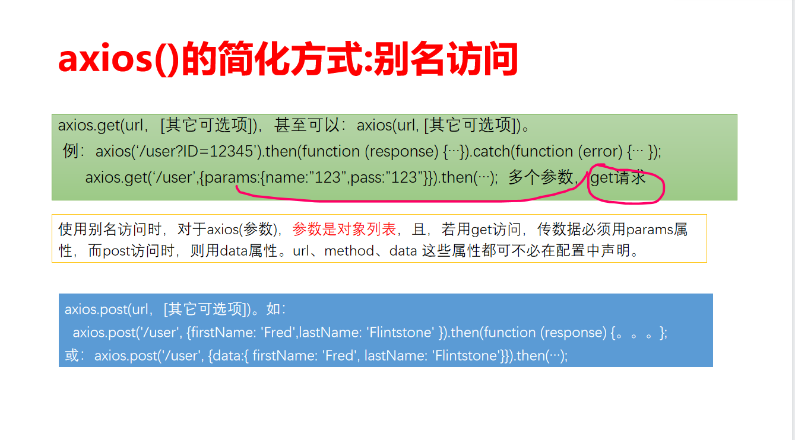

# WEB2.0

# 1.Servlet的运行过程


​                ● 当来自客户端请求时（A,B,C请求）

​                ● 服务器（tomcat）监听到请求

​                ● 根据请求中的地址信息，根据映射规则（web.xml,或注解），服务器找到相应的servlet

​                ● 同时，封装request,response对象传给servlet,并调用其service()方法

​                ● 若A,B,C请求同时，则用多线程方法解决，每个线程有自己的数据

# **2. request对象的getParameter函数和getAttribute函数的使用场景有何不同**

**（1）方法成对**

- 只有getParameter()，没有setParameter()

- setAttribute()和getAttribute()是一对；


**（2）请求方式**

​      **getParameter():**响应的是两个web组件之间为链接(重定向)关系时，如get和post表单提交请求，传递请求参数，注意此种方法是从**web客户端向web服务端**（前端向后端）传递数据，代表HTTP请求数据

```jsp
<form name="form1" method="post" action="2.jsp">
        <input type="text" name="username" />
        <input type="submit" value="提交" />
</form>
```

或
1.jsp中有`<a href="2.jsp?username=accp">2.jsp</a>`，在2.jsp中通过`request.getParameter("username")`来获得请求参数`username`

**getAttribute()：**响应的两个web组件之间为转发关系时，服务端的转发源通过`setAttribute()`设置传递的参数，然后转发目的通过`setAttribute()`获取传递的参数，这样转发时数据就不会丢失，注意此种方法只存在于web容器内部


servlet端代码为：

```
//pageModel是个对象
request.setAttribute("pageModel", pageModel);

request.getRequestDispatcher("/basedata/item_maint.jsp").forward(request, response);
```


​      另一个.jsp代码为（需要强制转换）：

```
PageModel pageModel = (PageModel) request.getAttribute("pageModel");
```

**（3）返回类型**

**getParameter()：**返回String类型的数据

**getAttribute()：**返回可是String类型的数据，也可以是对象，但是当返回的是对象时需要强制转换


# **3.哪些情况Session对象结束生存期**


- 客户端关闭浏览器

- session过期

- 调用invalidate方法使session 失效


# **4. Servlet过滤器的生命周期**

## **Servlet的生命周期**

包括加载和实例化、初始化、服务和销毁过程。

1. 实例化：Servlet 容器创建 Servlet 的实例
2. 初始化：该容器调用 init() 方法
3. 服务：如果请求 Servlet，则容器调用 service() 方法
4. 销毁：销毁实例之前调用 destroy() 方法
5. 不可用：销毁实例并标记为垃圾收集

（理解）其中，加载和实例化过程只有一次（调用init()方法），这个过程可能是Tomcat容器启动时执行，也可能是第一次访问该Servlet执行，这主要取决于容器的配置文件。服务过程（对每一次请求调用service()方法）是不受限制的，每次服务过程就是一个Servlet线程的运行过程。当Tomcat容器关闭时，执行destroy()方法，销毁Servlet实例。但是，也可能由于Servlet本身的变化而提前执行，不过Servlet的生命周期不长于容器的生命周期。

## **过滤器的生命周期**

1. 启动服务器时加载过滤器的实例，并调用init()方法来初始化实例； 
2. 每一次请求时都只调用方法doFilter()进行处理； 
3. 停止服务器时调用destroy()方法，销毁实例。

# **5. Java中有哪些常用的JSON处理工具包**

- Gson（项目地址：[https://github.com/google/gson](https://link.zhihu.com/?target=https%3A//github.com/google/gson)） Gson是目前功能最全的Json解析神器，Gson当初是为因应Google公司内部需求而由Google自行研发而来，但自从在2008年五月公开发布第一版后已被许多公司或用户应用。Gson的应用主要为toJson与fromJson两个转换函数，无依赖，不需要例外额外的jar，能够直接跑在JDK上。而在使用这种对象转换之前需先创建好对象的类型以及其成员才能成功的将JSON字符串成功转换成相对应的对象。类里面只要有get和set方法，Gson完全可以将复杂类型的json到bean或bean到json的转换，是JSON解析的神器。
- FastJson（项目地址：[https://github.com/alibaba/fastjson](https://link.zhihu.com/?target=https%3A//github.com/alibaba/fastjson)） Fastjson是一个Java语言编写的高性能的JSON处理器,由阿里巴巴公司开发。无依赖，不需要例外额外的jar，能够直接跑在JDK上。FastJson在复杂类型的Bean转换Json上会出现一些问题，可能会出现引用的类型，导致Json转换出错，需要制定引用。FastJson采用独创的算法，将parse的速度提升到极致，超过所有json库。
- Jackson（项目地址：[https://github.com/FasterXML/jackson](https://link.zhihu.com/?target=https%3A//github.com/FasterXML/jackson)） 相比json-lib框架，Jackson所依赖的jar包较少，简单易用并且性能也要相对高些。而且Jackson社区相对比较活跃，更新速度也比较快。Jackson对于复杂类型的json转换bean会出现问题，一些集合Map，List的转换出现问题。Jackson对于复杂类型的bean转换Json，转换的json格式不是标准的Json格式。
- Json-lib（项目地址：[http://json-lib.sourceforge.net/index.html](https://link.zhihu.com/?target=http%3A//json-lib.sourceforge.net/index.html)） json-lib最开始的也是应用最广泛的json解析工具，json-lib 不好的地方确实是依赖于很多第三方包，包括commons-beanutils.jar，commons-collections-3.2.jar，commons-lang-2.6.jar，commons-logging-1.1.1.jar，ezmorph-1.0.6.jar，对于复杂类型的转换，json-lib对于json转换成bean还有缺陷，比如一个类里面会出现另一个类的list或者map集合，json-lib从json到bean的转换就会出现问题。json-lib在功能和性能上面都不能满足现在互联网化的需求。


# **6. Axios发起get请求的简化方式**



# 7. Springboot框架默认使用的日志处理工具包中把日志分为哪些等级（ ？）（从低到高）

## **TRACE，DEBUG，INFO，WARN，ERROR，FATAL**


**说明：**

**TRACE：**微量，级别最低

**DEBUG：**需要调试时候的关键信息打印

**INFO：**普通的打印信息（默认）

**WARN：**警告，不影响使用，但需要注意的问题

**ERROR：**错误信息，级别较高的错误日志信息

**FATAL：**致命的，因为代码异常导致程序退出执行的事件（不需要我们自己打印）


# **8. Spring依赖注入概念**

由于Spring容器负责创建被调用者的实例，实例创建后又负责将该实例注入调用者，被称为依赖注入。

## <u>**Spring IOC管理bean**</u>

Spring IOC的核心就是一个对象容器，所有对象（bean）通过Spring的xml配置文件进行管理，其实质就是一个大工厂。
将原本由Java管理的代码交给xml配置文件管理，实现各组件的解耦，利于后期升级和维护

**简单示例**

**HelloWorld.java**

```java
public class HelloWorld {
	private String message;						//成员变量
	public void setMessage(String message){		//set方法
		this.message=message;
	}
	public String getMessage(){
		return this.message;
	}
}
```

**SpringBean.xml**

```xml
...
<bean id="helloWorld" class="HelloWorld">		<!--id是给bean取别名，class为关联的类-->
<property name="message" value="Hello World!">	<!--关联的类中有message对象，此处的value就是为其赋值-->
...
```

**测试类AppTest.java**

```java
public class AppTest{
    public static void main(String[] args) {
        //必须操作，将context与SpringBean.xml绑定
        ApplicationContext context=new ClassPathXmlApplicationContext("SpringBean.xml");
        //获取context中id=helloWorld的bean，此处即完成了对obj1的初始化
        HelloWorld obj1=(HelloWorld) context.getBean("helloWorld");
        System.out.println(obj1.getMessage());
        //同理，初始化obj2
        HelloWorld obj2=(HelloWorld) context.getBean("helloWorld");
        obj2.setMessage("张三，你好")；	//更改数据成员 message 的值
        System.out.println(obj2.getMessage());
        //再次输出obj1
        System.out.println("obj1="+obj1.getMessage());
    }
}
```

**输出结果**

> Hello World!
>
> 张三，你好
>
> obj1=张三，你好

**要点**

1. obj1和obj2都是通过xml文件配置的类名和id进行实例化的
2. 默认配置文件装配的对象是单例的（singleton）的，也即是说obj1和obj2是同一个对象，可通过设置scope=prototype改变单例模式
   这也说明了为什么obj2在修改自己的数据成员message之后，再输出obj1的message是和obj2一样的
3. Spring容器生成的对象的生命周期由容器维护

## 基于xml的注入

### setter方法注入

**User.java**

```java
ublic class User {
    private String name;
    public void setName(String name) {
        this.name = name;
    }
    public String getName() {
        return name;
    }
}
```

**UserDao.java**

```java
public class UserDao {
    public void login(User u){
        System.out.println("Welcome"+u.getName());
    }
}
```

**UserService.java**

```java
public class UserService {
    private User user;
    private UserDao userDao;
	// 必须有set方法,否则无法实例化user对象以及userDao对象
    public void setUser(User user) {
        this.user = user;
    }

    public void setUserDao(UserDao userDao) {
        this.userDao = userDao;
    }

    public void loginUser(){
        userDao.login(user);
    }
}
```

**配置文件中**

```xml
<beans> 
    <!--注册User-->
    <bean id="user" class="User">
        <property name="name" value="张三"/>
    </bean>
    <!--注册UserDao-->
    <bean id="userDao" class="UserDao"/>
    <!--注册UserService-->
    <bean id="userService" class="UserService">
        <property name="user" ref="user"/>
        <property name="userDao" ref="userDao"/>
    </bean>
</beans>
```

**测试代码**

```java
public class AppTest {
	public static void main(String[] args) {
        //applicationContext.xml 为bean的配置文件
		ApplicationContext ctx = new ClassPathXmlApplicationContext("applicationContext.xml");
        // 此处userService对象通过其set方法进行实例化
		UserService userService = (UserService) ctx.getBean("userService");
		userService.loginUser();
	}
```

**输出结果**

> Welcome张三

**要点**

1. Spring框架装配**UerService对象**时，先用默认构造器（无参构造器）生成对象，然后根据UserService对象提供的set方法给对象赋值，所以UserService对象需要提供set方法
2. **User对象**也是通过引用关系按set方法注入
3. **UserDao对象**的生成是根据引用关系按构造器方法注入，因为UserDao对象没有set方法

### 构造方法注入

**UserService.java** 修改

```java
public class UserService {
    private User user;
    private UserDao userDao;

    public UserService(User user,UserDao userDao){
        this.userDao = userDao;
        this.user = user;
    }

    public void loginUser(){
        userDao.login(user);
    }
}
```

配置文件修改

```xml
<bean id="userService" class="com.example.spring_01.service.UserService">
        <constructor-arg ref="userDao"></constructor-arg>
        <constructor-arg ref="user"></constructor-arg>
</bean>
```

**要点**

1. 配置文件中引入`<constructor-arg>`元素表明构造器参数
2. 元素的顺序要与构造器形参的顺序一致
   1. `public UserService(User user,UserDao userDao)`
   2. `<constructor-arg ref="user"></constructor-arg>`
      `<constructor-arg ref="userDao"></constructor-arg>`

## 基于注解的依赖注入

基于注解的依赖注入在xml配置方式之前进行，因此xml配置方式将覆盖前者

Spring中没有打开注解配置方式，因此需要在Spring配置文件中启用

```xml
<context:annotation-config/>
<!--注册UserService-->
<bean id="userService" class="com.example.spring_01.service.UserService"></bean>
<!--去掉所有子元素-->
<!--其他不变-->
```

UserService.java

```java
public class UserService {
    @Autowired
    private User user;
    @Autowired
    private UserDao userDao;
   /* @Autowired
    public UserService(User user,UserDao userDao){
        this.userDao = userDao;
        this.user = user;
    }*/
    //上面为构造方式 下面为set方式，两者二选一即可通过直接方式简化bean的配置
    /*
    @Autowired
    public void setUser(User user) {
        this.user = user;
    }
    @Autowired
    public void setUserDao(UserDao userDao) {
        this.userDao = userDao;
    }
    */

    public void loginUser(){
        userDao.login(user);
    }
}
```


# **9. myBatis的作用**


是一个基于Java的持久层框架，iBATIS提供的持久层框架包括SQL Maps和Data Access Objects（DAOs）。MyBatis 是一款优秀的持久层框架，它支持自定义SQL、存储过程以及高级映射，免除了几乎所有的JDBC代码以及设置参数和获取结果集的工作。MyBatis 可以通过简单的XML或注解来配置和映射原始类型、接口和Java POJO（Plain Old Java Objects，普通 Java 对象）为数据库中的记录。


# **10. Web开发DAO和MVC四层模式，用图示表示**

## **MVC四层开发模式：表现层、服务层、业务层、数据访问层**

- 表现层	UI用户界面、UI逻辑
- 服务层	Service对外统一提供接口
- 业务层	业务规则/业务流（Controller）、业务逻辑（Module）
- 数据库访问层	SQL语句


# 11. **myBatis开发DAO层(第9章PPT，13页、16页、17页)**

```java
@Mapper
public interface DAOBookTable {
    @Update("update tb_book set bookName=#{bookName}, price=#{price}, publishing=#{publishing}, type=#{type}, `storage`=#{storage}, pic=#{pic} where bookID=#{bookID}")
    public boolean updateBook(Book b);

    @Delete("delete from tb_book where bookID=#{id}")
    public boolean delBookByBookID(String id);

    @Insert("insert into tb_book(bookID,bookName,price,publishing,storage,type,pic) values(#{bookID},#{bookName},#{price},#{publishing},#{storage},#{type},#{pic})")
    public boolean addBook(Book b);

    @Select("select * from tb_book where bookID=#{id}")
    public Book getBookByID(String id);
}

```


# **12. 教材代码SpringMVC目录的注册register.html文件**

```html
<!DOCTYPE HTML PUBLIC "-//W3C//DTD HTML 4.0 Transitional//EN">
<html>

<head>
    <title>注册页面</title>
    <meta http-equiv="Content-Type" content="text/html; charset=utf-8" />
    <script src="JS/vue.js"></script>
    <script src="JS/axios.min.js"></script>
</head>


<body>
    <h1> 注册页面</h1>
    <div id="app">
        <form @submit.prevent="onSubmit" method="post">
            <br> 用户名：<input type="text" @blur="checkUserName" v-model="userName" /><span>{{promptNameMess}}</span>
            <br> 密码：<input type="password" v-model="passWord" />
            <br> 联系电话：<input type="text" v-model="tell" />
            <br><input type="submit" value="提交" />
            <input type="reset" value="重置" name="reset" id="reset" />
            <br><span>{{registerMess}}</span>
            <span> 姓名：{{userInfo.userName}}</span>
            <span> 密码：{{userInfo.passWord}}</span>
            <span> 电话：{{userInfo.tell}}</span>
        </form>
    </div>

    <script type="text/javascript">
        var vm = new Vue({
            el: '#app',
            data: {
                userName: "", passWord: "", tell: "",
                promptNameMess: "", registerMess: "",
                userInfo: { userName: "", passWord: "", tell: "" }
            },
            methods: {
                checkUserName: function () {
                    self = this;
                    axios("user/userNameCheck.do?name=" + this.userName)
                        .then(function (response) {
                            if (response.data == "ok") {
                                self.promptNameMess = "用户名可用";
                            }
                            else {
                                self.promptNameMess = "用户名不合法或已被注册可用";
                            }
                        }).catch(function (error) { alert("error"); });
                },
                onSubmit: function () {
                    var self = this;//回调函数中无法获得this.
                    axios({
                        url: "user/register.do", method: "post",
                        data: { userName: this.userName, passWord: this.passWord, tell: this.tell }
                    }
                    ).then(function (response) {
                        //if(response.data=="ok"){
                        self.registerMess = "注册成功，信息为：";
                        self.userInfo = response.data;
                    }).catch(function (error) { });
                }
            }
        });        
    </script>

</body>

</html>
```


# **13. 教材代码SpringMVC目录的src目录下的MVC结构文件**

**UserManagementController  类**  

```java
package controller;

import org.springframework.beans.factory.annotation.Autowired;
import org.springframework.stereotype.Controller;
import org.springframework.web.bind.annotation.RequestBody;
import org.springframework.web.bind.annotation.RequestMapping;
import org.springframework.web.bind.annotation.RequestParam;
import org.springframework.web.bind.annotation.ResponseBody;

import entity.User;
import services.UserManagement;

@Controller
@ResponseBody
@RequestMapping("/user")
public class UserManagementController {
    @Autowired
    private UserManagement um;

    @RequestMapping("/userNameCheck.do")
    public String checkUserName(@RequestParam String name) {
        if (um.checkUserName(name))
            return "ok";
        return "err";
    }

    @RequestMapping("/register.do")
    public User register(@RequestBody User user) {
        System.out.println(user.toString());
        return um.addUser(user);
    }
}
```

**User 类**

**UserManagement**

```java
package services;

import org.springframework.stereotype.Service;

import entity.User;

@Service
public class UserManagement {
    //@Autowired
    //private User u;
    public User addUser(User u) {
        //不访问数据库，简单处理
        return u;
    }

    public boolean checkUserName(String name) {
        if (name.equals("123456")) return false;
        return true;
    }
}

```


# **14**. 教材代码2021ajax目录src/control/LoginAxios、LoginAjax的代码

**LoginAxios 类**

```java
package control;

import com.alibaba.fastjson.JSON;
import com.alibaba.fastjson.JSONObject;

import java.io.BufferedReader;
import java.io.IOException;
import java.io.PrintWriter;

import javax.servlet.ServletException;
import javax.servlet.annotation.WebServlet;
import javax.servlet.http.HttpServlet;
import javax.servlet.http.HttpServletRequest;
import javax.servlet.http.HttpServletResponse;

import servics.LoginManagement;

/**
 * Servlet implementation class LoginAxios
 */
@WebServlet("/LoginAxios")
public class LoginAxios extends HttpServlet {
    private static final long serialVersionUID = 1L;

    /**
     * @see HttpServlet#HttpServlet()
     */
    public LoginAxios() {
        super();
        // TODO Auto-generated constructor stub
    }

    /**
     * @see HttpServlet#doGet(HttpServletRequest request, HttpServletResponse response)
     */
    protected void doGet(HttpServletRequest request, HttpServletResponse response) throws ServletException, IOException {
        // TODO Auto-generated method stub
        response.setContentType("text/html;  charset=utf-8");//写回时，若有中文；
        request.setCharacterEncoding("utf-8");//对”get“请求无效。获得请求中有中文；
        //不能用String name=request.getParameter("name");也许是axios的一个不足，ajax可以
        BufferedReader rd = request.getReader();
        String strJSON = "", temp;
        while ((temp = rd.readLine()) != null) {
            strJSON = strJSON + temp;
        }
        System.out.println(strJSON);
        JSONObject obj = JSON.parseObject(strJSON);
        String name = obj.getString("name");
        String pass = obj.getString("pass");
        PrintWriter out = response.getWriter();
        String returnString = "error";
        if (LoginManagement.login(name, pass))
            returnString = "ok";
        out.write(returnString);
    }

    /**
     * @see HttpServlet#doPost(HttpServletRequest request, HttpServletResponse response)
     */
    protected void doPost(HttpServletRequest request, HttpServletResponse response) throws ServletException, IOException {
        // TODO Auto-generated method stub
        doGet(request, response);
    }
}
```

**LoginAjax 类**

```java
package control;

import com.alibaba.fastjson.JSON;
import com.alibaba.fastjson.JSONObject;

import java.io.BufferedReader;
import java.io.IOException;
import java.io.PrintWriter;

import javax.servlet.ServletException;
import javax.servlet.annotation.WebServlet;
import javax.servlet.http.HttpServlet;
import javax.servlet.http.HttpServletRequest;
import javax.servlet.http.HttpServletResponse;
import javax.servlet.http.HttpSession;

import servics.LoginManagement;

/**
 * Servlet implementation class LoginAjax
 */
@WebServlet("/LoginAjax")
public class LoginAjax extends HttpServlet {
    private static final long serialVersionUID = 1L;

    /**
     * @see HttpServlet#HttpServlet()
     */
    public LoginAjax() {
        super();
        // TODO Auto-generated constructor stub
    }

    /**
     * @see HttpServlet#doGet(HttpServletRequest request, HttpServletResponse response)
     */
    protected void doGet(HttpServletRequest request, HttpServletResponse response) throws ServletException, IOException {
        // TODO Auto-generated method stub
        response.setContentType("text/html;  charset=utf-8");
        BufferedReader rd = request.getReader();
        String strJSON = "", temp;
        while ((temp = rd.readLine()) != null) {
            strJSON = strJSON + temp;
        }
        System.out.println(strJSON);
        JSONObject user = JSON.parseObject(strJSON);
        String name = (String) user.get("name");
        String pass = (String) user.get("pass");
        PrintWriter out = response.getWriter();
        HttpSession session = request.getSession();
        if (LoginManagement.login(name, pass)) {//登录成功
            session.setAttribute("name", name);
            out.write(name);//写回“登录名”
        } else out.write("error");
    }

    /**
     * @see HttpServlet#doPost(HttpServletRequest request, HttpServletResponse response)
     */
    protected void doPost(HttpServletRequest request, HttpServletResponse response) throws ServletException, IOException {
        // TODO Auto-generated method stub
        doGet(request, response);
    }
}

```


# **15**. 第2章PPT第19页、20页**

```jsp
<%@ page contentType="text/html;charset=utf-8" %>
	<HTML>
	<BODY bgcolor=pink ><Font size=5>
	<FORM action="LoginServlet" Method="post">
	<BR>输入帐号：
	<BR><Input type=text name="account">
	<BR>输入密码：
	<BR><Input type=password name="secret">
	<BR><Input type=submit name="g" value="提交">
	</FORM>
	<% if(request.getAttribute("log")!=null) {
		String str=(String)request.getAttribute("log");
		if(str.equals("error"))
			out.println("<br>用户名或者密码错误");
	} %> 
     </BODY>
```


```java
@WebServlet("/LoginServlet")
public class LoginServlet extends HttpServlet {
    public void doGet(HttpServletRequest request, HttpServletResponse response)
            throws ServletException, IOException {
        String account=request.getParameter("account");
        String secret=request.getParameter("secret");
        RequestDispatcher dispatcher = null;
        if(LoginManagement.login(account, secret)){//登录成功
            request.setAttribute("log", "ok");
            dispatcher=getServletContext().getRequestDispatcher("/main.jsp"); }
        else {//登录失败
            request.setAttribute("log", "err");
            dispatcher=getServletContext().getRequestDispatcher("/login.jsp");}
        dispatcher.forward(request, response);}
}
```

