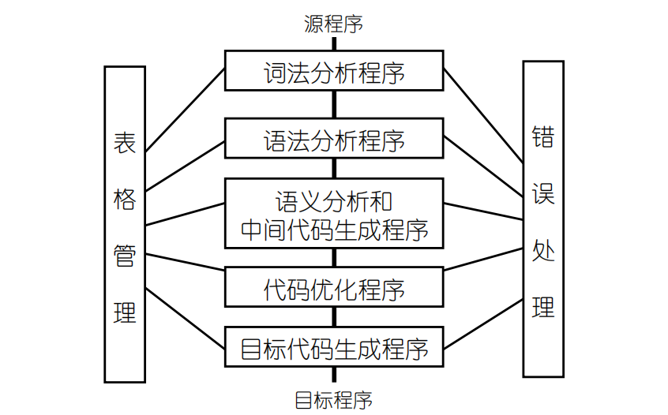
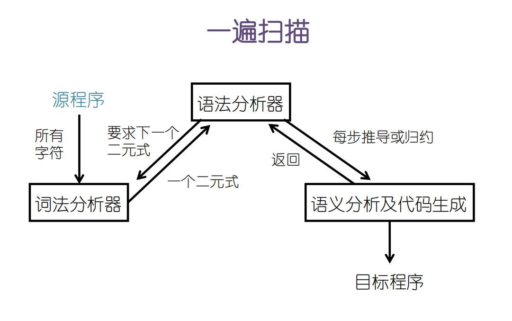
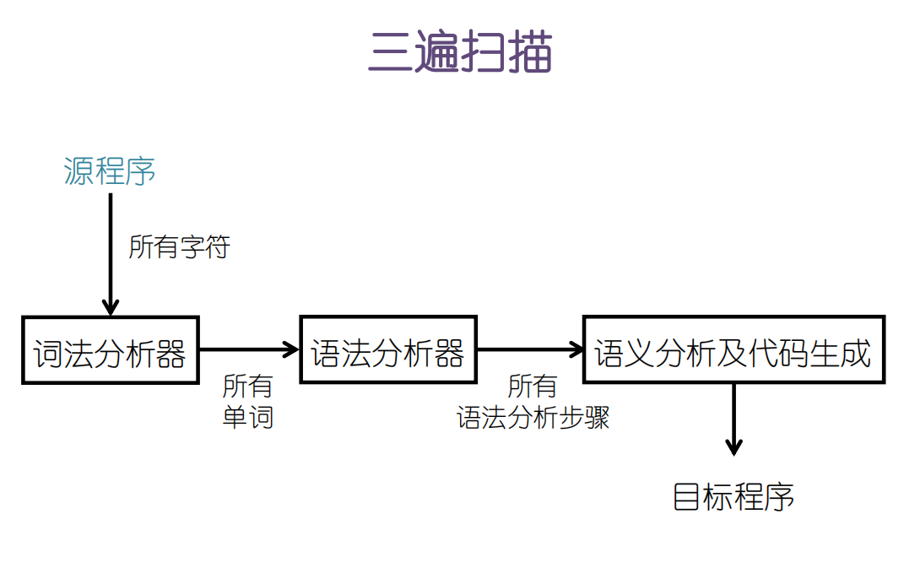
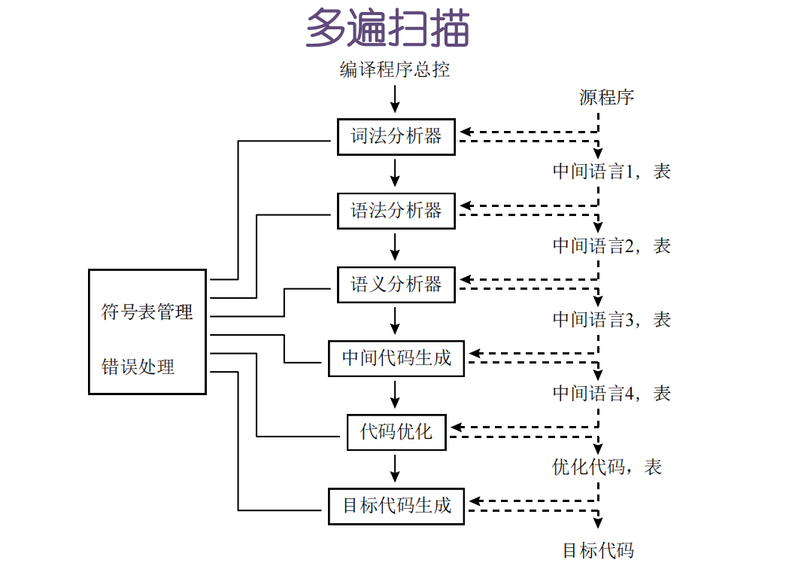

# 引论

## 1.1 课程概要

## 1.2 什么是编译程序

- 语言、源语言、目标语言

- 翻译、解释

  把某种语言（源语言）的程序，在不改变语义的条件下，转换成另一种语言（目标语言）程序。

- 程序设计语言的两种翻译方式：

  - 编译：读取源程序，翻译所有代码，输出翻译结果，等待执行采用编译方式的程序叫做**编译程序**，或编译器（Compiler）
  - 解释：读取一条代码，翻译后直接执行，等待下一条输入，采用解释方式的程序叫做**解释程序**，或解释器（Translator）
  - 编译程序的延长线
    - 文本编辑器、浏览器：对标记语言（markup language）的编译
    - 编译环境的实时报错、调试功能
    - 正则表达式的识别→ 对非结构数据的搜索
    - 游戏角色的操作
    - 家电的操作面板
    - 对某种特定的输入流进行解析，依次做出特定的反应

  

## 1.3 编译程序的结构

## 1.4 词法分析的介绍

- 任务

  从左往右扫描源程序，根据词法规则，识别出每个单词及其类别，输出一串二元式，交给语法分析程序。

- 工具

  - 描述词法规则

    正规文法、正规式

  - 识别装置

    有穷自动机

## 1.5 语法分析的介绍

- 任务

  接收一串二元式（单词和类型），根据某种语言的语法，将二元式序列分割成各类语法单位：短语、子句、语句、过程、程序

- 语法（文法，grammer）

  - 定义

    语言的规则

  - 表示

    用扩展巴科斯范式（EBNF）表示，如：

    A → V = E
    E → T | E + T
    T → F | T * F
    F → V | (E) | C
    V → 标识符
    C → 常数

  - **语法分析**

    - 自上而下(top-down)：推导 (derive)
      最左推导：每次把最左边的大写字母换成其他符号
      最右推导：每次把最右边的大写字母换成其他符号
    - 自下而上(bottom-up)：归约(reduce)
      最左归约：每次把最左边的一组符号换成其他符号(最右推导的逆过程)
      最右归约：每次把最右边的一组符号换成其他符号(最左推导的逆过程)

  - 工具

    下推自动机、语法树

## 1.6 语义分析和中间代码生成的介绍

- 任务

  对语法分析所识别出的各类语法短语进行静态语义检查，若语义正确，则生成中间代码

- 静态语义

  编译阶段需要处理的语义

  - 临时变量创建和注销
  - 类型匹配判断
  - 类型转换
  - 根据语义生成描述操作的中间代码(四元式等)

## 1.7 代码优化和目标代码生成

- **代码优化**

  对中间代码进行加工，使生成的目标代码更为高效，即省时间和省空间

- **目标代码生成**

  把(经优化的)中间代码转换成特定机器上的低级语言代码

## 1.8 表格与出错处理

- 任务

  用各种表格记录源程序的各种信息及编译过程中的各种状态

  - 常用表

    符号表、常数表、标号表、中间代码表

  - 数据结构

    由简单类型、二元式、四元式、链表和各种自定义数据结构组成的一维数组和二维数组

## 1.9 遍与编译程序的编译

- 遍

  指对源程序或其中间形式从头到尾扫描一遍，并作相关的加工处理，生成新的中间形式或目标程序

  - 一遍搜索

    

  - 三遍搜索

    

  - 多遍搜索

    

- 编译程序的编译

  - 机器语言

  - 汇编语言

  - 高级语言

  - 自编译（滚雪球）

  - 编译工具自动生成

    LEX（词法分析）与YACC（语法分析）

  - 移植

    同种语言的编译程序在不同类型的机器之间移植

# 文法与语言

## 2.1 引言

## 2.2 字母表-符号串-运算

## 2.3 文法模型★

## 2.4 推导与句型

## 2.5 文法的类型

## 2.6 文法的构造与简化★

## 2.7 【自学】语法树

## 2.8【自学】文法的二义性

# 词法分析

## 3.1 引言

## 3.2 正规文法★

## 3.3 正规式

## 3.4 有穷自动机

## 3.5 确定的有穷自动机

## 3.6 不确定的有穷自动机

## 3.7 【自学】NFA的确定化1

## 3.8  ε闭包

## 3.9  NFA的确定化2★

## 3.10  DFA的最小化★

## 3.11 确定化与最小化的本质

## 3.12 右线性文法转NFA★

## 3.13  DFA转右线性文法

## 3.14  NFA转正规式

## 3.15 正规式转NFA

## 3.16 上机实现概述

# 自上而下的语法分析

## 4.1 引言1

## 4.2 引言2

## 4.3 LL1文法

## 4.4 First集和Follow集概要

## 4.5 非终结符的first集★

## 4.6 非终结符的follow集★

## 4.7 产生式的first集★

## 4.8 消除回溯★

## 4.9 消除左递归★

## 4.10 递归下降程序

## 4.11 预测分析程序

## 4.12 预测分析表识别输入串

# 自下而上的语法分析

## 5.1 引言

## 5.2 LR分析概述-识别过程

## 5.3 LRO-拓广文法-项目-活前缀

## 5.4 识别活前缀的NFA

## 5.5 LRO项目集族

## 5.6 从拓广文法直接构造LR0项目集族★

## 5.7 构造LRO预测分析表★

## 5.10 LR1分析-LR1项目5.11LR1项目集族★

## 5.12 LR1预测分析表★

## 5.13 LALR1分析★

## 5.14 二义性文法在LR分析里的应用★

## 5.15 简单优先分析★

## 5.16 算符优先分析-firstVT和lastVT★

## 5.17 构造算符优先关系表★

## 5.18 算符优先分析识别过程

## 5.19 算符优先分析与语义分析

# 语义分析

## 6.1 引言

## 6.2 声明语句翻译★

## 6.3 赋值语句翻译★

## 6.4 表达式翻译★

## 6.4.2【自学】赋值运算和表达式的翻译方案

## 6.5 条件语句翻译1

## 6.6 条件语句翻译2★

## 6.7 条件语句翻译3

## 6.7.1【自学】条件语句的翻译方案

## 6.8 条件语句小结

## 6.9【自学】循环语句翻译★