# 计算机操作系统

# CH1 操作系统引论 

**操作系统的工作**

1. 程序的执行
2. 完成与硬件有关的工作
3. 完成与硬件无关的工作
4. 计算机系统的效率与安全问题

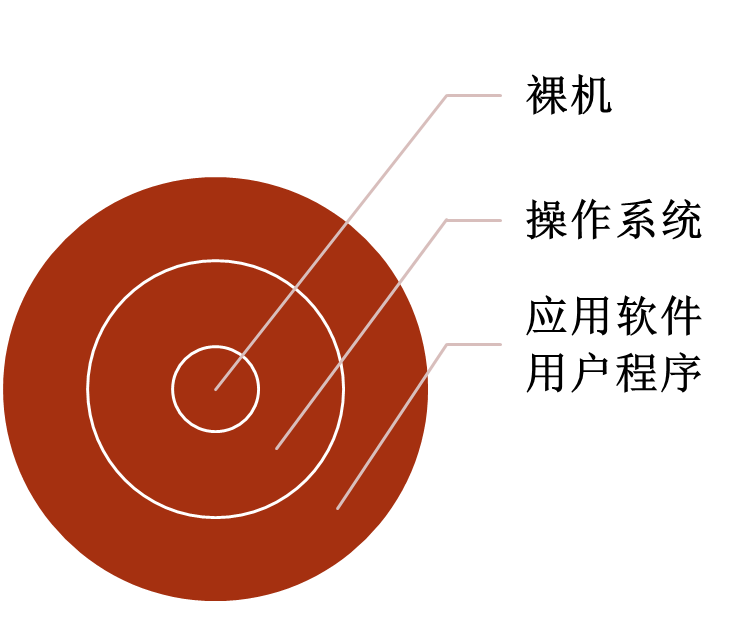

## OS的目标和作用

### OS的目标

- **方便性**	使计算机更容易使用
- **有效性**	提高CPU IO设备利用率、组织工作流程（架构与算法）
- 可拓展性
   如何才有可扩充性？
  - 采用层次结构
  - 扩展=模块+层次
- 开放性

### OS的作用

- OS作为用户和计算机硬件系统的接口
- OS作为计算机资源的管理者
- OS实现了对计算机资源的抽象

**OS作为用户和计算机硬件系统的接口**

用户可以通过..使用计算机

- 命令方式
- 图标、窗口方式（GUI）
- 系统调用方式（程序接口）


**OS作为计算机资源的管理者**

资源可以分为四类

- 处理器
- 存储器
- I/O设备
- 信息（数据和程序） 

**OS实现了对计算机资源的抽象**

虚拟性是SO的基本特征之一

> Q：如何实现OS的虚拟性
>
> Ans：抽象硬件资源

## OS的发展过程

20c50	第一个简单的批处理系统
20c60	多道程序批处理系统，分时系统
20c80-90 微型机、多处理机、计算机网络大发展年代→微机OS、多处理机OS和网络OS的形成和大发展年代

### 无OS的计算机系统

- 人工操作方式（打孔纸带）
  - 用户独占全机
  - CPU等待人工操作
- 脱机输入/输出方式
  本质就是把输入提前放到磁带机，主机输出也放到磁带机
  - 减少CPU的空闲时间
  - 提高了I/O速度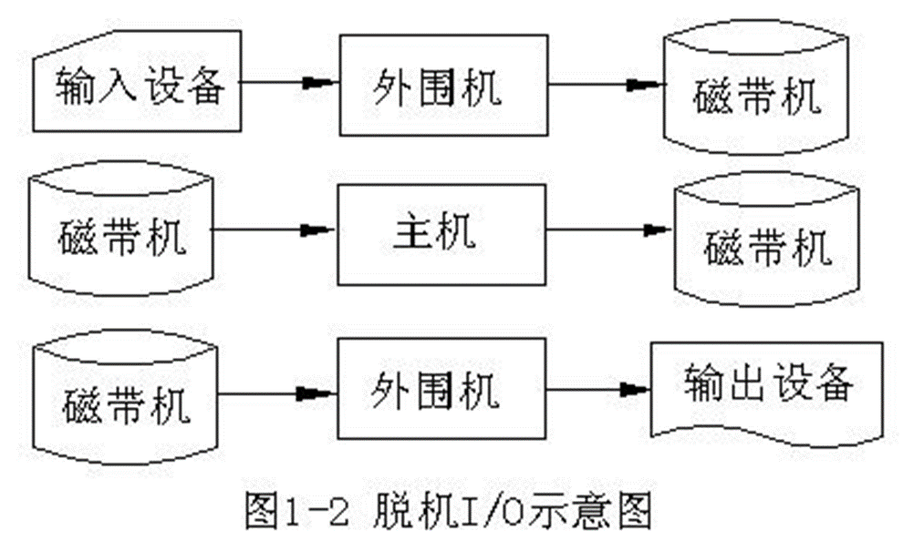

###  单道批处理系统

是OS的前身

把**一批作业**以脱机方式输入到磁带上
在监督程序的控制下使得这批作业**一个接一个**地连续处理

### 多道批处理系统

用户提交的作业事先放在外村上，形成“后备队列”
作业调度程序按照一定算法从后备队列中**选择若干作业**调入内存（不一定是顺序调入）

- 提高CPU利用率	原因：运行程序A时候，利用其因I/O操作时的CPU空档时间，再调度另一道程序B
- 提高内存和I/O设备的利用率
- 增加系统吞吐量

**特征**

- 多道性	多道程序在内存中并发执行
- 无序性	根据作业调度算法决定调用的先后顺序
- 调度性	作业提交到完成，经过两种调度：作业调度和进程调度

**优点**

- 资源利用率高
- 系统吞吐量大 系统吞吐量是指系统在单位时间内所完成的总工作量

**缺点**

- 平均周转时间长	作业周转时间是指从作业进入系统（提交）开始，直至它完成并退出系统为止所经历的时间
- 无交互能力

### 分时系统

指在一台主机上连接多个带有显示器和键盘的终端，同时允许多个用户通过自己的终端，以交互方式使用计算机，共享主机中的资源。 

**关键问题**
因为有很多用户，必须做到及时

- 及时接收
- 及时处理

**特征**

- 多路性	一台主机连接多个终端
- 独立性	终端彼此独立
- **及时性**	用户请求在很短时间内获得响应
- 交互性	用户通过终端与系统进行广泛的对话

### 实时系统

指系统能及时响应外部事件的请求，在规定时间内完成该事件的处理，并控制所有实时任务协调一致地运行。

**应用需求**

1. 实时控制
2. 实时信息处理

### 实时系统

实时系统与分时系统特征的比较 

1. 多路性	实时系统的多路性主要表现在：系统经常对多路的现场信息进行采集，以及对多个对象或多个执行机构进行控制。 
2. 独立性	实时系统中对信息的采集和对对象的控制，也都是彼此互不干扰 
3. 及时性	实时系统的及时性，是以控制对象所要求的开始截止时间或完成截止时间来确定的。**一般为秒级、百毫秒级直至毫秒级，甚至有的要低于100微秒。** 
4. 交互性	实时系统的交互性仅限于访问系统中某些特定的专用服务程序，不象分时系统那样能向终端用户提供数据处理服务、资源共享等服务。 
5. 可靠性	实时系统要求**系统高度可靠**，往往采用多级容错措施来保证系统的安全性及数据的安全性。 

## 操作系统的基本特征

1. 并发（Concurrence） 
2. 共享（Sharing） 
3. 虚拟（Virtual） 
4. 异步（Asynchronism）

### 并发 

**最重要的特征，其他三个都是以并发为前提的**

<font color=red>**并行与并发**</font>

并行性——两个或多个事件在**同一时刻**发生。 
并发性——两个或多个事件在**同一时间间隔**内发生。 

​    在多道程序环境下，并发性是指在一段时间内，**宏观上有多个程序在同时运行**，但在**单处理机系统中，每一时刻却只能有一道程序执行**，故微观上这些程序只能是**分时地交替执行**。若计算机系统中有多个处理机，则这些可以并发执行的程序可被分配到多个处理机上，实现并行执行。

<font color=red>并发是通过单通道交替执行实现的</font>

**进程**
与并发紧密相连的概念

是指在系统中能独立运行并作为资源分配的基本单位，它是由**一组机器指令、数据和堆栈**等组成的，是一个**活动实体**。

通常的程序是静态实体，它是不能并发执行的。为了使程序能并发执行，系统必须分别为每个程序建立进程（Process)

多个进程之间可以并发执行和交换信息

### 共享

共享是指系统中的资源可供内存中多个并发执行的进程（线程）共同使用。 

**资源共享方式**

1. 互斥共享方式
   1. 临界资源要求被互斥地共享
      **临界资源**是指每次仅允许一个进程访问的资源（例如打印机、消息缓冲队列、变量、数组）
2. 同时访问方式
   1. 对于共享资源
   2. **“同时”往往是宏观上的**，而微观上，这些进程可能是**交替地**对该资源进行访问

### 并发与共享的关系

是操作系统的两个最基本的特征
是互为存在条件的

资源的共享是**以进程的并发执行为条件的**，若系统不允许程序并发执行，自然不存在资源共享问题； 
若系统**不能对资源共享实施有效管理**，协调好诸进程对共享资源的访问，**也必然影响到程序并发执行的程度，甚至根本无法并发执行。** 

### 虚拟

虚拟——是指通过某种技术把一个物理实体变为若干个逻辑上的对应物

OS中利用了多种虚拟技术，分别用来实现虚拟处理机、虚拟内存、虚拟外部设备和虚拟信道等。 

例：

- 利用多道程序设计技术，把一台物理上的CPU虚拟为**多台逻辑上的CPU**，也称为**虚拟处理机**。 
- 利用虚拟存储技术，将一台机器的**物理内存变为虚拟存储器**，以便在逻辑上扩充存储器的容量。 
- 通过虚拟设备技术，将一台物理I/O设备虚拟为多台逻辑上的I/O设备(如，Apple远程光盘)，允许每个用户占用一台逻辑上的I/O设备，这样便可使原来在一段时间仅允许一个用户访问的设备（即临界资源），变为在**一段时间内允许多个用户同时访问的共享设备**。例如，虚拟打印机。 

### 异步

​    内存中的每个进程在何时能获得处理机运行，何时又因提出某种资源请求而暂停，以及进程以怎样的速度向前推进，每道程序总共需要多少时间才能完成等等，都是不可预知的
​	很可能是先进入内存的作业后完成，而后进入内存的作业先完成，或者说，进程是以人们不可预知的速度向前推进，此即进程的异步性。 

## 操作系统的主要功能

### 处理机管理

在传统的多道程序设计系统中，处理机的分配和运行，都是以进程为基本单位的
在引入线程的OS中，还包含对线程的管理

- 进程控制	创建和撤销进程（线程）
- 进程同步	对诸进程（线程）的运行进行协调
- 进程通信	实现进程（线程）之间的信息交换
- 进程调度（处理机调度）	按照一定的算法把处理机分配给进程（线程）

### 存储器管理

- 内存分配 (静态 、动态分配方式 )
- 内存保护 (硬件检查越界（segment fault）,软件处理)
- 地址映射 (逻辑、物理地址，硬件支持)
- 内存扩充 (虚拟存储技术)

### 设备管理

**任务**

- 完成进程提出的I/O请求；
- 为用户进程分配其所需的I/O设备；
- 提高CPU和I/O设备的利用率；
- 提高I/O速度；
- 方便用户使用I/O设备。

**功能**

- 缓冲管理
  在设备和CPU之间引入缓冲，可有效地缓和CPU和I/O设备速度不匹配的矛盾（硬盘是影响整体速度的一个重要原因），提高CPU的利用率，进而提高系统的吞吐量
- 设备分配
- 设备处理（设备驱动程序）

### 文件管理

功能

- 文件存储空间的管理
- 目录管理
- 文件的读/写管理和保护

## 操作系统的结构设计

传统的操作系统结构

- 第一代的OS是无结构的 
- 第二代OS采用了模块式结构 
- 第三代OS是层次式结构 

20世纪90年代中期后

- 第四代OS采用微内核结构 

### **微内核OS结构——现代OS结构** 

微内核结构能有效地支持多处理机运行，故非常使用于分布式系统环境

在与微内核技术发展的同时，**客户/服务器技术**、**面向对象技术**也在迅速发展，把它们应用到基于微内核结构的OS中，便具有了**以微内核为OS核心，以客户/服务器为基础，并且采用了面向对象的程序设计方法的特征。** 

**微内核技术**

- 微内核运行在核心态； 
- 开机后常驻内存（这就是为什么有程序调试有段错误）； 
- **并非一个完整的OS**，而只是为构建通用OS提供一个重要基础； 
- 常采用客户/服务器模式，OS的大部分功能和服务，都由若干服务器提供。 （这就是我们看到Windows中有各种service）

# CH2 进程的控制与描述

## 进程的基本概念

### 前驱图和顺序执行

**顺序执行有两层含义：**

- 外部顺序性
  对于多个用户程序来说，所有程序是依次执行的。
- 内部顺序性
  对于一个程序来说，它的所有指令是按序执行的。

**顺序程序执行的特征**

1. 顺序性
2. 封闭性
   1. 程序运行时独占全机资源，资源的状态（除初始态外）只有本程序才能改变它。
   2. 程序一旦开始执行，其执行结果不受外界影响。 
3. 可再现性

**程序并发有两层含义**

- 内部顺序性
  对于一个程序来说，它的所有指令是按序执行的。
- 外部顺序性
  对于多个程序来说，是交叉执行的。

<font color="red">只有不存在前趋关系的程序之间才有可能并发执行</font>

**并发执行的特征**

1. 间断性
2. 失去封闭性
   程序在并发执行时，由于多个程序共享系统资源，因而这些资源的状态将由多个程序来改变，致使程序的运行已失去了封闭性。 
3. 不可再现性

## 进程

### 进程的组成

**PCB**

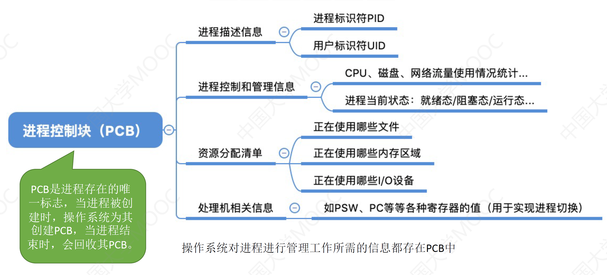

#### **进程的组织方式**

- 链接方式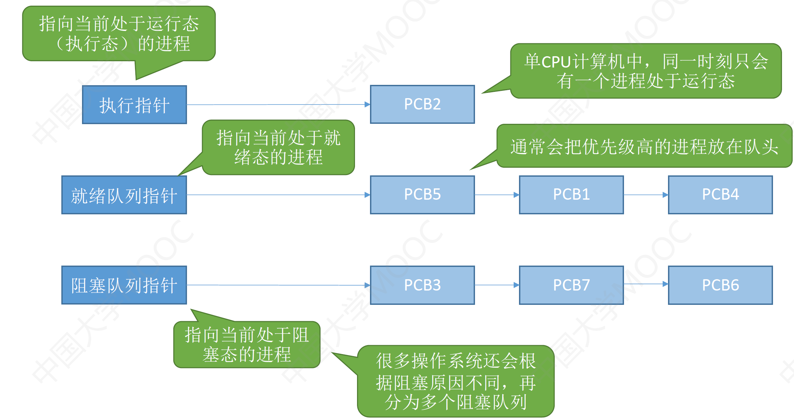
- 索引方式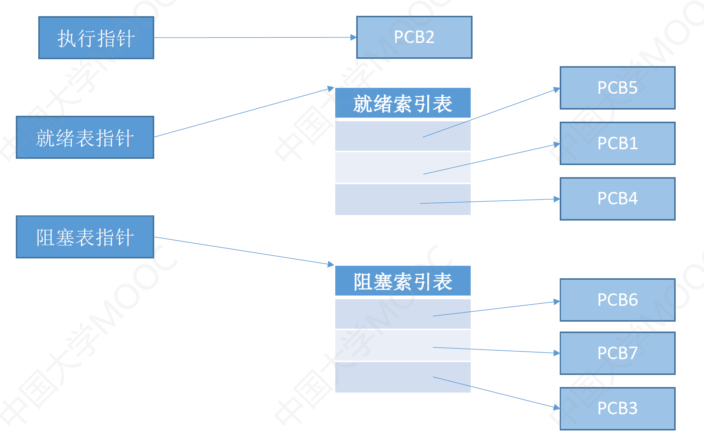

<font color=red>PCB是进程存在的唯一标志</font>

### **进程的状态**

- 创建态 创建完成后便进入就绪态
- 就绪态
- 运行态 进程在CPU上运行
- 阻塞态
  在进程运行的过程中，可能会请求等待某个事件的发生。在这个事件发生之前，进程无法继续往下执行，此时操作系统会
  让这个进程下CPU，并让它进入“阻塞态”
- 终止态 执行exit系统调用

#### **进程状态的转换**

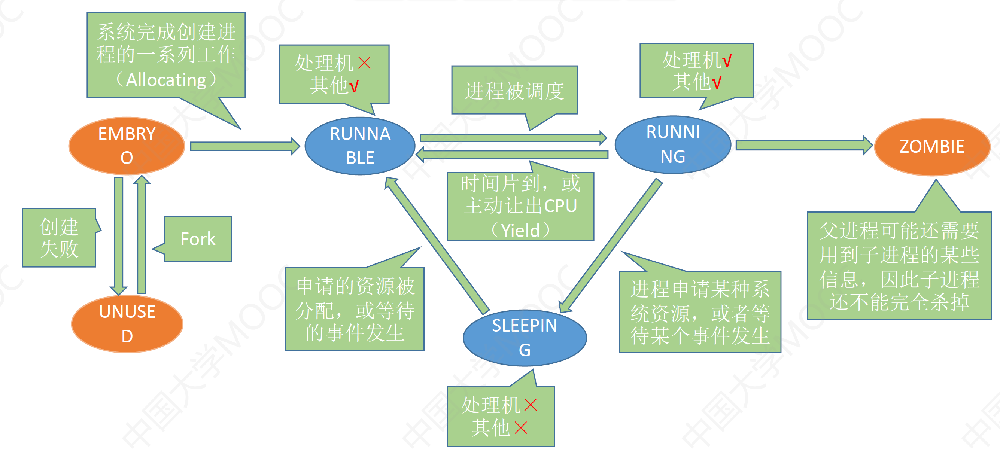

### **什么是进程控制**

进程控制的主要功能是对系统中的所有进程实施有效的管理，它具有创建新进程、撤销已有进程、实现
进程状态转换等功能。

使用原语来实现进程控制

原语的执行具有原子性，即执行过程只能一气呵成，期间不允许被中断。
可以用“**关中断指令**”和“**开中断指令**”这两个特权指令实现原子性

#### **进程控制相关原语**

**进程创建**

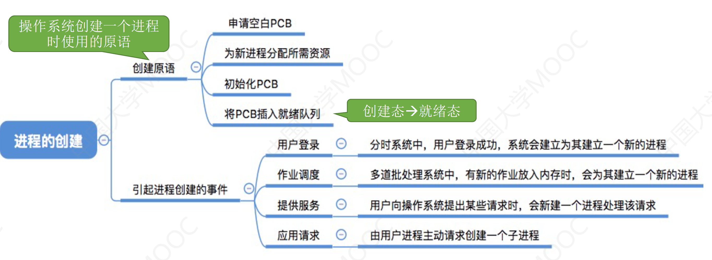

**进程终止**

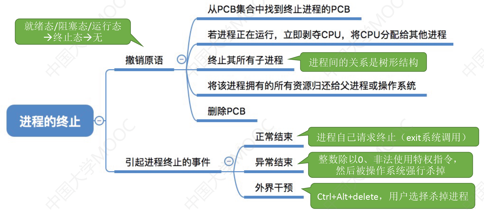

**进程的阻塞和唤醒**

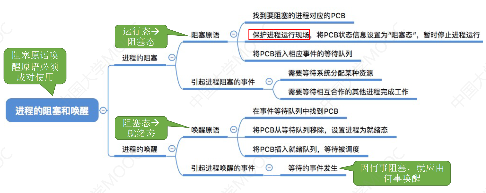

**进程的切换**

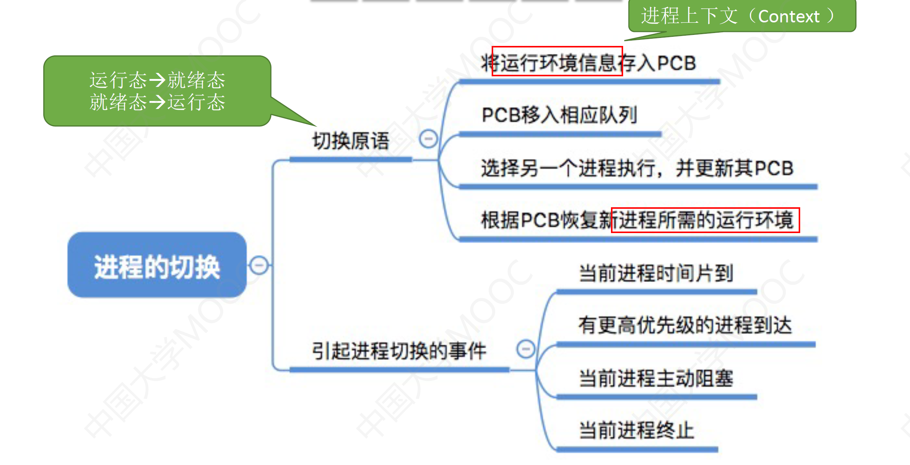

### 进程通信

#### 共享存储

**基于存储区**：各个应用对共享存储区的访问应该是互斥的

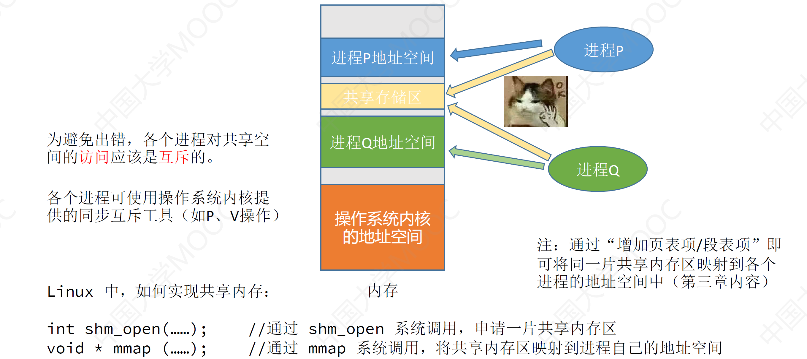

**基于数据结构**

比如共享空间里只能放一个长度为10的数组。这种共享方式速度慢、限制多，是一种低级通信方式

#### 消息传递

通过操作系统提供的“发送消息/接收消息”原语进行数据交换

- 直接通信方式
  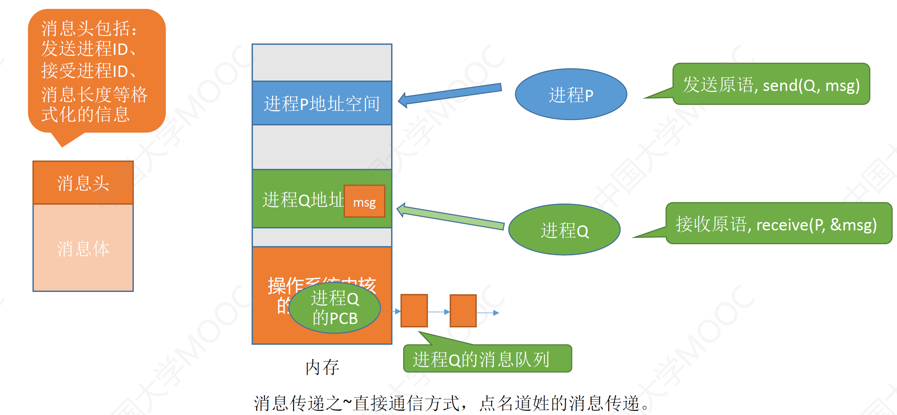
- 间接通信方式
  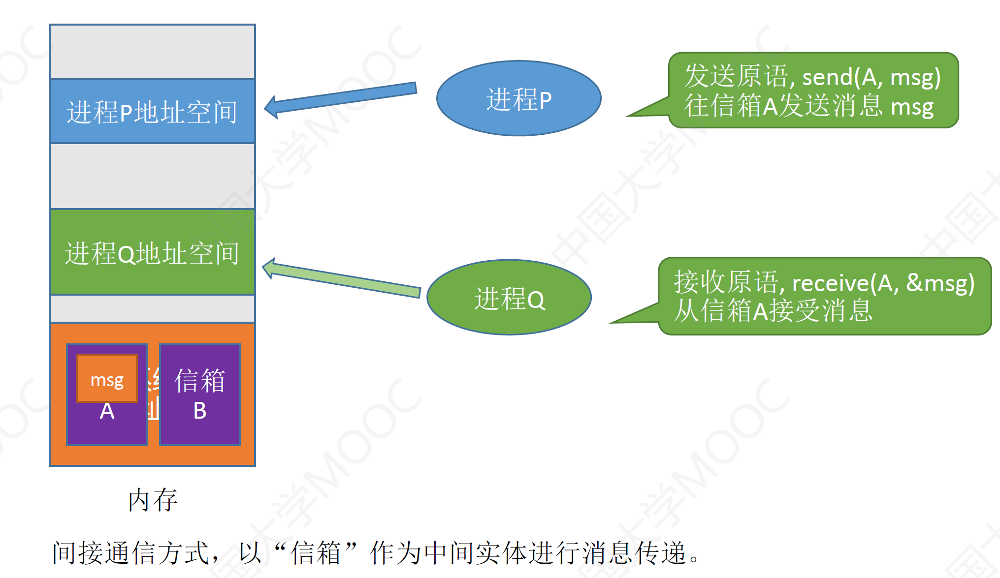

#### 管道通信

只支持半双工通信
如果要实现双向通信，则需要两个管道

当管道写满时，写进程将阻塞，直到读进程将管道中的数据取走，即可唤醒写进程
当管道读空时，读进程将阻塞，直到写进程往管道中写入数据，即可唤醒读进程

管道中的数据一旦被读出，就彻底消失。因此，当多个进程读同一个管道时，可能会错乱。对此，通常
有两种解决方案：

1. 一个管道允许多个写进程，一个读进程
2. 允许有多个写进程，多个读进程，但系统会让各个读进程轮流从管道中读数据（Linux的方案）

## 线程

线程是处理机的调度单位

### **为什么要引入线程？**

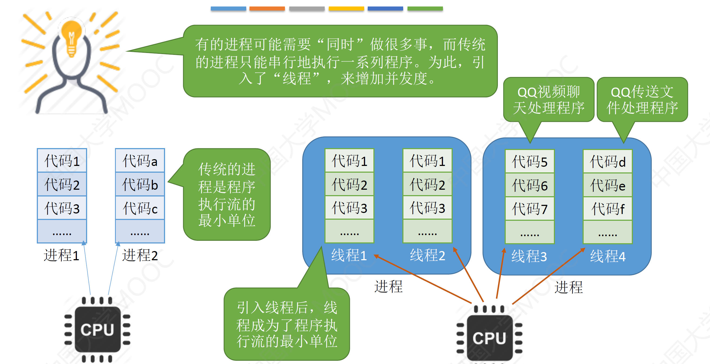

可以理解为轻量级进程

线程是一个基本的CPU执行单元，也是程序执行流的最小单位

引入线程之后，不仅是进程之间可以并发，进程内的各线程之间也可以并发，从而进一步提升了系统的并发度，使得一个进程内也可以并发处理各种任务

引入线程后，进程只作为除CPU之外的系统资源的分配单元（如打印机、内存地址空间等都是分配给进程的）

**线程**则作为**处理机的分配单元**

### 线程的属性

- 线程是处理机调度的单位
- 多CPU计算机中，不同线程可占用不同的CPU
- 每个线程都有一个线程ID，线程控制块（TCB）
- 线程也有就绪、运行、阻塞三种基本状态
- 线程几乎不拥有系统资源
- 同一进程的不同线程，共享进程资源
- 同一进程间的线程的通信无需系统干预
- 同一进程的线程的切换，不会影响进程的切换，**开销比较小**
- 不用进程的线程间的切换，会引起进程切换，**系统开销大**

### 实现方式

**用户级线程**

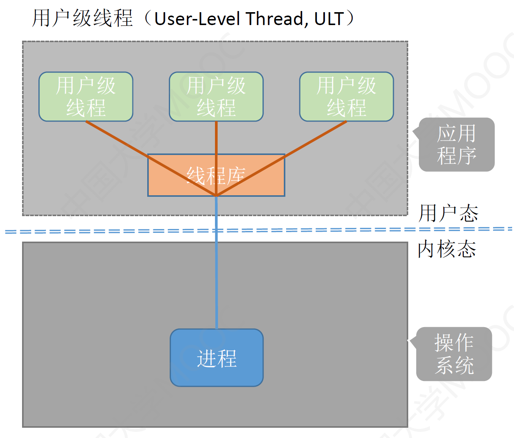 

**内核级线程**

管理工作由操作系统完成

内核级线程的切换在核心态下才能完成

操作系统会为每个内核级线程建立相应的TCB（Thread Control Block，线程控制块），通过TCB对线程进行管理。“内核级线程”就是“从操作系统内核视角看能看到的线程”

**优点**：当一个线程被阻塞后，别的线程还可以继续执行，并发能力强。多线程可在多核处理机上并行执行。
**缺点**：一个用户进程会占用多个内核级线程，线程切换由操作系统内核完成，需要切换到核心态，因此线程管理的成本高，开销大。

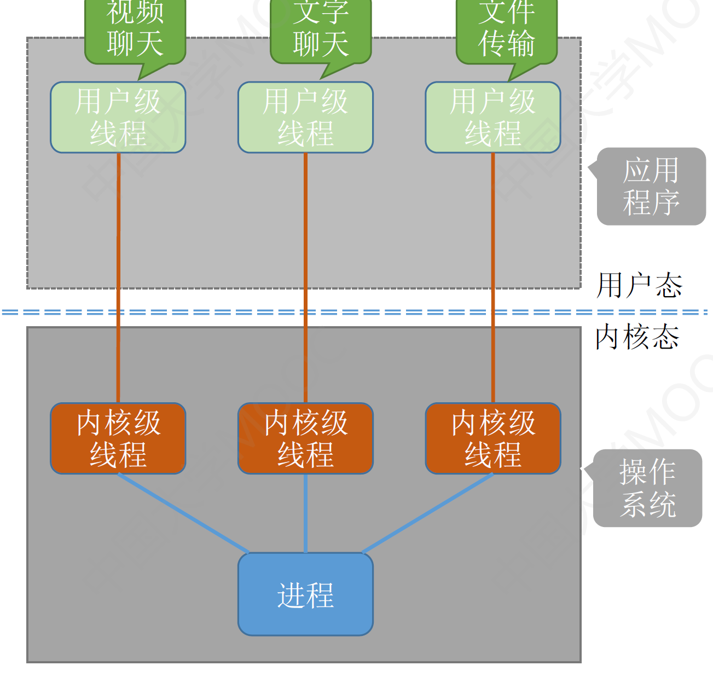

### 多线程模型

#### **一对一**

一个用户级线程映射到一个内核级线程。每个用户进程有与用户级线程同数量的内核级线程

**优点**：当一个线程被阻塞后，别的线程还可以继续执行，并发能力强。多线程可在多核处理机上并行执行。
**缺点**：一个用户进程会占用多个内核级线程，线程切换由操作系统内核完成，需要切换到核心态，因此线程管理的成本高，开销大。

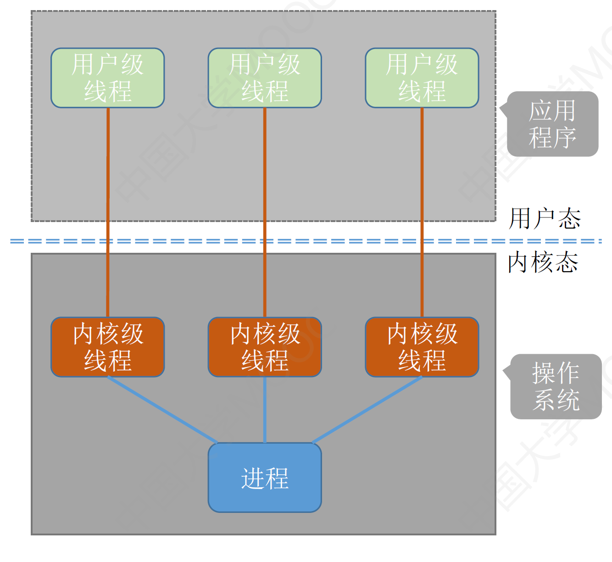

#### **多对一**

多个用户级线程映射到一个内核级线程。且一个进程只被分配一个内核级线程。

**优点**：用户级线程的切换在用户空间即可完成，不需要切换到核心态，线程管理的系统开销小，效率高
**缺点**：当一个用户级线程被阻塞后，整个进程都会被阻塞，并发度不高。多个线程不可在多核处理机上并行运行

操作系统只“看得见”内核级线程，因此<font color="red">只有内核级线程才是处理机分配的单位。</font>

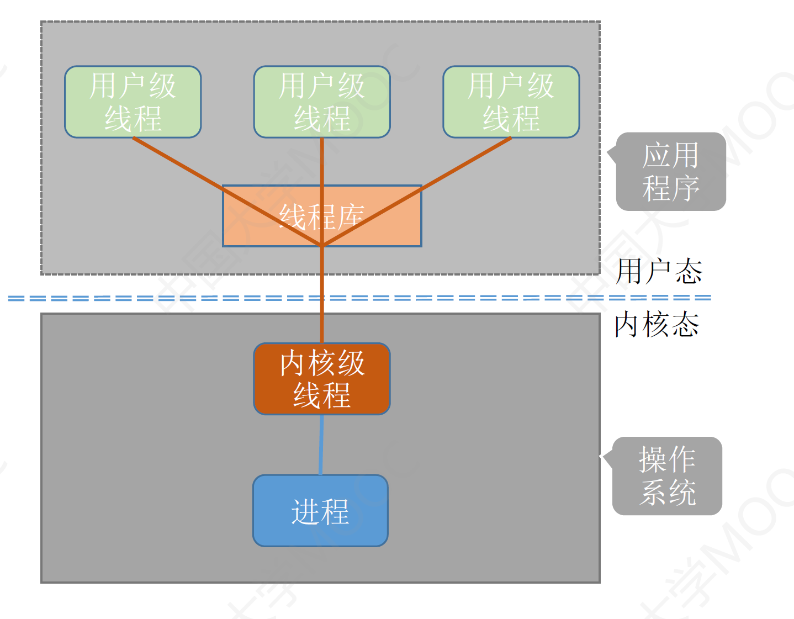

#### **多对多**

n用户及线程映射到m个内核级线程（n >= m）。每个用户进程对应m个内核级线程。

克服了多对一模型并发度不高的缺点（一个阻塞全体阻塞），又克服了一对一模型中一个用线程库 户进程占用太多内核级线程，开销太大的缺点。


### 线程的状态与转换

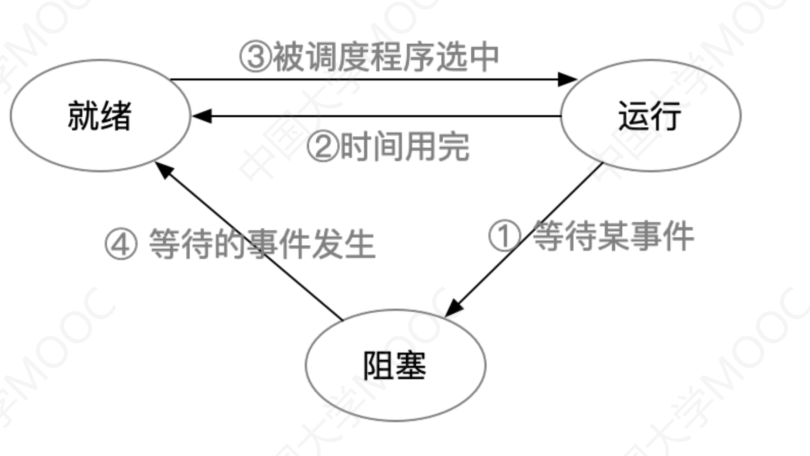

### **线程的组织**

**线程控制块 TCB** (Thread Control Block)

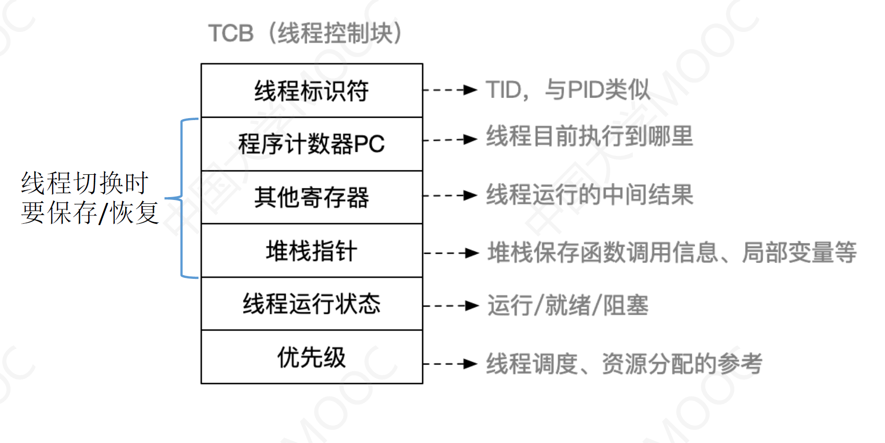

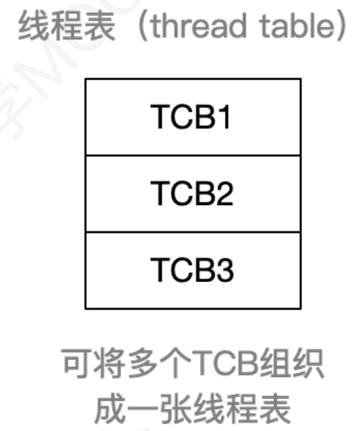

## 调度

### 处理机调度	

#### **调度的三个层次**

1. 高级调度（作业调度）
   按一定的原则从外存的作业后备队列中挑选一个作业调入内存，并创建进程。每个作业只调入一次，调出一次。作业调入时会建立PCB，调出时才撤销PCB。
2. 中级调度（内存调度）
   按照某种策略决定将哪个处于挂起状态的进程重新调入内存。
   一个进程可能会被多次调出、调入内存，因此中级调度发生的频率要比高级调度更高。
3. 低级调度（进程调度）
   按照某种策略从就绪队列中选取一个进程，将处理机分配给它。

三层调度的联系与对比

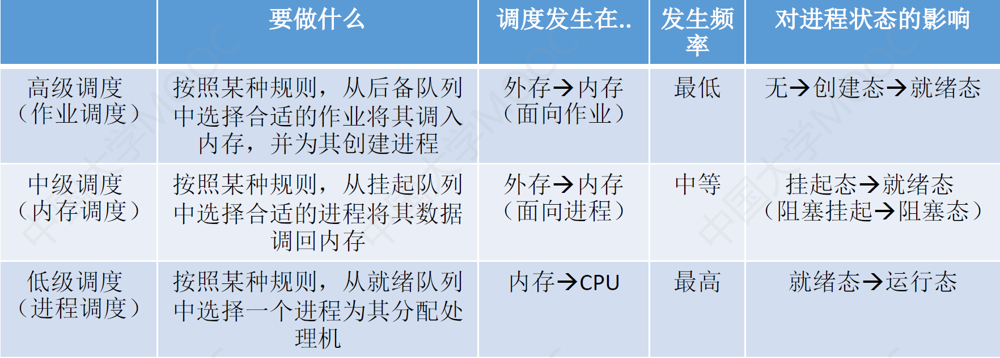

**七状态模型**

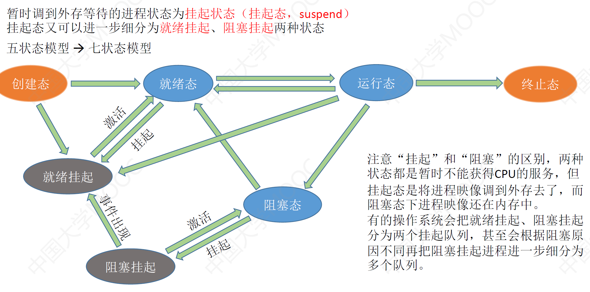

### 进程调度时机、切换与过程、方式

#### **进程调度（低级调度）的时机**

进程调度是按照某种算法从就绪队列中选择一个进程为其分配处理机

需要进行进程调度与切换的情况

1. 当前进程主动放弃
   1. 进程正常终止
   2. 运行过程中发生异常而终止
   3. 进程主动请求阻塞（如等待I/O）

2. 当前进程被动放弃
   1. 分给进程的时间片用完
   2. 有更紧急的事需要处理（如I/O中断）
   3. 有更高优先级的进程进入就绪队列


**不能进行进程调度与切换的情况**

1. 在处理**中断的**过程中。中断处理过程复杂，与硬件密切相关，很难做到在中断处理过程中进行进程切换。

2. 进程在**操作系统内核程序临界区**中。
3. 在**原子操作**过程中（原语）。原子操作不可中断，要一气呵成（如
    之前讲过的修改PCB中进程状态标志，并把PCB放到相应队列）

#### 进程调度方式

1. **非剥夺调度方式，又称非抢占方式。**即，只允许进程主动放弃处理机。在运行过程中即便有更紧迫的任务到达，当前进程依然会继续使用处理机，直到该进程终止或主动要求进入阻塞态。
   适合早期批处理系统
2. **剥夺调度方式，又称抢占方式**。当一个进程正在处理机上执行时，如果有一个更重要或更紧迫的进程需要使用处理机，则立即暂停正在执行的进程，将处理机分配给更重要紧迫的那个进程。
   可以优先处理更紧急的进程，也可实现让各进程按时间片轮流执行的功能（通过时钟中断）。适合于分时操作系统、实时操作系统

### 调度器/调度程序

#### 调度时机——什么事件会触发“调度程序”？

1. 创建新进程
2. 进程退出
3. 运行进程阻塞
4. I/O中断发生（可能唤醒某些阻塞进程）

#### **闲逛进程**

调度程序永远的备胎，没有其他就绪进程时，运行闲逛进程（idle）

**特性**

- 优先级最低
- 可以是0地址指令，占一个完整的指令周期（指令周期末尾例行检查中断）
- 能耗低

### 调度算法的评价指标

**CPU利用率**

$利用率=\frac{忙碌的时间}{总时间}$

**系统吞吐量**

单位时间内完成的作业的数量

$系统吞吐量=\frac{总共完成了多少道作业}{总共花了多少时间}$

**周转时间**

从作业被提交给系统开始，到作为完成为止的这段时间间隔

$平均周转时间=\frac{作业周转时间之和}{作业数量}$

$带权周转时间=\frac{作业周转时间}{作业实际运行的时间}$

周转时间与带权周转时间都是越小越好

**等待时间**

指进程/作业处于等待处理机状态时间之和，等待时间越长，用户满意度越低

- 对于**进程**来说，等待时间就是指进程建立后等待被服务的时间之和，在等待I/O完成的期间其实进程也是在被服务的，所以不计入等待时间。
- 对于**作业**来说，不仅要考虑建立进程后的等待时间，还要加上作业在外存后备队列中等待的时间。

**响应时间**

指从用户提交请求到首次产生响应所用的时间

### 调度算法

#### **先来先服务（FCFS）**

**算法规则**：按照作业/进程到达的先后顺序进行服务

**优点**：公平、算法实现简单
**缺点**：排在长作业（进程）后面的短作业需要等待很长时间，带权周转时间很大，对短作业来说用户体验不好。即，FCFS算法对长作业有利，对短作业不利

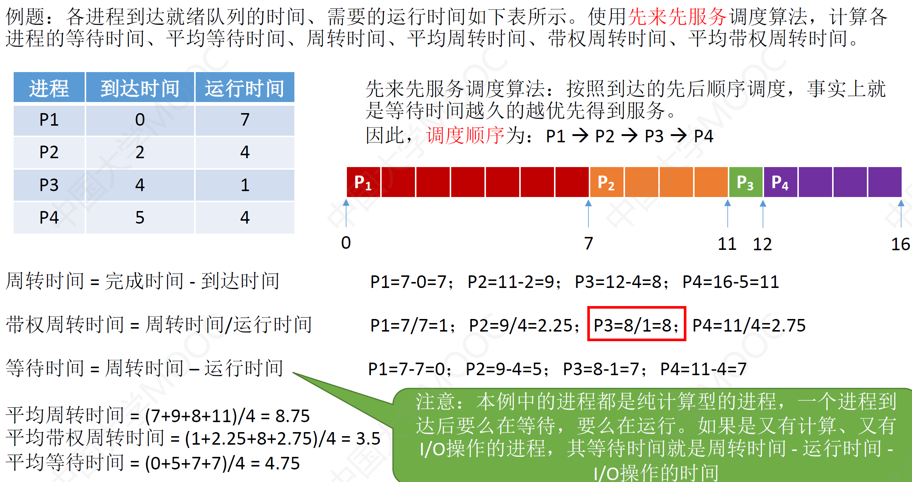

#### **短作业优先（SJF）**

**算法规则**：最短的作业/进程优先得到服务（所谓“最短”，是指**要求服务时间**最短）

**是否抢占**：SJF和SPF(短进程优先,Shortest Process First)是非抢占式的算法。但是也有抢占式的版本——最短剩余时间优先算法（SRTN, Shortest Remaining Time Next）

**优点**：“最短的”平均等待时间、平均周转时间
**缺点**：不公平。对短作业有利，对长作业不利。可能**产生饥饿**现象。另外，作业/进程的运行时间是由用户提供的，并不一定真实，不一定能做到真正的短作业优先

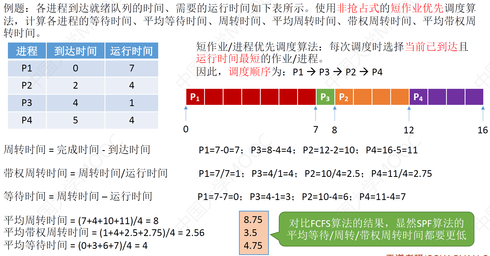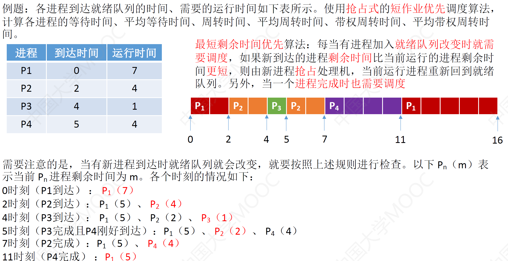

#### **高响应比优先（HRRN）**

**算法规则**：在每次调度时先计算各个作业/进程的**响应比**，选择响应比最高的作业/进程为其服务

$响应比=\frac{响应时间+要求服务时间}{要求服务时间}$

**是否为抢占式**：非抢占式的算法。因此只有当前运行的作业/进程主动放弃处理机时，才需要调度，才需要计算响应比

综合考虑了等待时间和运行时间（要求服务时间）
等待时间相同时，要求服务时间短的优先（SJF的优点）
要求服务时间相同时，等待时间长的优先（FCFS的优点）
对于长作业来说，随着等待时间越来越久，其响应比也会越来越大，从而**避免了长作业饥饿**的问题

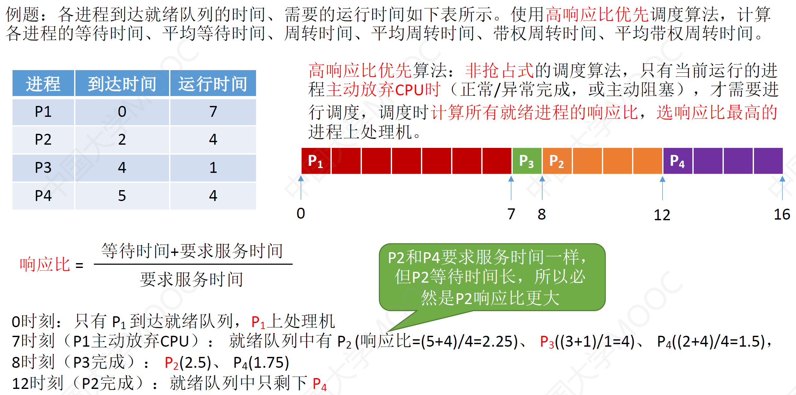

------

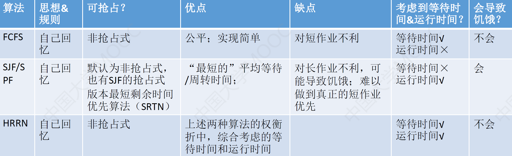

注：这几种算法主要关心对用户的公平性、平均周转时间、平均等待时间等评价系统整体性能的指标，但是不关心“响应时间”，也并不区分任务的紧急程度，因此对于用户来说，交互性很糟糕。因此这三种算法一般适合用于早期的批处理系统，当然，FCFS算法也常结合其他的算法使用，在现在也扮演着很重要的角色

------

#### **时间片轮转（RR）**

**算法规则**：按照各进程到达就绪队列的顺序，轮流让各个进程执行一个时间片（如100ms）。若进程未在一个时间片内执行完，则剥夺处理机，将进程重新放到就绪队列队尾重新排队。

**用于作业/进程调度**：用于进程调度（只有作业放入内存建立了相应的进程后，才能被分配处理机时间片）

**是否抢占**：若进程未能在时间片内运行完，将被强行剥夺处理机使用权，因此时间片轮转调度算法**属于抢占式的算法**。由**时钟**
**装置**发出时钟中断来通知CPU时间片已到。

**优点**：公平；响应快，适用于分时操作系统；
**缺点**：由于高频率的进程切换，因此有一定开销；不区分任务的紧急程度。

适用于分时操作系统

时间片太大，则会退化为先来先服务算法，增大进程响应时间
时间片太小，会导致进程频繁切换，系统花在切换进程的时间上增多，实际执行时间变短


#### **优先级调度算法**

**算法规则**：每个作业/进程有各自的优先级，调度时选择优先级最高的作业/进程

**是否抢占**：都有。非抢占式只需在进程主动放弃处理机时进行调度即可，而抢占式还需在就绪队列变化时，检查是否会发生抢占。

**优点**：用优先级区分紧急程度、重要程度，适用于实时操作系统。可灵活地调整对各种作业/进程的偏好程度。
**缺点**：若源源不断地有高优先级进程到来，则可能导致饥饿

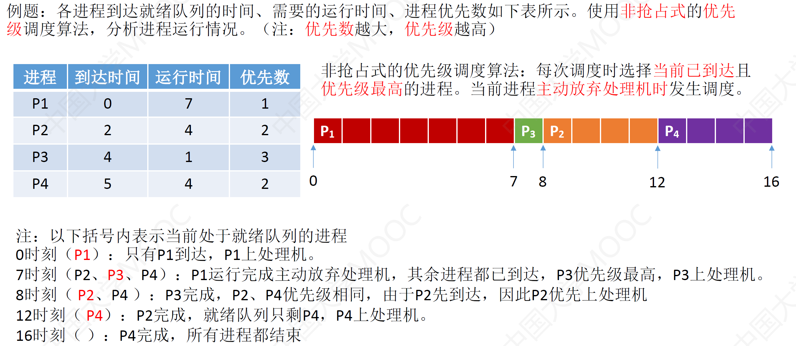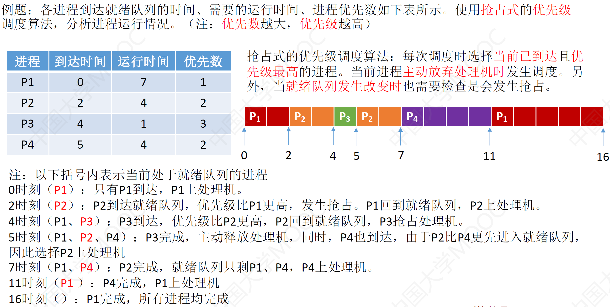

#### **多级反馈队列调度算法**

**算法规则**

1. 设置多级就绪队列，优先级从高到低，时间片从小到大
2. **新进程**到达时先进入**第1级队列**，按**FCFS**原则排队等待被分配时间片。若用完时间片进程还**未结束**，则进程进入**下一级队列队尾**。如果此时**已经在最下级的队列**，则重新放回**最下级队列队尾**。
3. 只有k级队列为空时，才会为k+1级对头的进程分配时间片
4. 被抢占处理机的进程放到原进程的队尾

是否抢占：抢占式的算法。在k级队列的进程运行过程中，若更上级的队列（1~k-1级）中进入了一个新进程，则由于新进程处于优先级更高的队列中，因此新进程会抢占处理机，原来运行的进程放回k级队列队尾。

**优点**

- 对各类型进程相对公平(FCFS的优点)
- 每个新到达的进程都可以很快就得到响应(RR的优点)
- 短进程只用较少的时间就可完成(SPF的优点)
- 不必实现估计进程的运行时间(避免用户作假)
- 可灵活地调整对各类进程的偏好程度，比如CPU密集型进程、I/0密集型进程
- (拓展:可以将因I/0而阻塞的进程重新放回原队列，这样I/0型进程就可以保持较高优先级)

**缺点**：可能会导致饥饿

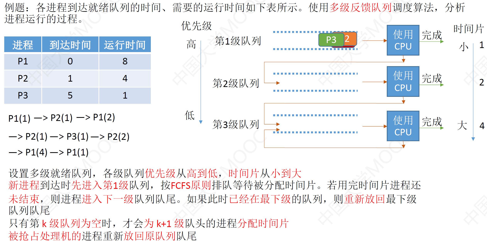

------

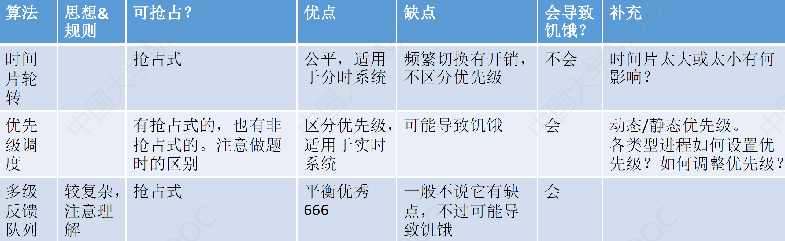

------

#### **多级队列调度算法**

按进程类型设置多个队列，进程创建成功后插入某个队列

队列之间采用固定优先级或者时间片划分

各级队列可采用不同的调度策略

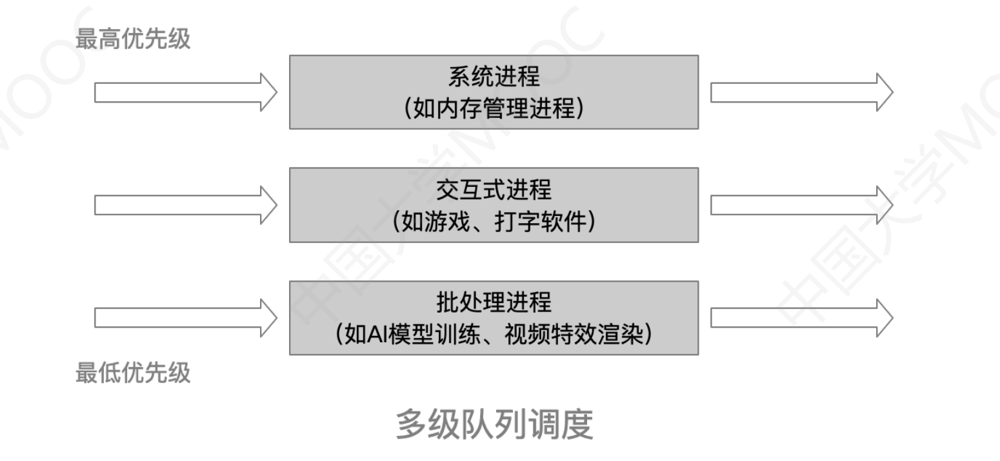

## 进程同步、互斥

### **进程同步**

进程具有异步性的特征。异步性是指，各并发执行的进程以各自独立的、不可预知的速度向前推进。
操作系统要提供“进程同步机制”来解决异步问题

### **进程互斥**

**四个部分**

1. 进入区
   检查是否可以进入临界区，如可进入，则进行上锁操作
2. 临界区
   访问临界资源的代码
3. 退出区
   负责“解锁”
4. 剩余区
   其余代码部分

**遵循原则**

1. 空闲让进。临界区空闲时，可以允许-一个请求进入临界区的进程立即进入临界区;
2. 忙则等待。当己有进程进入临界区时，其他试图进入临界区的进程必须等待; 
3. 有限等待。对请求访问的进程，应保证能在有限时间内进入临界区(保证不会饥饿) ;
4. 让权等待。当进程不能进入临界区时，应立即释放处理机，防止进程忙等待。

### 进程互斥的软件实现方法

#### 单标志法

算法思想：两个进程在访问完临界区后会把使用临界区的权限转交给另一个进程。也就是说每个进程进入临界区的权限只能被另一个进程赋予

#### 双标志先检查法

算法思想:设置一个布尔型数组flag[],数组中各个元素用来标记各进程想进入临界区的意愿，比如“flag[0] = ture”意味着0号进程PO现在想要进入临界区。每个进程在进入临界区之前先检查当前有没有别的进程想进入临界区，如果没有，则把自身对应的标志flag[i]设为true,之后开始访问临界区。

#### 双标志后检查法

算法思想:双标志先检查法的改版。前一一个算法的问题是先"检查”后“上锁”，但是这两个操作又无法一气呵成，因此导致了两个进程同时进入临界区的问题。因此，用先“上锁”后“检查”的方法，来避免上述问题。

双标志后检查法虽然解决了“忙则等待”的问题，但是又违背了“空闲让进”和“有限等待”原则，会因各进程都长期无法访问临界资源而产生“饥饿”现象。

#### Peterson算法

算法思想：结合双标志单标志法，如果双方都想进入临界区。

Peterson算法用软件方法解决了进程互斥问题，遵循了空闲让进、忙则等待、有限等待三个原则，但是依然未遵循让权等待的原则。

### 进程互斥的硬件实现方法

####  中断屏蔽方法

利用“开/关中断指令”实现(与原语的实现思想相同，即在某进程开始访问临界区到结束访问为止都不允许被中断，也就不能发生进程切换，因此也不可能发生两个同时访问临界区的情况)。

优点：简单、高效

缺点：不适用于多处理机；只适用于操作系统内核进程。

#### TestAndSet指令（TS|TSL指令）

简称TS指令，也有地方称为TestAndSetLock指令，或TSL指令
TSL指令是用硬件实现的，执行的过程不允许被中断，只能一气呵成。以下是用C语言描述的逻辑

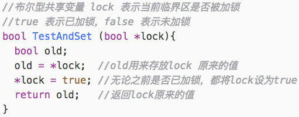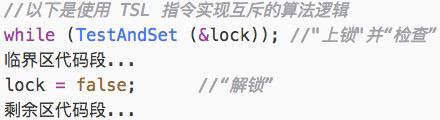

若刚开始lock是false，则TSL返回的old值为false，while循环条件不满足，直接跳过循环，进入临界区。若刚开始lock是true，则执行TLS后old返回的值为true，while循环条件满足，会一直循环，直到当前访问临界区的进程在退出区进行“解锁”。

相比软件实现方法，TSL指令把“上锁”和“检查”操作用硬件的方式变成了一气呵成的原子操作。
**优点**：实现简单，无需像软件实现方法那样严格检查是否会有逻辑漏洞；适用于多处理机环境
**缺点**：不满足“让权等待”原则，暂时无法进入临界区的进程会占用CPU并循环执行TSL指令，从
而导致“忙等”。

#### swap指令

有的地方也叫Exchange指令，或简称XCHG指令。
Swap指令是用硬件实现的，执行的过程不允许被中断，只能一气呵成。以下是用C语言描述的逻辑

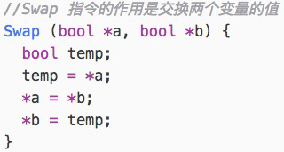

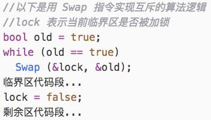

逻辑上来看Swap和TSL并无太大区别，都是先记录下此时临界区是否已经被上锁（记录在old变量上），再将上锁标记lock设置为true，最后检查old，如果old为false则说明之前没有别的进程对临界区上锁，则可跳出循环，进入临界区。

**优点**：实现简单，无需像软件实现方法那样严格检查是否会有逻辑漏洞；适用于多处理机环境
**缺点**：不满足“让权等待”原则，暂时无法进入临界区的进程会占用CPU并循环执行TSL指令，从
而导致“忙等“。

### 锁

#### 互斥锁

解决临界区最简单的工具就是互斥锁(mutex lock)。一个进程在进入临界区时应获得锁;
在退出临界区时释放锁。函数acquire()获得锁，而函数release()释放锁。

**特性:**

- 需忙等，进程时间片用完才下处理机，违反“让权等待”
- 优点:等待期间不用切换进程上下文，多处理器系统中，若上锁的时间短，则等待代价很低
- 常用于受处理器系统，一个核忙等，其他核照常工作，并快速释放临界区
- 不太适用于单处理机系统，忙等的过程中不可能解锁

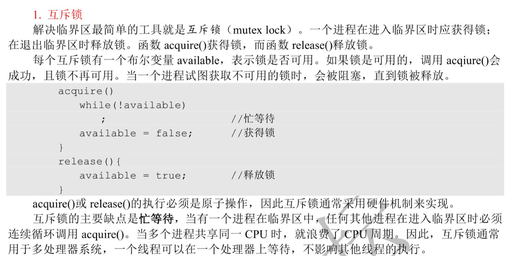

### 信号量机制

用户进程可以通过使用操作系统提供的一对原语来对信号量进行操作，从而很方便的实现了进程互斥、进程同步。

信号量其实就是一个变量(可以是一个整数，也可以是更复杂的记录型变量)，可以用一个信号量来表示系统中某种资源的数量，比如:系统中只有一台打印机，就可以设置一个初值为1的信号量。

一对原语: wait(S) 原语和signal(S)原语，可以把原语理解为我们自己写的函数，函数名分别为wait和signal,括号里的信号量S其实就是函数调用时传入的一个参数。

#### 整形信号量

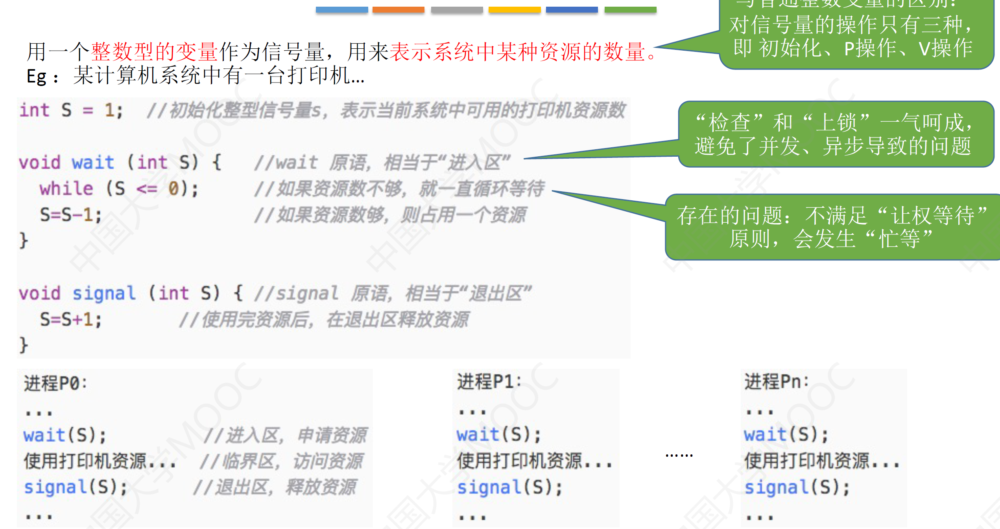

缺陷：忙等，不满足让权等待

#### 记录型信号量

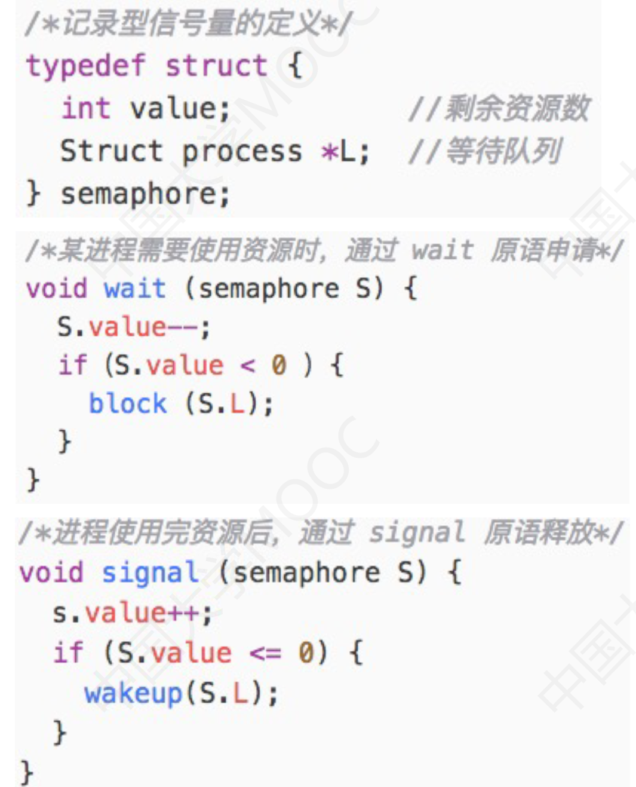

S.value的初值表示系统中某种资源的数目。

对信号量S的**一次P操作**意味着进程**请求一个单位的该类资源**，因此需要执行S.value--，表示资源数减1，当S.value < 0时表示该类资源已分配完毕，因此进程应**调用block**原语进行自我阻塞（当前运行的进程从**运行态->阻塞态**），主动放弃处理机，并**插入该类资源的等待队列**S.L中。可见，该机制遵循了“让权等待”原则，不会出现“忙等”现象。
对信号量S的**一次V操作**意味着进程**释放一个单位的该类资源**，因此需要执行S.value++，表示资源数加1，若加1后仍是S.value <= 0，表示依然有进程在**等待**该类资源，因此应**调用wakeup原语**唤醒**等待队列中的第一个进程**（被唤醒进程从阻塞态->就绪态）。

#### 用信号量机制实现进程互斥、同步、前驱关系

##### **生产者消费者问题**

系统中有一组生产者进程和一组消费者进程，生产者进程每次生产一个产品放入缓冲区，消费者进程每次从缓冲区中取出一个产品并使用。（注：这里的“产品”理解为某种数据）
生产者、消费者共享一个**初始为空、大小为n的缓冲区**。

只有**缓冲区没满**时，生产者才能把产品放入缓冲区，否则必须等待。===>缓冲区没满->生产者生产
只有**缓冲区不空**时，消费者才能从中取出产品，否则必须等待。===>缓冲区不空->消费者消费
缓冲区是临界资源，各进程必须**互斥地访问**

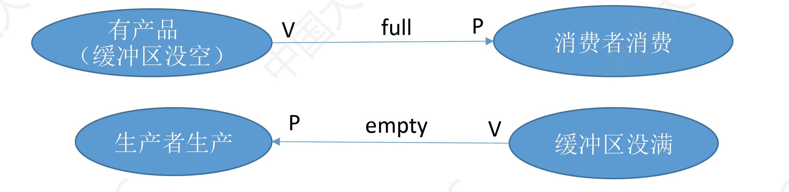

```C
semaphore mutex = 1；	// 互斥访问
semaphore full = 0;		// 同步信号量，表示非空缓冲区数量
semaphore empty = n;	// 同步信号量，表示空闲缓冲区的数量
```

```C
producer (){
	while(1){
		生产一个产品;
		P(empty);		// 消耗一个空闲缓冲区
		P(mutex);
		把产品放入缓冲区;
		V(mutex);
		V(full);		// 增加一个产品
	}
}

consumer (){
	while(1){
		P(full);		// 消耗一个产品
		P(mutex);
		从缓冲区取出一个产品;
		V(mutex);
		V(empty);		// 增加一个空闲缓冲区
		使用产品;
	}
}
```

注：不可改变P操作的顺序，即实现互斥操作的P一定要在实现同步操作的P之后。否则会导致死锁。

##### **多生产者多消费者**

例：桌子上有一只盘子，每次只能向其中放入一个水果。爸爸专向盘子中放苹果，妈妈专向盘子中放橘子，儿子专等着吃盘子中的橘子，女儿专等着吃盘子中的苹果。只有盘子空时，爸爸或妈妈才可向盘子中放一个水果。仅当盘子中有自己需要的水果时，儿子或女儿可以从盘子中取出水果。

分析：

互斥关系：对缓冲区（盘子）的访问要互斥地进行

同步关系：

1. 父亲将苹果放入盘子后，女儿才能取苹果
2. 母亲将橘子放入盘子后，儿子才能取橘子
3. 只有**盘子为空**时，父亲或母亲才能放入水果

```c
semaphore mutex = 1; //实现互斥访问盘子（缓冲区）
semaphore apple = 0; //盘子中有几个苹果
semaphore orange = 0; //盘子中有几个橘子
semaphore plate = 1; //盘子中还可以放多少个水果
```

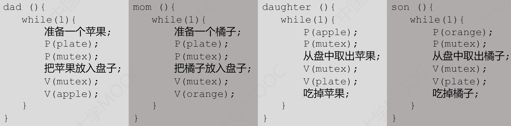

即使不设置互斥信号量，也不会出现多个进程同时访问盘子的现象

原因在于：本题中的缓冲区大小为1，在任何时刻，apple、orange、plate三个同步信号量中最多只有一个是1。因此在任何时刻，最多只有一个进程的P操作不会被阻塞，并顺利地进入临界区。（在其他缓冲区为1的问题上并不绝对）

**如果盘子（缓冲区）容量为2**，就必须专门设置一个互斥信号量mutex来保证互斥访问缓冲区。

##### **读者写者问题**

有读者和写者两组并发进程，共享一个文件，当两个或两个以上的读进程同时访问共享数据时不会产生副作用，但若某个写进程和其他进程（读进程或写进程）同时访问共享数据时则可能导致数据不一致的错误。
因此要求：①允许多个读者可以同时对文件执行读操作；②只允许一个写者往文件中写信息；③任一写者在完成写操作之前不允许其他读者或写者工作；④写者执行写操作前，应让已有的读者和写者全部退出。

写与写、读与写之间存在互斥关系

```c
semaphore rw = 1;	// 对共享文件的互斥访问
int count = 0;		// 读进程数量
semaphore mutex = 1;// 对count变量的互斥访问
```

```c
writer(){
	while(1){
		P(rw);
		写文件;
		V(rw);
	}
}

reader(){
    while(1){
        P(mutex)
        if(count == 0){
            P(rw);
        }
        count++;
        V(mutex);
        读文件;
		P(mutex);
        count--;
        if(count == 0){
            V(rw);
        }
        V(mutex);
    }
}
```

潜在的问题：只要有读进程还在读，写进程就要一直阻塞等待，可能“饿死”。因此，这种算法中，读进程是优先的。

```c
semaphore rw = 1;	// 对共享文件的互斥访问
int count = 0;		// 读进程数量
semaphore mutex = 1;// 对count变量的互斥访问
semaphore w = 1;	// 用于实现写优先
```

```
writer(){
	while(1){
		P(w);
		P(rw);
		写文件;
		V(rw);
		V(w);
	}
}

reader(){
    while(1){
    	P(w);
        P(mutex)
        if(count == 0){
            P(rw);
        }
        count++;
        V(mutex);
        V(w);	
        读文件;
		P(mutex);
        count--;
        if(count == 0){
            V(rw);
        }
        V(mutex);
    }
}
```

分析以下情况

读者1->读者2
写者1->写者2
写者1->读者1
读者1->写者1->读者2
写者1->读者1->写者2

##### **哲学家进餐问题**

一张圆桌上坐着5名哲学家，每两个哲学家之间的桌上摆一根筷子，桌子的中间是一碗米饭。哲学家们倾注毕生的精力用于思考和进餐，哲学家在思考时，并不影响他人。只有当哲学家饥饿时，才试图拿起左、右两根筷子（一根一根地拿起）。如果筷子已在他人手上，则需等待。饥饿的哲学家只有同时拿起两根筷子才可以开始进餐，当进餐完毕后，放下筷子继续思考。

1. 关系分析。系统中有5个哲学家进程，5位哲学家与左右邻居对其中间筷子的访问是互斥关系。
2. 整理思路。这个问题中只有互斥关系，但与之前遇到的问题不同的事，每个哲学家进程需要同时持有两个临界资源才能开始吃饭。如何避免临界资源分配不当造成的死锁现象，是哲学家问题的精髓。
3. 信号量设置。定义互斥信号量数组chopstick[5]={1,1,1,1,1}用于实现对5个筷子的互斥访问。并对哲学家按0~4编号，哲学家i左边
   的筷子编号为i，右边的筷子编号为(i+1)%5。

```c
semaphore chopstick[5]={1,1,1,1,1};
semaphore mutex = 1; //互斥地取筷子
Pi (){ //i号哲学家的进程
	while(1){
		P(mutex);
		P(chopstick[i]); //拿左
		P(chopstick[(i+1)%5]); //拿右
		V(mutex);
		吃饭…
		V(chopstick[i]); //放左
		V(chopstick[(i+1)%5]); //放右
		思考…
	}
}
```

更准确的说法应该是：各哲学家拿筷子这件事必须互斥的执行。这就保证了即使一个哲学家在拿筷子拿到一半时被阻塞，也不会有
别的哲学家会继续尝试拿筷子。这样的话，当前正在吃饭的哲学家放下筷子后，被阻塞的哲学家就可以获得等待的筷子了。

### 管程

#### **为什么引入**

信号量机制存在问题：编写程序容易出错

是一种高级的同步机制

#### 定义和基本特征

