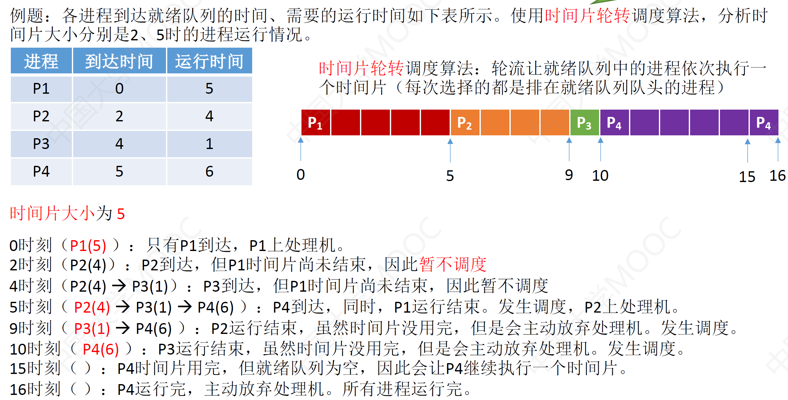
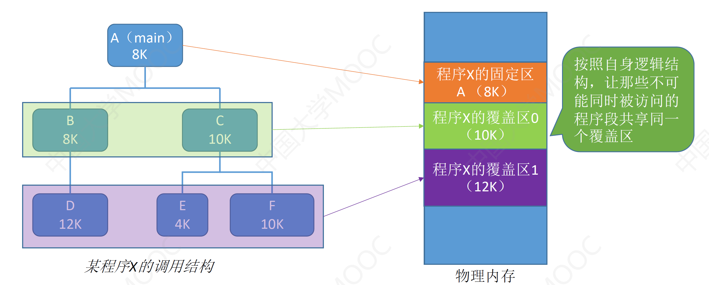
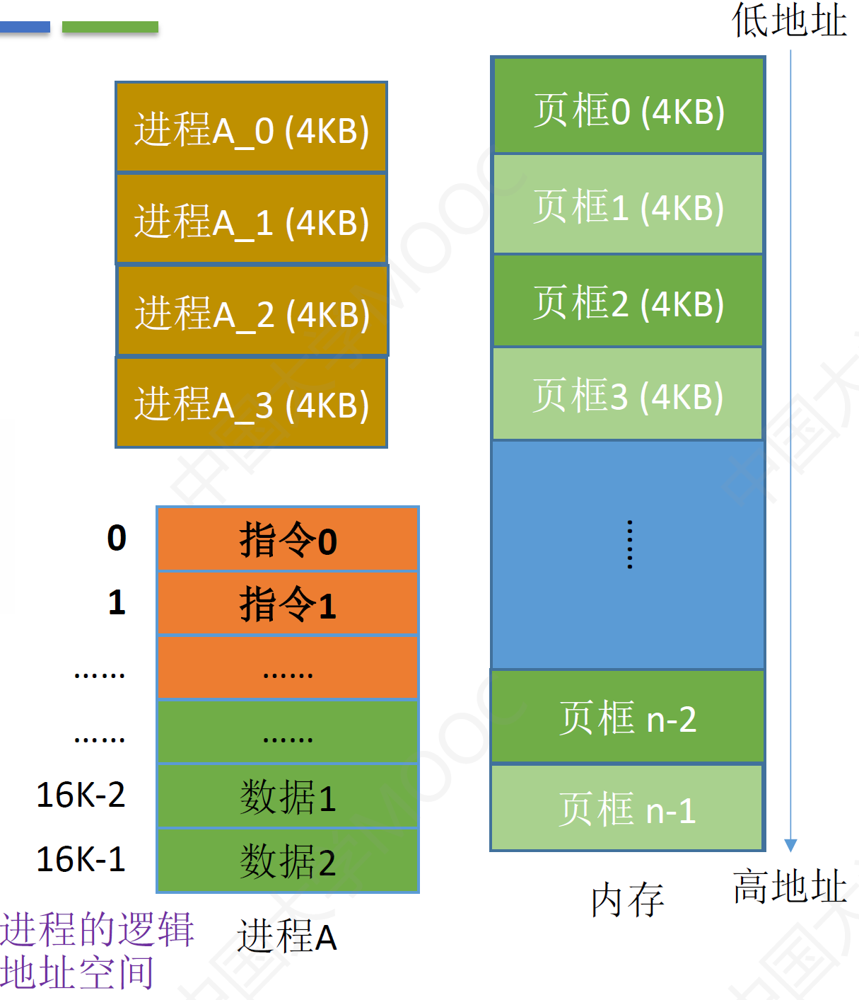

# 计算机操作系统

# CH1 操作系统引论 

**操作系统的工作**

1. 程序的执行
2. 完成与硬件有关的工作
3. 完成与硬件无关的工作
4. 计算机系统的效率与安全问题


## OS的目标和作用

### OS的目标

- **方便性**	使计算机更容易使用
- **有效性**	提高CPU IO设备利用率、组织工作流程（架构与算法）
- 可拓展性
   如何才有可扩充性？
  - 采用层次结构
  - 扩展=模块+层次
- 开放性

### OS的作用

- OS作为用户和计算机硬件系统的接口
- OS作为计算机资源的管理者
- OS实现了对计算机资源的抽象

**OS作为用户和计算机硬件系统的接口**

用户可以通过..使用计算机

- 命令方式
- 图标、窗口方式（GUI）
- 系统调用方式（程序接口）


**OS作为计算机资源的管理者**

资源可以分为四类

- 处理器
- 存储器
- I/O设备
- 信息（数据和程序） 

**OS实现了对计算机资源的抽象**

虚拟性是SO的基本特征之一

> Q：如何实现OS的虚拟性
>
> Ans：抽象硬件资源

## OS的发展过程

20c50	第一个简单的批处理系统
20c60	多道程序批处理系统，分时系统
20c80-90 微型机、多处理机、计算机网络大发展年代→微机OS、多处理机OS和网络OS的形成和大发展年代

### 无OS的计算机系统

- 人工操作方式（打孔纸带）
  - 用户独占全机
  - CPU等待人工操作
- 脱机输入/输出方式
  本质就是把输入提前放到磁带机，主机输出也放到磁带机
  - 减少CPU的空闲时间
  - 提高了I/O速度

###  单道批处理系统

是OS的前身

把**一批作业**以脱机方式输入到磁带上
在监督程序的控制下使得这批作业**一个接一个**地连续处理

### 多道批处理系统

用户提交的作业事先放在外村上，形成“后备队列”
作业调度程序按照一定算法从后备队列中**选择若干作业**调入内存（不一定是顺序调入）

- 提高CPU利用率	原因：运行程序A时候，利用其因I/O操作时的CPU空档时间，再调度另一道程序B
- 提高内存和I/O设备的利用率
- 增加系统吞吐量

**特征**

- 多道性	多道程序在内存中并发执行
- 无序性	根据作业调度算法决定调用的先后顺序
- 调度性	作业提交到完成，经过两种调度：作业调度和进程调度

**优点**

- 资源利用率高
- 系统吞吐量大 系统吞吐量是指系统在单位时间内所完成的总工作量

**缺点**

- 平均周转时间长	作业周转时间是指从作业进入系统（提交）开始，直至它完成并退出系统为止所经历的时间
- 无交互能力

### 分时系统

指在一台主机上连接多个带有显示器和键盘的终端，同时允许多个用户通过自己的终端，以交互方式使用计算机，共享主机中的资源。 

**关键问题**
因为有很多用户，必须做到及时

- 及时接收
- 及时处理

**特征**

- 多路性	一台主机连接多个终端
- 独立性	终端彼此独立
- **及时性**	用户请求在很短时间内获得响应
- 交互性	用户通过终端与系统进行广泛的对话

### 实时系统

指系统能及时响应外部事件的请求，在规定时间内完成该事件的处理，并控制所有实时任务协调一致地运行。

**应用需求**

1. 实时控制
2. 实时信息处理

### 实时系统

实时系统与分时系统特征的比较 

1. 多路性	实时系统的多路性主要表现在：系统经常对多路的现场信息进行采集，以及对多个对象或多个执行机构进行控制。 
2. 独立性	实时系统中对信息的采集和对对象的控制，也都是彼此互不干扰 
3. 及时性	实时系统的及时性，是以控制对象所要求的开始截止时间或完成截止时间来确定的。**一般为秒级、百毫秒级直至毫秒级，甚至有的要低于100微秒。** 
4. 交互性	实时系统的交互性仅限于访问系统中某些特定的专用服务程序，不象分时系统那样能向终端用户提供数据处理服务、资源共享等服务。 
5. 可靠性	实时系统要求**系统高度可靠**，往往采用多级容错措施来保证系统的安全性及数据的安全性。 

## 操作系统的基本特征

1. 并发（Concurrence） 
2. 共享（Sharing） 
3. 虚拟（Virtual） 
4. 异步（Asynchronism）

### 并发 

**最重要的特征，其他三个都是以并发为前提的**

<font color=red>**并行与并发**</font>

并行性——两个或多个事件在**同一时刻**发生。 
并发性——两个或多个事件在**同一时间间隔**内发生。 

​    在多道程序环境下，并发性是指在一段时间内，**宏观上有多个程序在同时运行**，但在**单处理机系统中，每一时刻却只能有一道程序执行**，故微观上这些程序只能是**分时地交替执行**。若计算机系统中有多个处理机，则这些可以并发执行的程序可被分配到多个处理机上，实现并行执行。

<font color=red>并发是通过单通道交替执行实现的</font>

**进程**
与并发紧密相连的概念

是指在系统中能独立运行并作为资源分配的基本单位，它是由**一组机器指令、数据和堆栈**等组成的，是一个**活动实体**。

通常的程序是静态实体，它是不能并发执行的。为了使程序能并发执行，系统必须分别为每个程序建立进程（Process)

多个进程之间可以并发执行和交换信息

### 共享

共享是指系统中的资源可供内存中多个并发执行的进程（线程）共同使用。 

**资源共享方式**

1. 互斥共享方式
   1. 临界资源要求被互斥地共享
      **临界资源**是指每次仅允许一个进程访问的资源（例如打印机、消息缓冲队列、变量、数组）
2. 同时访问方式
   1. 对于共享资源
   2. **“同时”往往是宏观上的**，而微观上，这些进程可能是**交替地**对该资源进行访问

### 并发与共享的关系

是操作系统的两个最基本的特征
是互为存在条件的

资源的共享是**以进程的并发执行为条件的**，若系统不允许程序并发执行，自然不存在资源共享问题； 
若系统**不能对资源共享实施有效管理**，协调好诸进程对共享资源的访问，**也必然影响到程序并发执行的程度，甚至根本无法并发执行。** 

### 虚拟

虚拟——是指通过某种技术把一个物理实体变为若干个逻辑上的对应物

OS中利用了多种虚拟技术，分别用来实现虚拟处理机、虚拟内存、虚拟外部设备和虚拟信道等。 

例：

- 利用多道程序设计技术，把一台物理上的CPU虚拟为**多台逻辑上的CPU**，也称为**虚拟处理机**。 
- 利用虚拟存储技术，将一台机器的**物理内存变为虚拟存储器**，以便在逻辑上扩充存储器的容量。 
- 通过虚拟设备技术，将一台物理I/O设备虚拟为多台逻辑上的I/O设备(如，Apple远程光盘)，允许每个用户占用一台逻辑上的I/O设备，这样便可使原来在一段时间仅允许一个用户访问的设备（即临界资源），变为在**一段时间内允许多个用户同时访问的共享设备**。例如，虚拟打印机。 

### 异步

​    内存中的每个进程在何时能获得处理机运行，何时又因提出某种资源请求而暂停，以及进程以怎样的速度向前推进，每道程序总共需要多少时间才能完成等等，都是不可预知的
​	很可能是先进入内存的作业后完成，而后进入内存的作业先完成，或者说，进程是以人们不可预知的速度向前推进，此即进程的异步性。 

## 操作系统的主要功能

### 处理机管理

在传统的多道程序设计系统中，处理机的分配和运行，都是以进程为基本单位的
在引入线程的OS中，还包含对线程的管理

- 进程控制	创建和撤销进程（线程）
- 进程同步	对诸进程（线程）的运行进行协调
- 进程通信	实现进程（线程）之间的信息交换
- 进程调度（处理机调度）	按照一定的算法把处理机分配给进程（线程）

### 存储器管理

- 内存分配 (静态 、动态分配方式 )
- 内存保护 (硬件检查越界（segment fault）,软件处理)
- 地址映射 (逻辑、物理地址，硬件支持)
- 内存扩充 (虚拟存储技术)

### 设备管理

**任务**

- 完成进程提出的I/O请求；
- 为用户进程分配其所需的I/O设备；
- 提高CPU和I/O设备的利用率；
- 提高I/O速度；
- 方便用户使用I/O设备。

**功能**

- 缓冲管理
  在设备和CPU之间引入缓冲，可有效地缓和CPU和I/O设备速度不匹配的矛盾（硬盘是影响整体速度的一个重要原因），提高CPU的利用率，进而提高系统的吞吐量
- 设备分配
- 设备处理（设备驱动程序）

### 文件管理

功能

- 文件存储空间的管理
- 目录管理
- 文件的读/写管理和保护

## 操作系统的结构设计

传统的操作系统结构

- 第一代的OS是无结构的 
- 第二代OS采用了模块式结构 
- 第三代OS是层次式结构 

20世纪90年代中期后

- 第四代OS采用微内核结构 

### **微内核OS结构——现代OS结构** 

微内核结构能有效地支持多处理机运行，故非常使用于分布式系统环境

在与微内核技术发展的同时，**客户/服务器技术**、**面向对象技术**也在迅速发展，把它们应用到基于微内核结构的OS中，便具有了**以微内核为OS核心，以客户/服务器为基础，并且采用了面向对象的程序设计方法的特征。** 

**微内核技术**

- 微内核运行在核心态； 
- 开机后常驻内存（这就是为什么有程序调试有段错误）； 
- **并非一个完整的OS**，而只是为构建通用OS提供一个重要基础； 
- 常采用客户/服务器模式，OS的大部分功能和服务，都由若干服务器提供。 （这就是我们看到Windows中有各种service）

# CH2 进程的控制与描述

## 进程的基本概念

### 前驱图和顺序执行

**顺序执行有两层含义：**

- 外部顺序性
  对于多个用户程序来说，所有程序是依次执行的。
- 内部顺序性
  对于一个程序来说，它的所有指令是按序执行的。

**顺序程序执行的特征**

1. 顺序性
2. 封闭性
   1. 程序运行时独占全机资源，资源的状态（除初始态外）只有本程序才能改变它。
   2. 程序一旦开始执行，其执行结果不受外界影响。 
3. 可再现性

**程序并发有两层含义**

- 内部顺序性
  对于一个程序来说，它的所有指令是按序执行的。
- 外部顺序性
  对于多个程序来说，是交叉执行的。

<font color="red">只有不存在前趋关系的程序之间才有可能并发执行</font>

**并发执行的特征**

1. 间断性
2. 失去封闭性
   程序在并发执行时，由于多个程序共享系统资源，因而这些资源的状态将由多个程序来改变，致使程序的运行已失去了封闭性。 
3. 不可再现性

## 进程

### 进程的组成

**PCB**


#### **进程的组织方式**

- 链接方式
- 索引方式

<font color=red>PCB是进程存在的唯一标志</font>

### **进程的状态**

- 创建态 创建完成后便进入就绪态
- 就绪态
- 运行态 进程在CPU上运行
- 阻塞态
  在进程运行的过程中，可能会请求等待某个事件的发生。在这个事件发生之前，进程无法继续往下执行，此时操作系统会
  让这个进程下CPU，并让它进入“阻塞态”
- 终止态 执行exit系统调用

#### **进程状态的转换**


### **什么是进程控制**

进程控制的主要功能是对系统中的所有进程实施有效的管理，它具有创建新进程、撤销已有进程、实现
进程状态转换等功能。

使用原语来实现进程控制

原语的执行具有原子性，即执行过程只能一气呵成，期间不允许被中断。
可以用“**关中断指令**”和“**开中断指令**”这两个特权指令实现原子性

#### **进程控制相关原语**

**进程创建**


**进程终止**


**进程的阻塞和唤醒**


**进程的切换**


### 进程通信

#### 共享存储

**基于存储区**：各个应用对共享存储区的访问应该是互斥的


**基于数据结构**

比如共享空间里只能放一个长度为10的数组。这种共享方式速度慢、限制多，是一种低级通信方式

#### 消息传递

通过操作系统提供的“发送消息/接收消息”原语进行数据交换

- 直接通信方式
  
- 间接通信方式
  

#### 管道通信

只支持半双工通信
如果要实现双向通信，则需要两个管道

当管道写满时，写进程将阻塞，直到读进程将管道中的数据取走，即可唤醒写进程
当管道读空时，读进程将阻塞，直到写进程往管道中写入数据，即可唤醒读进程

管道中的数据一旦被读出，就彻底消失。因此，当多个进程读同一个管道时，可能会错乱。对此，通常
有两种解决方案：

1. 一个管道允许多个写进程，一个读进程
2. 允许有多个写进程，多个读进程，但系统会让各个读进程轮流从管道中读数据（Linux的方案）

## 线程

线程是处理机的调度单位

### **为什么要引入线程？**


可以理解为轻量级进程

线程是一个基本的CPU执行单元，也是程序执行流的最小单位

引入线程之后，不仅是进程之间可以并发，进程内的各线程之间也可以并发，从而进一步提升了系统的并发度，使得一个进程内也可以并发处理各种任务

引入线程后，进程只作为除CPU之外的系统资源的分配单元（如打印机、内存地址空间等都是分配给进程的）

**线程**则作为**处理机的分配单元**

### 线程的属性

- 线程是处理机调度的单位
- 多CPU计算机中，不同线程可占用不同的CPU
- 每个线程都有一个线程ID，线程控制块（TCB）
- 线程也有就绪、运行、阻塞三种基本状态
- 线程几乎不拥有系统资源
- 同一进程的不同线程，共享进程资源
- 同一进程间的线程的通信无需系统干预
- 同一进程的线程的切换，不会影响进程的切换，**开销比较小**
- 不用进程的线程间的切换，会引起进程切换，**系统开销大**

### 实现方式

**用户级线程**

 

**内核级线程**

管理工作由操作系统完成

内核级线程的切换在核心态下才能完成

操作系统会为每个内核级线程建立相应的TCB（Thread Control Block，线程控制块），通过TCB对线程进行管理。“内核级线程”就是“从操作系统内核视角看能看到的线程”

**优点**：当一个线程被阻塞后，别的线程还可以继续执行，并发能力强。多线程可在多核处理机上并行执行。
**缺点**：一个用户进程会占用多个内核级线程，线程切换由操作系统内核完成，需要切换到核心态，因此线程管理的成本高，开销大。


### 多线程模型

#### **一对一**

一个用户级线程映射到一个内核级线程。每个用户进程有与用户级线程同数量的内核级线程

**优点**：当一个线程被阻塞后，别的线程还可以继续执行，并发能力强。多线程可在多核处理机上并行执行。
**缺点**：一个用户进程会占用多个内核级线程，线程切换由操作系统内核完成，需要切换到核心态，因此线程管理的成本高，开销大。


#### **多对一**

多个用户级线程映射到一个内核级线程。且一个进程只被分配一个内核级线程。

**优点**：用户级线程的切换在用户空间即可完成，不需要切换到核心态，线程管理的系统开销小，效率高
**缺点**：当一个用户级线程被阻塞后，整个进程都会被阻塞，并发度不高。多个线程不可在多核处理机上并行运行

操作系统只“看得见”内核级线程，因此<font color="red">只有内核级线程才是处理机分配的单位。</font>


#### **多对多**

n用户及线程映射到m个内核级线程（n >= m）。每个用户进程对应m个内核级线程。

克服了多对一模型并发度不高的缺点（一个阻塞全体阻塞），又克服了一对一模型中一个用线程库 户进程占用太多内核级线程，开销太大的缺点。


### 线程的状态与转换


### **线程的组织**

**线程控制块 TCB** (Thread Control Block)


## 调度

### 处理机调度	

#### **调度的三个层次**

1. 高级调度（作业调度）
   按一定的原则从外存的作业后备队列中挑选一个作业调入内存，并创建进程。每个作业只调入一次，调出一次。作业调入时会建立PCB，调出时才撤销PCB。
2. 中级调度（内存调度）
   按照某种策略决定将哪个处于挂起状态的进程重新调入内存。
   一个进程可能会被多次调出、调入内存，因此中级调度发生的频率要比高级调度更高。
3. 低级调度（进程调度）
   按照某种策略从就绪队列中选取一个进程，将处理机分配给它。

三层调度的联系与对比


**七状态模型**


### 进程调度时机、切换与过程、方式

#### **进程调度（低级调度）的时机**

进程调度是按照某种算法从就绪队列中选择一个进程为其分配处理机

需要进行进程调度与切换的情况

1. 当前进程主动放弃
   1. 进程正常终止
   2. 运行过程中发生异常而终止
   3. 进程主动请求阻塞（如等待I/O）

2. 当前进程被动放弃
   1. 分给进程的时间片用完
   2. 有更紧急的事需要处理（如I/O中断）
   3. 有更高优先级的进程进入就绪队列


**不能进行进程调度与切换的情况**

1. 在处理**中断的**过程中。中断处理过程复杂，与硬件密切相关，很难做到在中断处理过程中进行进程切换。

2. 进程在**操作系统内核程序临界区**中。
3. 在**原子操作**过程中（原语）。原子操作不可中断，要一气呵成（如
    之前讲过的修改PCB中进程状态标志，并把PCB放到相应队列）

#### 进程调度方式

1. **非剥夺调度方式，又称非抢占方式。**即，只允许进程主动放弃处理机。在运行过程中即便有更紧迫的任务到达，当前进程依然会继续使用处理机，直到该进程终止或主动要求进入阻塞态。
   适合早期批处理系统
2. **剥夺调度方式，又称抢占方式**。当一个进程正在处理机上执行时，如果有一个更重要或更紧迫的进程需要使用处理机，则立即暂停正在执行的进程，将处理机分配给更重要紧迫的那个进程。
   可以优先处理更紧急的进程，也可实现让各进程按时间片轮流执行的功能（通过时钟中断）。适合于分时操作系统、实时操作系统

### 调度器/调度程序

#### 调度时机——什么事件会触发“调度程序”？

1. 创建新进程
2. 进程退出
3. 运行进程阻塞
4. I/O中断发生（可能唤醒某些阻塞进程）

#### **闲逛进程**

调度程序永远的备胎，没有其他就绪进程时，运行闲逛进程（idle）

**特性**

- 优先级最低
- 可以是0地址指令，占一个完整的指令周期（指令周期末尾例行检查中断）
- 能耗低

### 调度算法的评价指标

**CPU利用率**

$利用率=\frac{忙碌的时间}{总时间}$

**系统吞吐量**

单位时间内完成的作业的数量

$系统吞吐量=\frac{总共完成了多少道作业}{总共花了多少时间}$

**周转时间**

从作业被提交给系统开始，到作为完成为止的这段时间间隔

$平均周转时间=\frac{作业周转时间之和}{作业数量}$

$带权周转时间=\frac{作业周转时间}{作业实际运行的时间}$

周转时间与带权周转时间都是越小越好

**等待时间**

指进程/作业处于等待处理机状态时间之和，等待时间越长，用户满意度越低

- 对于**进程**来说，等待时间就是指进程建立后等待被服务的时间之和，在等待I/O完成的期间其实进程也是在被服务的，所以不计入等待时间。
- 对于**作业**来说，不仅要考虑建立进程后的等待时间，还要加上作业在外存后备队列中等待的时间。

**响应时间**

指从用户提交请求到首次产生响应所用的时间

### 调度算法

#### **先来先服务（FCFS）**

**算法规则**：按照作业/进程到达的先后顺序进行服务

**优点**：公平、算法实现简单
**缺点**：排在长作业（进程）后面的短作业需要等待很长时间，带权周转时间很大，对短作业来说用户体验不好。即，FCFS算法对长作业有利，对短作业不利


#### **短作业优先（SJF）**

**算法规则**：最短的作业/进程优先得到服务（所谓“最短”，是指**要求服务时间**最短）

**是否抢占**：SJF和SPF(短进程优先,Shortest Process First)是非抢占式的算法。但是也有抢占式的版本——最短剩余时间优先算法（SRTN, Shortest Remaining Time Next）

**优点**：“最短的”平均等待时间、平均周转时间
**缺点**：不公平。对短作业有利，对长作业不利。可能**产生饥饿**现象。另外，作业/进程的运行时间是由用户提供的，并不一定真实，不一定能做到真正的短作业优先


#### **高响应比优先（HRRN）**

**算法规则**：在每次调度时先计算各个作业/进程的**响应比**，选择响应比最高的作业/进程为其服务

$响应比=\frac{响应时间+要求服务时间}{要求服务时间}$

**是否为抢占式**：非抢占式的算法。因此只有当前运行的作业/进程主动放弃处理机时，才需要调度，才需要计算响应比

综合考虑了等待时间和运行时间（要求服务时间）
等待时间相同时，要求服务时间短的优先（SJF的优点）
要求服务时间相同时，等待时间长的优先（FCFS的优点）
对于长作业来说，随着等待时间越来越久，其响应比也会越来越大，从而**避免了长作业饥饿**的问题


------


注：这几种算法主要关心对用户的公平性、平均周转时间、平均等待时间等评价系统整体性能的指标，但是不关心“响应时间”，也并不区分任务的紧急程度，因此对于用户来说，交互性很糟糕。因此这三种算法一般适合用于早期的批处理系统，当然，FCFS算法也常结合其他的算法使用，在现在也扮演着很重要的角色

------

#### **时间片轮转（RR）**

**算法规则**：按照各进程到达就绪队列的顺序，轮流让各个进程执行一个时间片（如100ms）。若进程未在一个时间片内执行完，则剥夺处理机，将进程重新放到就绪队列队尾重新排队。

**用于作业/进程调度**：用于进程调度（只有作业放入内存建立了相应的进程后，才能被分配处理机时间片）

**是否抢占**：若进程未能在时间片内运行完，将被强行剥夺处理机使用权，因此时间片轮转调度算法**属于抢占式的算法**。由**时钟**
**装置**发出时钟中断来通知CPU时间片已到。

**优点**：公平；响应快，适用于分时操作系统；
**缺点**：由于高频率的进程切换，因此有一定开销；不区分任务的紧急程度。

适用于分时操作系统

时间片太大，则会退化为先来先服务算法，增大进程响应时间
时间片太小，会导致进程频繁切换，系统花在切换进程的时间上增多，实际执行时间变短



#### **优先级调度算法**

**算法规则**：每个作业/进程有各自的优先级，调度时选择优先级最高的作业/进程

**是否抢占**：都有。非抢占式只需在进程主动放弃处理机时进行调度即可，而抢占式还需在就绪队列变化时，检查是否会发生抢占。

**优点**：用优先级区分紧急程度、重要程度，适用于实时操作系统。可灵活地调整对各种作业/进程的偏好程度。
**缺点**：若源源不断地有高优先级进程到来，则可能导致饥饿


#### **多级反馈队列调度算法**

**算法规则**

1. 设置多级就绪队列，优先级从高到低，时间片从小到大
2. **新进程**到达时先进入**第1级队列**，按**FCFS**原则排队等待被分配时间片。若用完时间片进程还**未结束**，则进程进入**下一级队列队尾**。如果此时**已经在最下级的队列**，则重新放回**最下级队列队尾**。
3. 只有k级队列为空时，才会为k+1级对头的进程分配时间片
4. 被抢占处理机的进程放到原进程的队尾

是否抢占：抢占式的算法。在k级队列的进程运行过程中，若更上级的队列（1~k-1级）中进入了一个新进程，则由于新进程处于优先级更高的队列中，因此新进程会抢占处理机，原来运行的进程放回k级队列队尾。

**优点**

- 对各类型进程相对公平(FCFS的优点)
- 每个新到达的进程都可以很快就得到响应(RR的优点)
- 短进程只用较少的时间就可完成(SPF的优点)
- 不必实现估计进程的运行时间(避免用户作假)
- 可灵活地调整对各类进程的偏好程度，比如CPU密集型进程、I/0密集型进程
- (拓展:可以将因I/0而阻塞的进程重新放回原队列，这样I/0型进程就可以保持较高优先级)

**缺点**：可能会导致饥饿


------


------

#### **多级队列调度算法**

按进程类型设置多个队列，进程创建成功后插入某个队列

队列之间采用固定优先级或者时间片划分

各级队列可采用不同的调度策略


## 进程同步、互斥

### **进程同步**

进程具有异步性的特征。异步性是指，各并发执行的进程以各自独立的、不可预知的速度向前推进。
操作系统要提供“进程同步机制”来解决异步问题

### **进程互斥**

**四个部分**

1. 进入区
   检查是否可以进入临界区，如可进入，则进行上锁操作
2. 临界区
   访问临界资源的代码
3. 退出区
   负责“解锁”
4. 剩余区
   其余代码部分

**遵循原则**

1. 空闲让进。临界区空闲时，可以允许-一个请求进入临界区的进程立即进入临界区;
2. 忙则等待。当己有进程进入临界区时，其他试图进入临界区的进程必须等待; 
3. 有限等待。对请求访问的进程，应保证能在有限时间内进入临界区(保证不会饥饿) ;
4. 让权等待。当进程不能进入临界区时，应立即释放处理机，防止进程忙等待。

### 进程互斥的软件实现方法

#### 单标志法

算法思想：两个进程在访问完临界区后会把使用临界区的权限转交给另一个进程。也就是说每个进程进入临界区的权限只能被另一个进程赋予

#### 双标志先检查法

算法思想:设置一个布尔型数组flag[],数组中各个元素用来标记各进程想进入临界区的意愿，比如“flag[0] = ture”意味着0号进程PO现在想要进入临界区。每个进程在进入临界区之前先检查当前有没有别的进程想进入临界区，如果没有，则把自身对应的标志flag[i]设为true,之后开始访问临界区。

#### 双标志后检查法

算法思想:双标志先检查法的改版。前一一个算法的问题是先"检查”后“上锁”，但是这两个操作又无法一气呵成，因此导致了两个进程同时进入临界区的问题。因此，用先“上锁”后“检查”的方法，来避免上述问题。

双标志后检查法虽然解决了“忙则等待”的问题，但是又违背了“空闲让进”和“有限等待”原则，会因各进程都长期无法访问临界资源而产生“饥饿”现象。

#### Peterson算法

算法思想：结合双标志单标志法，如果双方都想进入临界区。

Peterson算法用软件方法解决了进程互斥问题，遵循了空闲让进、忙则等待、有限等待三个原则，但是依然未遵循让权等待的原则。

### 进程互斥的硬件实现方法

####  中断屏蔽方法

利用“开/关中断指令”实现(与原语的实现思想相同，即在某进程开始访问临界区到结束访问为止都不允许被中断，也就不能发生进程切换，因此也不可能发生两个同时访问临界区的情况)。

优点：简单、高效

缺点：不适用于多处理机；只适用于操作系统内核进程。

#### TestAndSet指令（TS|TSL指令）

简称TS指令，也有地方称为TestAndSetLock指令，或TSL指令
TSL指令是用硬件实现的，执行的过程不允许被中断，只能一气呵成。以下是用C语言描述的逻辑


若刚开始lock是false，则TSL返回的old值为false，while循环条件不满足，直接跳过循环，进入临界区。若刚开始lock是true，则执行TLS后old返回的值为true，while循环条件满足，会一直循环，直到当前访问临界区的进程在退出区进行“解锁”。

相比软件实现方法，TSL指令把“上锁”和“检查”操作用硬件的方式变成了一气呵成的原子操作。
**优点**：实现简单，无需像软件实现方法那样严格检查是否会有逻辑漏洞；适用于多处理机环境
**缺点**：不满足“让权等待”原则，暂时无法进入临界区的进程会占用CPU并循环执行TSL指令，从
而导致“忙等”。

#### swap指令

有的地方也叫Exchange指令，或简称XCHG指令。
Swap指令是用硬件实现的，执行的过程不允许被中断，只能一气呵成。以下是用C语言描述的逻辑


逻辑上来看Swap和TSL并无太大区别，都是先记录下此时临界区是否已经被上锁（记录在old变量上），再将上锁标记lock设置为true，最后检查old，如果old为false则说明之前没有别的进程对临界区上锁，则可跳出循环，进入临界区。

**优点**：实现简单，无需像软件实现方法那样严格检查是否会有逻辑漏洞；适用于多处理机环境
**缺点**：不满足“让权等待”原则，暂时无法进入临界区的进程会占用CPU并循环执行TSL指令，从
而导致“忙等“。

### 锁

#### 互斥锁

解决临界区最简单的工具就是互斥锁(mutex lock)。一个进程在进入临界区时应获得锁;
在退出临界区时释放锁。函数acquire()获得锁，而函数release()释放锁。

**特性:**

- 需忙等，进程时间片用完才下处理机，违反“让权等待”
- 优点:等待期间不用切换进程上下文，多处理器系统中，若上锁的时间短，则等待代价很低
- 常用于受处理器系统，一个核忙等，其他核照常工作，并快速释放临界区
- 不太适用于单处理机系统，忙等的过程中不可能解锁


### 信号量机制

用户进程可以通过使用操作系统提供的一对原语来对信号量进行操作，从而很方便的实现了进程互斥、进程同步。

信号量其实就是一个变量(可以是一个整数，也可以是更复杂的记录型变量)，可以用一个信号量来表示系统中某种资源的数量，比如:系统中只有一台打印机，就可以设置一个初值为1的信号量。

一对原语: wait(S) 原语和signal(S)原语，可以把原语理解为我们自己写的函数，函数名分别为wait和signal,括号里的信号量S其实就是函数调用时传入的一个参数。

#### 整形信号量


缺陷：忙等，不满足让权等待

#### 记录型信号量


S.value的初值表示系统中某种资源的数目。

对信号量S的**一次P操作**意味着进程**请求一个单位的该类资源**，因此需要执行S.value--，表示资源数减1，当S.value < 0时表示该类资源已分配完毕，因此进程应**调用block**原语进行自我阻塞（当前运行的进程从**运行态->阻塞态**），主动放弃处理机，并**插入该类资源的等待队列**S.L中。可见，该机制遵循了“让权等待”原则，不会出现“忙等”现象。
对信号量S的**一次V操作**意味着进程**释放一个单位的该类资源**，因此需要执行S.value++，表示资源数加1，若加1后仍是S.value <= 0，表示依然有进程在**等待**该类资源，因此应**调用wakeup原语**唤醒**等待队列中的第一个进程**（被唤醒进程从阻塞态->就绪态）。

#### 用信号量机制实现进程互斥、同步、前驱关系

##### **生产者消费者问题**

系统中有一组生产者进程和一组消费者进程，生产者进程每次生产一个产品放入缓冲区，消费者进程每次从缓冲区中取出一个产品并使用。（注：这里的“产品”理解为某种数据）
生产者、消费者共享一个**初始为空、大小为n的缓冲区**。

只有**缓冲区没满**时，生产者才能把产品放入缓冲区，否则必须等待。===>缓冲区没满->生产者生产
只有**缓冲区不空**时，消费者才能从中取出产品，否则必须等待。===>缓冲区不空->消费者消费
缓冲区是临界资源，各进程必须**互斥地访问**


```C
semaphore mutex = 1；	// 互斥访问
semaphore full = 0;		// 同步信号量，表示非空缓冲区数量
semaphore empty = n;	// 同步信号量，表示空闲缓冲区的数量
```

```C
producer (){
	while(1){
		生产一个产品;
		P(empty);		// 消耗一个空闲缓冲区
		P(mutex);
		把产品放入缓冲区;
		V(mutex);
		V(full);		// 增加一个产品
	}
}

consumer (){
	while(1){
		P(full);		// 消耗一个产品
		P(mutex);
		从缓冲区取出一个产品;
		V(mutex);
		V(empty);		// 增加一个空闲缓冲区
		使用产品;
	}
}
```

注：不可改变P操作的顺序，即实现互斥操作的P一定要在实现同步操作的P之后。否则会导致死锁。

##### **多生产者多消费者**

例：桌子上有一只盘子，每次只能向其中放入一个水果。爸爸专向盘子中放苹果，妈妈专向盘子中放橘子，儿子专等着吃盘子中的橘子，女儿专等着吃盘子中的苹果。只有盘子空时，爸爸或妈妈才可向盘子中放一个水果。仅当盘子中有自己需要的水果时，儿子或女儿可以从盘子中取出水果。

分析：

互斥关系：对缓冲区（盘子）的访问要互斥地进行

同步关系：

1. 父亲将苹果放入盘子后，女儿才能取苹果
2. 母亲将橘子放入盘子后，儿子才能取橘子
3. 只有**盘子为空**时，父亲或母亲才能放入水果

```c
semaphore mutex = 1; //实现互斥访问盘子（缓冲区）
semaphore apple = 0; //盘子中有几个苹果
semaphore orange = 0; //盘子中有几个橘子
semaphore plate = 1; //盘子中还可以放多少个水果
```


即使不设置互斥信号量，也不会出现多个进程同时访问盘子的现象

原因在于：本题中的缓冲区大小为1，在任何时刻，apple、orange、plate三个同步信号量中最多只有一个是1。因此在任何时刻，最多只有一个进程的P操作不会被阻塞，并顺利地进入临界区。（在其他缓冲区为1的问题上并不绝对）

**如果盘子（缓冲区）容量为2**，就必须专门设置一个互斥信号量mutex来保证互斥访问缓冲区。

##### **读者写者问题**

有读者和写者两组并发进程，共享一个文件，当两个或两个以上的读进程同时访问共享数据时不会产生副作用，但若某个写进程和其他进程（读进程或写进程）同时访问共享数据时则可能导致数据不一致的错误。
因此要求：①允许多个读者可以同时对文件执行读操作；②只允许一个写者往文件中写信息；③任一写者在完成写操作之前不允许其他读者或写者工作；④写者执行写操作前，应让已有的读者和写者全部退出。

写与写、读与写之间存在互斥关系

```c
semaphore rw = 1;	// 对共享文件的互斥访问
int count = 0;		// 读进程数量
semaphore mutex = 1;// 对count变量的互斥访问
```

```c
writer(){
	while(1){
		P(rw);
		写文件;
		V(rw);
	}
}

reader(){
    while(1){
        P(mutex)
        if(count == 0){
            P(rw);
        }
        count++;
        V(mutex);
        读文件;
		P(mutex);
        count--;
        if(count == 0){
            V(rw);
        }
        V(mutex);
    }
}
```

潜在的问题：只要有读进程还在读，写进程就要一直阻塞等待，可能“饿死”。因此，这种算法中，读进程是优先的。

```c
semaphore rw = 1;	// 对共享文件的互斥访问
int count = 0;		// 读进程数量
semaphore mutex = 1;// 对count变量的互斥访问
semaphore w = 1;	// 用于实现写优先
```

```
writer(){
	while(1){
		P(w);
		P(rw);
		写文件;
		V(rw);
		V(w);
	}
}

reader(){
    while(1){
    	P(w);
        P(mutex)
        if(count == 0){
            P(rw);
        }
        count++;
        V(mutex);
        V(w);	
        读文件;
		P(mutex);
        count--;
        if(count == 0){
            V(rw);
        }
        V(mutex);
    }
}
```

分析以下情况

读者1->读者2
写者1->写者2
写者1->读者1
读者1->写者1->读者2
写者1->读者1->写者2

##### **哲学家进餐问题**

一张圆桌上坐着5名哲学家，每两个哲学家之间的桌上摆一根筷子，桌子的中间是一碗米饭。哲学家们倾注毕生的精力用于思考和进餐，哲学家在思考时，并不影响他人。只有当哲学家饥饿时，才试图拿起左、右两根筷子（一根一根地拿起）。如果筷子已在他人手上，则需等待。饥饿的哲学家只有同时拿起两根筷子才可以开始进餐，当进餐完毕后，放下筷子继续思考。

1. 关系分析。系统中有5个哲学家进程，5位哲学家与左右邻居对其中间筷子的访问是互斥关系。
2. 整理思路。这个问题中只有互斥关系，但与之前遇到的问题不同的事，每个哲学家进程需要同时持有两个临界资源才能开始吃饭。如何避免临界资源分配不当造成的死锁现象，是哲学家问题的精髓。
3. 信号量设置。定义互斥信号量数组chopstick[5]={1,1,1,1,1}用于实现对5个筷子的互斥访问。并对哲学家按0~4编号，哲学家i左边
   的筷子编号为i，右边的筷子编号为(i+1)%5。

```c
semaphore chopstick[5]={1,1,1,1,1};
semaphore mutex = 1; //互斥地取筷子
Pi (){ //i号哲学家的进程
	while(1){
		P(mutex);
		P(chopstick[i]); //拿左
		P(chopstick[(i+1)%5]); //拿右
		V(mutex);
		吃饭…
		V(chopstick[i]); //放左
		V(chopstick[(i+1)%5]); //放右
		思考…
	}
}
```

更准确的说法应该是：各哲学家拿筷子这件事必须互斥的执行。这就保证了即使一个哲学家在拿筷子拿到一半时被阻塞，也不会有
别的哲学家会继续尝试拿筷子。这样的话，当前正在吃饭的哲学家放下筷子后，被阻塞的哲学家就可以获得等待的筷子了。

### 死锁

#### 死锁、饥饿、死循环区别

死锁：各进程互相等待对方手里的资源，导致各进程都阻塞，无法向前推进的现象。
饥饿：由于长期得不到想要的资源，某进程无法向前推进的现象。比如：在短进程优先（SPF）算法中，若有源源不断的短进程到来，则长进程将一直得不到处理机，从而发生长进程“饥饿”。
死循环：某进程执行过程中一直跳不出某个循环的现象。有时是因为程序逻辑bug导致的，有时是程序员故意设计的。


#### 死锁产生的必要条件

产生死锁必须满足以下四个条件，任缺一就不会发生死锁

1. 互斥条件
   1. 只有对必须互斥使用的资源的争抢才会导致死锁（如哲学家的筷子、打印机设备）。
   2. 像内存、扬声器这样可以同时让多个进程使用的资源是不会导致死锁的（因为进程不用阻塞等待这种资源）。
2. 不剥夺条件
   1. 进程所获得的资源在未使用完之前，**不能由其他进程强行夺走**，只能主动释放。
3. 请求和保持条件
   1. 进程**已经保持了至少一个资源**，但又提出了**新的资源请求**，而该资源又**被其他进程占有**，此时请求进程被阻塞，但又**对自己已有的资源保持不放**。
4. 循环等待条件（发生死锁一定有循环等待，但发生循环等待不一定会产生死锁。循环等待是死锁的必要不充分条件）
   1. 存在一种进程资源的循环等待链，链中的每一个进程已获得的资源同时被下一个进程所请求。

## **死锁的处理**

### 不允许发生死锁

#### **预防死锁**

1. 破坏互斥条件（比如spooling技术）
   1. 缺点：并不是所有的资源都可以改造成可共享使用的资源。并且为了系统安全，很多地方还必须保护这种互斥性。因此，很多时候都无法破坏互斥条件。
2. 破坏不剥夺条件
   1. 方案一：当某个进程请求新的资源得不到满足时，它必须立即释放保持的所有资源，待以后需要时再重新申请。也就是说，即使某些资源尚未使用完，也需要主动释放，从而破坏了不可剥夺条件。
   2. 方案二：当某个进程需要的资源被其他进程所占有的时候，可以由操作系统协助，将想要的资源强行剥夺。这种方式一般需要考虑各进程的优先级（比如：剥夺调度方式，就是将处理机资源强行剥夺给优先级更高的进程使用）
   3. 缺点：
      1. 实现起来比较复杂。
      2. 释放已获得的资源可能造成前一阶段工作的失效。因此这种方法一般只适用于易保存和恢复状态的资源，如CPU。
      3. 反复地申请和释放资源会增加系统开销，降低系统吞吐量。
      4. 若采用方案一，意味着只要暂时得不到某个资源，之前获得的那些资源就都需要放弃，以后再重新申请。如果一直发生这样的情况，就会导致进程饥饿。
3. 破坏请求和保持条件
   1. 可以采用静态分配方法，即进程在运行前一次申请完它所需要的全部资源，在它的资源未满足前，不让它投入运行。一旦投入运行后，这些资源就一直归它所有，该进程就不会再请求别的任何资源了。
   2. 缺点
      1. 有些资源可能只需要用很短的时间，因此如果进程的整个运行期间都一直保持着所有资源，就会造成严重的资源浪费，资源利用率极低。另外，该策略也有可能导致某些进程饥饿。
4. 破坏循环等待条件
   1. 可采用顺序资源分配法。首先给系统中的资源编号，规定每个进程必须按编号递增的顺序请求资源，同类资源（即编号相同的资源）一次申请完。
   2. 缺点：
      1. 不方便增加新的设备，因为可能需要重新分配所有的编号；
      2. 进程实际使用资源的顺序可能和编号递增顺序不一致，会导致资源浪费；
      3. 必须按规定次序申请资源，用户编程麻烦。

#### **避免死锁**

**安全序列**

所谓安全序列，就是指如果系统按照这种序列分配资源，则每个进程都能顺利完成。只要能找出一个安全序列，系统就是安全状态。当然，**安全序列可能有多个。**
如果分配了资源之后，系统中找不出任何一个安全序列，系统就进入了不安全状态。这就意味着之后**可能**所有进程都无法顺利的执行下去。当然，如果有进程提前归还了一些资源，那系统也有可能重新回到安全状态，不过我们在分配资源之前总是要考虑到最坏的情况。

如果系统处于**安全状态**，就**一定不会发生死锁**。如果系统**进入不安全状态**，就**可能**发生死锁（处于不安全状态未必就是发生了死锁，但发生死锁时一定是在不安全状态）
因此可以**在资源分配之前预先判断这次分配是否会导致系统进入不安全状态**，以此决定是否答应资源分配请求。这也是“银行家算法”的核心思想。

##### **银行家算法**

核心思想：在进程提出资源申请时，先预判此次分配是否会导致系统进入不安全状态。如果会进入不安全状态，就暂时不答应这次请求，让该进程先阻塞等待。

**数据结构：**
长度为m的一维数组Available表示还有多少可用资源
n\*m矩阵Max表示各进程对资源的最大需求数
n*m矩阵Allocation表示已经给各进程分配了多少资源
Max – Allocation = Need矩阵表示各进程最多还需要多少资源
用长度为m的一位数组Request表示进程此次申请的各种资源数

**银行家算法步骤：**
①检查此次申请是否超过了之前声明的最大需求数
②检查此时系统剩余的可用资源是否还能满足这次请求
③试探着分配，更改各数据结构
④用安全性算法检查此次分配是否会导致系统进入不安全状态

**安全性算法步骤：**
检查当前的剩余可用资源是否能满足某个进程的最大需求，如果可以，就把该进程加入安全序列，
并把该进程持有的资源全部回收。
不断重复上述过程，看最终是否能让所有进程都加入安全序列


### 允许发生死锁-死锁的检测和解除

#### 死锁的检测

用某种数据结构来保存资源的请求和分配信息；
提供一种算法，利用上述信息来检测系统是否已进入死锁状态。

如果系统中剩余的可用资源数足够满足进程的需求，那么这个进程暂时是不会阻塞的，可以顺利地执行下去。如果这个进程执行结束了把资源归还系统，就可能使某些正在等待资源的进程被激活，并顺利地执行下去。相应的，这些被激活的进程执行完了之后又会归还一些资源，这样可能又会激活另外一些阻塞的进程…

如果按上述过程分析，最终**能消除所有边**，就称这个图是**可完全简化的**。此时一定没有发生死锁（相当于能找到一个安全序列）

如果最终**不能消除所有边**，那么此时就是发生了**死锁**

最终还连着边的那些进程就是处于死锁状态的进程。

#### 死锁的解除

一旦检测出死锁的发生，就应该立即解除死锁。
补充：并不是系统中所有的进程都是死锁状态，用死锁检测算法**化简资源分配图后，还连着边的那些进程就是死锁进程**

解除死锁的主要方法有：

1. **资源剥夺法**。挂起（暂时放到外存上）某些死锁进程，并抢占它的资源，将这些资源分配给其他的死锁进程。但是应防止被挂起的进程长时间得不到资源而饥饿。
2. **撤销进程法**（或称终止进程法）。强制撤销部分、甚至全部死锁进程，并剥夺这些进程的资源。这种方式的优点是实现简单，但所付出的代价可能会很大。因为有些进程可能已经运行了很长时间，已经接近结束了，一旦被终止可谓功亏一篑，以后还得从头再来。
3. **进程回退法**。让一个或多个死锁进程回退到足以避免死锁的地步。这就要求系统要记录进程的历史信息，设置还原点。

# CH3 内存管理

## 内存管理概念

### 程序的三种装入方式

#### 绝对装入

在编译时，如果知道程序将放到内存中的哪个位置，编译程序将产生绝对地址的目标代码。装入程序按照装入模块中的地址，将程序和数据装入内存。

绝对装入只适用于**单道程序环境。**

程序中使用的绝对地址，可在编译或汇编时给出，也可由程序员直接赋予。通常情况下都是编译或汇编时再转换为绝对地址。

#### 可重定位装入

又称**可重定位装入**。编译、链接后的装入模块的地址都是从0开始的，指令中使用的地址、数据存放的地址都是相对于起始地址而言的逻辑地址。可根据内存的当前情况，将装入模块装入到内存的适当位置。装入时对地址进行“**重定位**”，将逻辑地址变换为物理地址（地址变换是在装入时一次完成的）

静态重定位的特点是在一个作业装入内存时，必须分配其要求的**全部内存空间**，如果没有足够的内存，就不能装入该作业。
作业一旦进入内存后，在运行期间就**不能再移动**，也**不能再申请内存空间**。

#### 动态重定位

又称**动态运行时装入**。编译、链接后的装入模块的地址都是从0开始的。装入程序把装入模块装入内存后，并不会立即把逻辑地址转换为物理地址，而是把地址转换推迟到程序真正要执行时才进行。因此装入内存后所有的地址依然是逻辑地址。这种方式需要一个重定位寄存器的支持。

### 程序的三种链接方式

**静态链接**：在程序运行之前，先将各目标模块及它们所需的库函数连接成一个完整的可执行文件（装入模块），之后不再拆开。

**装入时动态链接**：将各目标模块装入内存时，边装入边链接的链接方式。

**运行时动态链接**：在程序执行中需要该目标模块时，才对它进行链接。其优点是便于修改和更新，便于实现对目标模块的共享。

### 覆盖与交换

#### 覆盖技术

**思想：**将程序分为多个段（多个模块）。常用的段常驻内存，不常用的段在需要时调入内存。
内存中分为一个“固定区”和若干个“覆盖区”。
需要常驻内存的段放在“固定区”中，调入后就不再调出（除非运行结束）
不常用的段放在“覆盖区”，需要用到时调入内存，用不到时调出内存

解决程序大小超过内存总和的问题



必须由程序员**声明覆盖结构**，操作系统完成自动覆盖。
缺点：对用户不透明，增加了用户编程负担。

覆盖技术只用于早期的操作系统中，现在已成为历史。

#### 交换技术

**思想：**内存空间紧张时，系统将内存中某些进程暂时**换出外存**，把外存中某些已具备运行条件的进程**换入内存**（进程在内存与磁盘间动态调度）

**中级调度（内存调度）**，就是要决定将哪个处于挂起状态的进程重新调入内存。


**应该在外存（磁盘）的什么位置保存被换出的进程？**

具有对换功能的操作系统中，通常把磁盘空间分为**文件区和对换区**两部分。
文件区主要用于存放文件，主要追求存储空间的利用率，因此对文件区空间的管理采用离散分配方式；
对换区空间只占磁盘空间的小部分，被换出的进程数据就存放在对换区。
由于对换的速度直接影响到系统的整体速度，因此对换区空间的管理主要追求换入换出速度，因此通常对换区采用连续分配方式。总之，对换区的I/O速度比文件区的更快。

**应该换出哪些进程？**

可优先换出阻塞进程；可换出优先级低的进程；为了防止优先级低的进程在被调入内存后很快又被换出，有的系统还会考虑进程在内存的驻留时间

### 连续分配管理方式

#### **单一连续分配**

在单一连续分配方式中，内存被分为系统区和用户区。系统区通常位于内存的低地址部分，用于存放操作系统相关数据；用户区用于存放用户进程相关数据。
内存中只能有**一道用户程序**，用户程序独占整个用户区空间。

**优点**：实现简单；**无外部碎片**；可以采用覆盖技术扩充内存；不一定需要采取内存保护（eg：早期的PC操作系统MS-DOS）。
**缺点**：只能用于单用户、单任务的操作系统中；**有内部碎片**；**存储器利用率极低**。


#### **固定分区分配**

将**整个用户空间**划分为**若干个固定大小的分区**，在**每个分区中只装入一道作业**，这样就形成了最早的、最简单的一种可运行多道程序的内存管理方式。

**分区大小相等**：缺乏灵活性，但是很适合用于用一台计算机控制多个相同对象的场合。
**分区大小不等**：增加了灵活性，可以满足不同大小的进程需求。根据常在系统中运行的作业大小情况进行划分


需要一张**分区说明表**来实现各个分区的分配与回收。每个表项对应一个分区，通常按分区大小排列。每个表项包括对应分区的
大小、起始地址、状态（是否已分配）。

当某用户程序要装入内存时，由操作系统内核程序根据用户程序大小检索该表，从中找到一个能满足大小的、未分配的分区，将之分配给该程序，然后修改状态为“已分配”。

**优点**：实现简单，无外部碎片。
**缺点**：a.当用户程序太大时，可能所有的分区都不能满足需求，此时不得不采用覆盖技术来解决，但这又会降低性能；b.会产生内部碎片，内存利用率低。

#### **动态分区分配**

又称为**可变分区分配**。这种分配方式不会预先划分内存分区，而是在进程装入内存时，根据进程的大小动态地建立分区，并使分区的大小正好适合进程的需要。因此系统分区的大小和数目是可变的。


动态分区分配没有内部碎片，但是有外部碎片。

可以通过紧凑（拼凑，Compaction）技术来解决外部碎片。

### 动态分区分配算法

#### 首次适应

**算法思想：**每次都从低地址开始查找，找到第一个能满足大小的空闲分区。

**实现方法：**空闲分区以地址递增的次序排列。每次分配内存时顺序查找空闲分区链（或空闲分区表），找到大小能满足要求的第一个空闲分区。

#### 最佳适应

**算法思想：**：由于动态分区分配是一种连续分配方式，为各进程分配的空间必须是连续的一整片区域。因此为了保证当“大进程”到来时能有连续的大片空间，可以尽可能多地留下大片的空闲区，即，优先使用更小的空闲区。

**如何实现：**空闲分区**按容量递增次序链接**。每次分配内存时顺序查找空闲分区链（或空闲分区表），找到大小能满足要求的第一个空闲分区。

**缺点：**每次都选最小的分区进行分配，会留下越来越多的、很小的、难以利用的内存块。因此这种方法会产生很多的外部碎片。

#### 最坏适应

又称最大适应算法（Largest Fit）

**算法思想：**为了解决最佳适应算法的问题——即留下太多难以利用的小碎片，可以在每次分配时优先使用最大的连续空闲区，这样分配后剩余的空闲区就不会太小，更方便使用。

**如何实现：**空闲分区按容量递减次序链接。每次分配内存时顺序查找空闲分区链（或空闲分区表），找到大小能满足要求的第一个空闲分区。

**缺点：**每次都选最大的分区进行分配，虽然可以让分配后留下的空闲区更大，更可用，但是这种方式会导致较大的连续空闲区被
迅速用完。如果之后有“大进程”到达，就没有内存分区可用了。

#### 临近适应

**算法思想：**首次适应算法每次都从链头开始查找的。这可能会导致低地址部分出现很多小的空闲分区，而每次分配查找时，都要经过这些分区，因此也增加了查找的开销。如果每次都从上次查找结束的位置开始检索，就能解决上述问题。
如何实现：空闲分区以地址递增的顺序排列（可排成一个循环链表）。每次分配内存时**从上次查找结束的位置开始查找**空闲分区链（或空闲分区表），找到大小能满足要求的第一个空闲分区。

首次适应算法每次都要从头查找，每次都需要检索低地址的小分区。但是这种规则也决定了当低地址部分有更小的分区可以满足需求时，会更有可能用到低地址部分的小分区，也会更有可能把高地址部分的大分区保留下来（最佳适应算法的优点）
邻近适应算法的规则可能会导致无论低地址、高地址部分的空闲分区都有相同的概率被使用，也就导致了高地址部分的大分区更可能被使用，划分为小分区，最后导致无大分区可用（最大适应算法的缺点）
综合来看，四种算法中，首次适应算法的效果反而更好

------


### 基本分页存储管理

#### 什么是分页存储

将内存空间分为一个个大小相等的分区（比如：每个分区4KB），每个分区就是一个“**页框”**（页框=页帧=内存块=物理块=物理页面）。每个页框有一个编号，即“页框号”（页框号=页帧号=内存块号=物理块号=物理页号），页框号从0开始。

将进程的逻辑地址空间也分为与页框大小相等的一个个部分，每个部分称为一个“页”或“页面”。每个页面也有一个编号，即“页号”，页号也是从0开始。



操作系统**以页框为单位为各个进程分配**内存空间。进程的每个页面分别放入一个页框中。也就是说，进程的页面与内存的页
框有一一对应的关系。

各个页面不必连续存放，可以放到不相邻的各个页框中。

##### **页表**

为了能知道进程的每个页面在内存中存放的位置，操作系统要为**每个进程**建立一张页表。
注：页表通常存在PCB（进程控制块）中

1. 一个进程对应一张页表

2. 进程的每个页面对应一个页表项
3. 每个页表项由“页号”和“块号”组成
4. 页表记录进程页面和实际存放的内存块之间的映射关系
5. 每个页表项的长度是相同的

**每个页表项所占字节**

例：假设某系统物理内存大小为4GB，页面大小为4KB
内存块大小=页面大小=4KB=$2^{12}$B
4GB的内存总共会被分为$2^{32}/2^{12}=2^{20}$个内存块
内存块号的范围应该是$0->2^{20}-1$
内存块号至少要用20 bit来表示
至少要用3B来表示块号（3*8=24bit）

**假设页表中的各页表项从内存地址为X的地方开始连续存放,如何找到页号为i的页表项？**
i号页表项的存放地址= X + 3*I
因此，页表中的**页号可以是隐含的**，即**页号不占用存储空间**

#### 地址转换

如果要访问逻辑地址A，则

1. 确定逻辑地址A对应的“页号”P
2. 找到P号页面在内存中的起始地址（需要查页表）
3. 确定逻辑地址A的“页内偏移量”W

逻辑地址A对应的物理地址= P号页面在内存中的起始地址+页内偏移量W

页号=逻辑地址/页面长度（取除法的整数部分）
页内偏移量=逻辑地址%页面长度（取除法的余数部分）

在计算机内部，地址是用二进制表示的，如果页面大小刚好是2的整数幂，则计算机硬件可以很快速的把逻辑地址拆分
成（页号，页内偏移量）

**结论**：如果每个页面大小为$2^k$B，用二进制数表示逻辑地址，则末尾K位即为页内偏移量，其余部分就是页号


<font color=red>如果有k位表示“页内偏移量”，则说明该系统中一个页面的大小是$2^k$个内存单元<br>如果有M位表示“页号”，则说明在该系统中，一个进程最多允许有$2^M$个页面</font>

#### 基本地址变换机构

基本地址变换机构可以借助进程的页表将逻辑地址转换为物理地址。
通常会在系统中设置一个**页表寄存器**（PTR），**存放页表在内存中的起始地址F**和**页表长度M**。进程未执行时，页表的始址和页表长度放在进程控制块（PCB）中，当进程被调度时，操作系统内核会把它们放到页表寄存器中。


#### 具有快表的地址变换机构

**快表**，又称**联想寄存器**（TLB，translation lookaside buffer ），是一种**访问速度比内存快很多**的高速缓存（TLB不是内存），用来存放最近访问的页表项的副本，可以加速地址变换的速度。与此对应，内存中的页表常称为慢表。

**引入快表后的地址变换过程**

1. CPU给出逻辑地址，由某个硬件算得页号、页内偏移量，将页号与快表中的所有页号进行比较。
2. 如果找到匹配的页号，说明要访问的页表项在快表中有副本，则直接从中取出该页对应的内存块号，再将内存块号与页内偏移量拼接形成物理地址，最后，访问该物理地址对应的内存单元。因此，若**快表命中**，则访问某个逻辑地址**仅需一次访存**即可。
3. 如果没有找到匹配的页号，则需要访问内存中的页表，找到对应页表项，得到页面存放的内存块号，再将内存块号与页内偏移量拼接形成物理地址，最后，访问该物理地址对应的内存单元。因此，若快表未命中，则访问某个逻辑地址需要两次访存（注意：在找到页表项后，应同时将其存入快表，以便后面可能的再次访问。但若快表已满，则必须按照一定的算法对旧的页表项进行替换）

**局部性原理**

- 时间局部性：如果执行了程序中的某条指令，那么不久后这条指令很有可能再次执行；如果某个数据被访问过，不久之后该数据很可能再次被访问。（因为程序中存在大量的循环）
- 空间局部性：一旦程序访问了某个存储单元，在不久之后，其附近的存储单元也很有可能被访问。（因为很多数据在内存中都是连续存放的）

TLB和普通Cache的区别——TLB中只有页表项的副本，而普通Cache中可能会有其他各种数据的副本

#### 两级页表

**单级页表存在的问题**

某计算机系统按字节寻址，支持32位的逻辑地址，采用分页存储管理，页面大小为4KB，页表项长度为4B。
4KB = $2^{12}$B，因此页内地址要用12位表示，剩余20位表示页号。
因此，该系统中用户进程最多有$2^{20}$页。相应的，一个进程的页表中，最多会有$2^{20}$ = 1M = 1,048,576个页表项，所以一个页表最大需要$2^{20}$ * 4B = $2^{22}$ B，共需要$2^{22}$/$2^{12}$ = $2^{10}$个页框存储该页表。
根据页号查询页表的方法：K号页对应的页表项存放位置=页表始址+ K * 4
要在所有的页表项都连续存放的基础上才能用这种方法找到页表项

<u>需要专门给进程分配$2^{10}$ = 1024个连续的页框来存放它的页表</u>

根据局部性原理可知，很多时候，进程在一段时间内只需要访问某几个页面就可以正常运行了。因此没有必要让整个页表都常驻内存。


**地址变换过程**

1. 按照地址结构将逻辑地址拆分成三部分
2. 从PCB中读出页目录表始址，再根据一级页号查页目录表，找到下一级页表在内存中的存放位置
3. 根据二级页号查二级页表，找到最终想访问的内存块号
4. 结合页内偏移量得到物理地址

**小细节**


### 基本分段存储管理

进程的地址空间：按照程序自身的逻辑关系划分为若干个段，每个段都有一个段名（在低级语言中，程序员使用段名来编程），每段从0开始编址
内存分配规则：以段为单位进行分配，每个段在内存中占据连续空间，但各段之间可以不相邻。


段号的位数决定了每个进程最多可以分几个段
段内地址位数决定了每个段的最大长度是多少

#### 段表


#### 地址变换


#### 分段分页管理对比

**页**是**信息的物理单位**。分页的主要目的是为了实现离散分配，提高内存利用率。分页仅仅是系统管理上的需要，完全是系统行为，**对用户是不可见的**。
**段**是**信息的逻辑单位**。分段的主要目的是更好地满足用户需求。一个段通常包含着一组属于一个逻辑模块的信息。分段**对用户是可见的**，用户编程时需要显式地给出段名。
页的大小固定且由系统决定。段的长度却不固定，决定于用户编写的程序。
**分页**的用户进程**地址空间是一维的**，程序员只需给出一个记忆符即可表示一个地址。
**分段**的用户进程**地址空间是二维的**，程序员在标识一个地址时，既要给出段名，也要给出段内地址。

分段比分页更容易实现信息的共享和保护。
不能被修改的代码称为**纯代码**或**可重入代码**（不属于临界资源），这样的代码是可以共享的。可修改的代码是不能共享的（比如，有一个代码段中有很多变量，各进程并发地同时访问可能造成数据不一致）

### 段页式管理

#### 分页、分段的优缺点分析


分段管理中产生的外部碎片也可以用“紧凑”来解决，只是需要付出较大的时间代价

#### 分段+分页=段页式管理


#### 逻辑地址结构

段页式系统的逻辑地址结构由段号、页号、页内地址（页内偏移量）组成

段号的位数决定了每个进程最多可以分几个段
页号位数决定了每个段最大有多少页
页内偏移量决定了页面大小、内存块大小是多少

### 虚拟内存管理

#### 虚拟内存

程序不需全部装入即可运行，运行时根据需要动态调入数据，若内存不够，还需换出一些数据

#### **虚拟内存的特征**

1. 多次性:无需在作业运行时一次性全部装入内存，而是允许被分成多次调入内存。
2. 对换性:无露在作业运行时一直常驻内存，而是允许在作业运行过程中，将作业换入、换出。
3. 虚拟性:从逻辑上扩充了内存的容量，使用户看到的内存容量，远大于实际的容量。

#### 实现方法

1. 访问的信息不在内存时，由操作系统负责将所需信息从外存调入内存(请求调页功能)
2. 内存空间不够时，将内存中暂时用不到的信息换出到外存(页面置换功能)
3. 请求分页存储管理
4. 虚拟内存的实现
   1. 请求分段存储管理
   2. 请求段页式存储管理

### 请求分页管理方式

#### 页表机制

- 在基本分页的基础上增加了几个表项
- 状态位:表示页面是否已在内存中
- 访问字段:记录最近被访问过几次，或记录上次访问的时间，供置换算法选择换出页面时参考
- 修改位:表示页面调入内存后是否被修改过，只有修改过的页面才需在置换时写回外存
- 外存地址:页面在外存中存放的位置

#### 缺页中断机构

- 找到页表项后检查页面是否已在内存，若没在内存，产生缺页中断
- 缺页中断处理中，需要将目标页面调入内存，有必要时还要换出页面
- 缺页中断属于内中断，属于内中断中的“故障"，即可能被系统修复的异常	

#### 地址变换机构 

- 找到页表项是需要检查页面是否在内存
- 若页面不再内存中，需要请求调页
- 若内存空间不够，还需换出页面
- 页面调入内存后，需要修改相应页表项	

### 页框分配

### 页面置换算法

#### 最佳置换算法(OPT)

**最佳置换算法(OPT, Optimal)** :每次选择淘汰的页面将是以后永不使用，或者在最长时间内不再被访问的页面，这样可以保证最低的缺页率。


#### 先进先出置换算法(FIFO)

**先进先出置换算法(FIFO)** :每次选择淘汰的页面是最早进入内存的页面

**实现方法**:把调入内存的页面根据调入的先后顺序排成一个队列，需要换出页面时选择队头页面即可。
队列的最大长度取决于系统为进程分配了多少个内存块。


#### 最近最久未使用置换算法(LRU)

**最近最久未使用置换算法(LRU，leastrecentlyused)**:每次淘汰的页面是最近最久未使用的页面
**实现方法**:赋予每个页面对应的页表项中，用访间字段记录该页面自.上次被访问以来所经历的时间t。当需要淘汰一个页面时，选择现有页面中t值最大的，即最近最久未使用的页面。


#### 时钟置换算法(CLOCK)


#### 改进型的时钟置换算法


### 页面分配策略

**驻留集**:指请求分页存储管理中给进程分配的物理块的集合。
在采用了虚拟存储技术的系统中，驻留集大小一般小于进程的总大小。
若驻留集太小，会导致缺页频繁，系统要花大量的时间来处理缺页，实际用于进程推进的时间很少;
驻留集太大，又会导致多道程序并发度下降，资源利用率降低。所以应该选择一个合适的驻留集大小。

**固定分配**:操作系统为每个进程分配一组固定数目的物理块，在进程运行期间不再改变。即，驻留集大小不变
**可变分配**:先为每个进程分配一定数目的物理块，在进程运行期间，可根据情况做适当的增加或减少。即，驻留集大小可变

**局部置换**:发生缺页时只能选进程自己的物理块进行置换。
**全局置换**:可以将操作系统保留的空闲物理块分配给缺页进程，也可以将别的进程持有的物理块置换到外存，再分配给缺页进程。

**固定分配局部置换**:系统为每个进程分配-定数量的物理块，在整个运行期间都不改变。若进程在运行中发生缺页，则只能从该进程在内存中的页面中选出一页换出，然后再调入需要的页面。这种策略的缺点是:很难在刚开始就确定应为每个进程分配多少个物理块才算合理。(采用这种 策略的系统可以根据进程大小、优先级、或是根据程序员给出的参数来确定为一个进程分配的内存块数)

**可变分配全局置换**:刚开始会为每个进程分配一定数量的物理块。操作系统会保持一个空闲物理块队列。当某进程发生缺页时，从空闲物理块中取出一块分配给该进程;若已无空闲物理块，则可选择一个未锁定的页面换出外存，再将该物理块分配给缺页的进程。采用这种策略时，只要某进程发生缺页,都将获得新的物理块，仅当空闲物理块用完时，系统才选择一个未锁定的页面调出。被选择调出的页可能是系统中任何一个进程中的页，因此这个被选中的进程拥有的物理块会减少，缺页率会增加。

**可变分配局部置换**:刚开始会为每个进程分配一定数量的物理块。当某进程发生缺页时，只允许从该进程自己的物理块中选出一一个进行换出外存。如果进程在运行中频繁地缺页，系统会为该进程多分配几个物理块，直至该进程缺页率趋势适当程度;反之，如果进程在运行中缺页率特别低，则可适当减少分配给该进程的物理块。

**可变分配全局置换**:只要缺页就给分配新物理块

**可变分配局部置换**:要根据发生缺页的频率来动态地增加或减少进程的物理块

#### 何时调入页面

1. 预调页策略:根据局部性原理，一次调入若干个相邻的页面可能比一次调入一个页面更高效。但如果提前调入的页面中大多数都没被访问过，则又是低效的。因此可以预测不久之后可能访问到的页面，将它们预先调入内存，但目前预测成功率只有50%左右。故这种策略主要用于进程的首次调入，由程序员指出应该先调入哪些部分。
2. 请求调页策略:进程在运行期间发现缺页时才将所缺页面调入内存。由这种策略调入的页面一定会被访问到，但由于每次只能调入一页，而每次调页都要磁盘I/O操作，因此I/0开销较大。

#### 何处调入页面

- 系统拥有足够的对换区空间:页面的调入、调出都是在内存与对换区之间进行，这样可以保证页面的调入、调出速度很快。在进程运行前，需将进程相关的数据从文件区复制到对换区。
- 系统缺少足够的对换区空间:凡是不会被修改的数据都直接从文件区调入，由于这些页面不会被修改，因此换出时不必写回磁盘，下次需要时再从文件区调入即可。对于可能被修改的部分，换出时需写回磁盘对换区，下次需要时再从对换区调入。
- UNIX方式:运行之前进程有关的数据全部放在文件区，故未使用过的页面，都可从文件区调入。若被使用过的页面需要换出，则写回对换区，下次需要时从对换区调入。

#### 抖动

刚刚换出的页面马上又要换入内存，刚刚换入的页面马上又要换出外存，这种频繁的页面调度行为称为抖动，或颠簸。产生抖动的主要原因是进程频繁访问的页面数目高于可用的物理块数(分配给进程的物理块不够)

### 内存映射文件

内存映射文件——操作系统向上层程序员提供的功能（系统调用）
• 方便程序员访问文件数据
• 方便多个进程共享同一个文件

多个进程可以映射同一个文件，实现共享在物理内存中，一个文件对应同一份数据，当一个进程修改文件数据时，另一个进程可以立马“看到”

# CH4 文件管理

## 文件的逻辑结构

### 无结构文件

### 有结构文件

#### 顺序文件

**链式存储**

无法实现随机存取

**顺序存储**

- 可变长记录
  - 无法实现随即存取
- 定长记录
  - 可实现随机存取
  - 增加或删除一个记录比较困难

#### **索引文件**

所应表记录索引项

#### 索引顺序文件

#### 多级索引顺序文件

## 文件目录

### 文件控制块

目录文件中的一条记录就是一个“文件控制块（FCB）”

FCB的有序集合称为“文件目录”

FCB中包含了文件的**基本信息**(**文件名**、**物理地址**、逻辑结构、物理结构等)，存取控制信息(是否可读/可写、禁止访问的用户名
单等)，使用信息(如文件的建立时间、修改时间等)。

### 目录结构

#### 单级目录结构

#### 两级目录结构

早期的多用户操作系统，采用两级目录结构。分为主文件目录(MFD, Master File Directory)和用户文件目录(UFD，User Flie Directory)。

#### 多级目录结构（树型目录结构）

用户(或用户进程)要访问某个文件时要用文件路径名标识文件，文件路径名是个字符串。各级目录之间用“/”隔开。

当用户想要访问某个文件时，可以使用从**当前目录出发**的“**相对路径**”。

树形目录结构可以很方便地对文件进行分类，层次结构清晰，也能够更有效地进行文件的管理和保护。但是，树形结构**不便于实现文件的共享**。为此，提出了“**无环图目录结构**“。

### 索引结点（FCB的改进）

## 文件的物理结构（文件分配方式）

### 文件分配方式

#### 连续分配

每个文件在磁盘上占有一组连续的块

连续分配的文件在顺序读/写时速度最快

物理上采用连续分配，存储空间利用率低，会产生难以利用的磁盘碎片可以用紧凑来处理碎片，但是需要耗费很大的时间代价。

#### 链接分配

链接分配采取离散分配的方式，可以为文件分配离散的磁盘块。分为隐式链接和显式链接两种。

**隐式链接**

除了文件的最后一个磁盘块之外，每个磁盘块中都会保存指向下一个盘块的指针，这些指针对用户是透明的。

<u>用户给出要访问的逻辑块号i，操作系统找到该文件对应的目录项(FCB)</u>
从目录项中找到起始块号(即0号块)将0号逻辑块读入内存，由此知道1号逻辑块存放的物理块号，于是读入1号逻辑块，再找到2号逻辑块的存放位置...以此类推。
因此，读入i号逻辑块，总共需要i+1次磁盘I/O。

结论:采用**链式分配(隐式链接)**方式的文件，**只支持顺序访问**，**不支持随机访问**，**查找效率低**。另外，指向下一个盘块的指针也需要耗费少量的存储空间。

**显式链接**

把用于链接文件各物理块的指针显式地存放在一张表中。即文件分配表(FAT, File Allocation Table )

例如新创建的文件”aaa“依次存放在磁盘块2 5 0 1


<u>用户给出要访问的逻辑块号i,操作系统找到该文件对应的目录项(FCB)</u>
从目录项中找到起始块号，若i>0， 则查询内存中的文件分配表FAT,往后找到i号逻辑块对应的物理块号。逻辑块号转换成物理块号的过程不需要读磁盘操作。
结论:采用链式分配(显式链接)方式的文件，支持顺序访问，也**支持随机访问**(想访问i号逻辑块时，并不需要依次访问之前的0~i-1号逻辑块)，由于块号转换的过程不需要访问磁盘，因此相比于隐式链接来说，访问速度快很多。

显然，显式链接也不会产生外部碎片，也可以很方便地对文件进行拓展。

#### 索引分配

**索引分配**允许文件离散地分配在各个磁盘块中，系统会为**每个文件建立一张索引表**，索引表中**记录了文件的各个逻辑块对应的物理块**(索引表的功能类似于内存管理中的页表一一建立逻辑页面到物理页之间的映射关系)。索引表存放的磁盘块称为**索引块**。文件数据存放的磁盘块称为**数据块**。

用户给出要访问的逻辑块号i,操作系统找到该文件对应的目录项(FCB)
从目录项中可知索引表存放位置，将索引表从外存读入内存，并查找索引表即可只i号逻辑块在外存中的存放位置。
可见，索引分配方式可以支持随机访问。文件拓展也很容易实现(只需要给文件分配，一个空闲块，并增加一一个索引表项即可)
但是索引表需要占用一定的存储空间

若文件太大，索引表很长，解决方法有：

1. 链接方案:如果索引表太大，一个索引块装不下，那么可以将多个索引块链接起来存放。
   缺点:若文件很大，索引表很长，就需要将很多个索引块链接起来。想要找到i号索引块，必须先依次读入0~i-1号索引块，这就导致磁盘I/O次数过多，查找效率低下。
2. 多层索引:建立多层索引(原理类似于多级页表)。使第一层索引块指向第二层的索引块。还可根据文件大小的要求再建立第三层、第四层索引块。采用K层索引结构，且顶级索引表未调入内存，则访问一个数据块只需要K+ 1次读磁盘操作。
   缺点:即使是小文件，访问一个数据块依然需要K+1次读磁盘。
3. 混合索引:多种索引分配方式的结合。例如，一个文件的顶级索引表中，既包含直接地址索引(直接指向数据块)，又包含一级间接索引(指向单层索引表)、还包含两级间接索引(指向两层索引表)。
   优点:对于小文件来说，访问一个数据块所需的读磁盘次数更少。

## 文件存储空间管理

### 存储空间管理

#### 空闲表法

适用于“连续分配方式”

如何分配磁盘块

如何回收磁盘块

#### 空闲链表法

- 空闲盘块链
- 空闲盘区链
  连续的盘块可组成一个盘区
  第一个盘块记录盘区长度和下一个盘区的指针

#### 位示图法

每个二进制位代表一个盘快

如何分配:若文件需要K个块，①顺序扫描位示图，找到K个相邻或不相邻的“O”;②根据字号、位号算出对应的盘块号，将相应盘块分配给文件;③将相应位设置为“1”

如何回收:①根据回收的盘块号计算出对应的字号、位号;②将相应二进制位设为“0”

#### 成组链接法

适合大型文件系统，了解即可。

## 文件的基本操作

### 创建文件

Create系统调用

- 在外存中找到文件所需空间
- 根据文件存放路径的信息找到该目录对应的目录文件在目录中创建该文件对应的目录项。目录项中包含了文件名、文件在外存中的存放位置等信息。

### 删除文件

Delete系统调用

- 根据文件存放路径找到相应的目录文件，从目录中找到文件名对应的目录项。
- 根据该目录项记录的文件在外存的存放位置、文件大小等信息，回收文件占用的磁盘块。(回收磁盘块时，根据空闲表法、空闲链表法位图法等管理策略的不同，需要做不同的处理)

### 打开文件

Open系统调用

- 根据文件存放路径找到相应的目录文件，从目录中找到文件名对应的的目录项，并检查该用户是否有指定的操作权限。
- 将目录项复制到内存中的“打开文件表”中。并将对应表目的编号返回给用户。之后用户使用打开文件表的编号来指明要操作的文件。

打开文件表

### 读取文件

进程使用read系统调用完成写操作。需要指明是哪个文件(在支持“打开文件”操作的系统中，只需要提供文件在打开文件表中的索引号即可)，还需要指明要读入多少数据(如:读入1KB)、指明读入的数据要放在内存中的什么位置。
操作系统在处理read系统调用时，会从读指针指向的外存中，将用户指定大小的数据读入用户指定的内存区域中。

### 写文件

进程使用write系统调用完成写操作，需要指明是哪个文件(在支持“打开文件”操作的系统中，只需要提供文件在打开文件表中的索引号即可)，还需要指明要写出多少数据(如:写出1KB)、写回外存的数据放在内存中的什么位置
操作系统在处理write系统调用时，会从用户指定的内存区域中，将指定大小的数据写回写指针指向的外存。

## 文件共享

### 基于索引结点的共享方式（硬链接）

各个用户的目录项指向同一个索引结点

索引结点中设置一个链接计数变量count,用于表示链接到本索引结点上的用户目录项数。
若count=2，说明此时有两个用户目录项链接到该索引结点上，或者说是有两个用户在共享此文件。
若某个用户决定“删除”该文件，则只是要把用户目录中与该文件对应的目录项删除，且索引结点的count值减1。

### 基于符号链的共享方式（软链接）

在一个Link型的文件中记录共享文件的存放路径(Windows 快捷方式)

操作系统根据路径一层层查找目录，最终找到共享文件即使软链接指向的共享文件已被删除，Link 型文件依然存在，只是通过Link型文件中的路径去查找共享文件会失败(找不到对应目录项)
由于用软链接的方式访问共享文件时要查询多级目录，会有多次磁盘I/O,因此软链接访问速度理论上比硬链接会慢

## 文件保护

### 口令保护

优点:保存口令的空间开销不多，验证口令的时间开销也很小。
缺点:正确的“口令”存放在系统内部，不够安全。

### 加密保护

使用某个“密码”对文件进行加密，在访问文件时需要提供正确的“密码”才能对文件进行正确的解密。

优点:保密性强，不需要在系统中存储“密码”
缺点:编码/译码，或者说加密/解密要花费一定时间。

### 访问控制

在每个文件的FCB (或索引结点)中增加一个访问控制列表(Access-ControlList, ACL)，该表中记录了各个用户可以对该文件执行哪些操作。

实现灵活，可实现复杂的文件保护功能

## 文件系统的全局结构（布局）

### 文件系统在磁盘中的结构

物理格式化，即低级格式化——划分扇区，检测坏扇区，并用备用扇区替换坏扇区

逻辑格式化后，磁盘分区(分卷Volume)，完成各分区的文件系统初始化

### 文件系统在内存中的结构

有目录的缓存、系统打开文件表、用户打开文件表

## 虚拟文件系统

虚拟文件系统的特点:

1. 向上层用户进程提供统一标准的系统调用接口，屏蔽底层具体文件系统的实现差异。
2. VFS要求下层的文件系统必须实现某些规定的函数功能，如: open/read/write。一个新的文件系统想要在某操作系统上被使用，就必须满足该操作系统VFS的要求。
3. 每打开一个文件，VFS就在主存中新建一个vnode， 用统一的数据结构表示文件，无论该文件存储在哪个文件系统。

## 文件系统的挂载

文件系统挂载(mounting)，即文件系统安装/装载

文件系统挂载要做的事:

- 在VFS中注册新挂载的文件系统。**内存中的挂载表**( mount table)包含每个文件系统的相关信息，包括文件系统类型、容量大小等。
- 新挂载的文件系统，要向VFS提供一个**函数地址列表**。
- 将新文件系统加到**挂载点**(mountpoint )也就是将新文件系统挂载在某个父目录下。

# CH5 输入输出管理