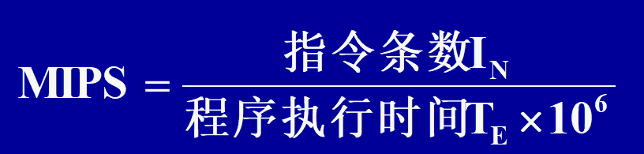

# 第一章 计算机系统概论

## 计算机的硬件组成

### 计算机的功能部件

一个完整的计算机系统由硬件和软件两大系统组成
**硬件系统包括**

- 运算器
- 控制器
- 存储器
  -  主存储器
    也称内存储器，简称内存、主存，CPU能够直接访问
  - 辅助存储器
    也称外存储器，简称外存、辅存) CPU不能直接访问的大容量、速度较慢的存储器**
- 输入设备
- 输出设备

### 冯·诺伊曼计算机

**存储程序思想**

1. 计算机由输入设备、输出设备、运算器、存储器和控制器五大部件组成
2. 采用二进制形式表示数据和指令
3. 采用存储程序方式

冯诺依曼计算机以运算器为中心，现代计算机以存储器为中心

## 计算机的软件系统

基本的软件系统应包括系统软件与应用软件两大类

1. 系统软件
   - 保证计算机系统高效、正确运行的基础软件，通常作为系统资源提供给用户使用
2. 应用软件

对某一具体功能来说，可以用硬件实现，也可以用软件实现，这就是硬件、软件在逻辑功能上的等效

### 计算机系统的多级层次结构

**第 0 级 硬件操作时序**
	实际的硬件层，是硬件组成的实体。 
**第 1 级  微程序机器层**
	实际的硬件层，它由机器硬件直接执行微指令。
**第 2 级  传统机器语言层**
	实际的硬件层，由微程序解释机器指令系统。
**第 3 级  操作系统层**
	由操作系统程序实现。操作系统程序是由机器指令和广义指令组成的。其中广义指令是为扩展机器功能而设置的，是由操作系统定义和解释的软件指令。这一层也称为混合层。
**第 4 级  汇编语言层**
	汇编语言是一种符号形式语言，用户借此可编写汇编语言源程序。这一层由汇编程序支持和执行。
**第 5 级  高级语言层**
	高级语言层为方便用户编写各类应用程序而设置的。它是面向用户的。该层由各种高级语言编译程序支持和执行。
**第 6 级  应用语言层**
	应用语言层是直接面向某个应用领域，为方便用户编写该应用领域的应用程序而设置的。由相应的应用软件包支持和执行。

第0、1、2级是实机器，上面几层均为虚机器（虚拟机）

### 计算机硬件系统的组织

#### 总线

现在普遍采用总线结构

**总线使用规定**

- 必须分时发送
- 可同时接收

**总线的分类**

1. 按照任务分类
   - CPU内部总线（芯片内总线）
     用于连接CPU内部各寄存器和算术逻辑部件
   - 部件内总线
     属于芯片间的总线    
   - 系统总线
   - 外总线
2. 按照信息传送方向分
   - 单项总线
   - 双向总线
3. 按照信息传送方向的位数分
   - 并行总线
   - 串行总线

**采用总线结构的好处**

- 可以大大减少系统中的信息传输线数，减轻发送部件的负载
- 可以简化硬件结构，灵活地修改与扩充系统

**总线的连接方式**

单总线结构

- 优点
  - 控制简单，易于系统扩充
  - 将I/O与存储器同等对待，统一进行编址
- 缺点
  - 同一时间只能在一对设备之间传输信息，系统速度受到限制
  - 把主存与I/O设备同等对待，降低了主存的地位

**双总线结构**
在单总线的基础上，在CPU与主存之间增加了一组存储器总线，CPU访存直接通过存储器总线实现
采用以CPU为中心的存储器总线和I/O总线，分别进行数据传送

提高了CPU的访存速度

**三总线结构**
在面向主存的双总线结构的基础上，增加I/O总线，使得CPU与主存、主存与I/O之间均具备独立的信息传输通路

##### 通道

对于中型、大型计算机系统,由于I/O设备的增多使I/O处理成为又一个十分突出的问题。为此提出了“通道”的概念。

## 计算机的性能指标

**基本字长**
基本字长是指参与运算的数的基本位数。
字长通常是硬件组织的基本单位，它决定着寄存器、ALU、数据总线的位数，因而直接影响着系统的硬件成本。

字长标志着计算机系统的**运算精度**

**主存容量**

主存储器所能存储的最大信息量称为主存容量。
CPU需要执行的程序和要处理的数据都存放在主存中。

**运算速度**

MIPS(每秒百万条指令) 
MFLOPS(每秒百万次浮点运算)。

MIPS的计算

# 第二章 计算机中数据信息的表示

## 数制与数制转换

**数制转换原则**
整数部分、小数部分，分别进行转换

## 带符号数的表示

### 机器数与真值

1. 机器数
   在计算机中的二进制表示形式。机器数的数值部分和符号均用二进制代码表示
2. 真值
   机器数按一般表示方法所表示的数值

**机器数特点**

1. 最高位“0”代表正“+”，“1”代表负“-”
2. 小数点隐含在数据的某一固定位置上，不占用存储空间
3. 二进制位数与机器字长有关，超过机器字长的数值舍去

### 原码表示

保持原有的数值部分的形式不变，只将符号用二进制代码表示。
原码表示是最简单的机器数表示方法。

**纯小数源码定义**

**纯整数原码定义**

**原码的范围**

- 纯小数,n+1位原码的数据表示范围：
  -0.111…11～+0.111…11
  即$-(1-2^{-n}) ～ (1-2^{-n})$
- 纯整数,n+1位原码的数据表示范围：
  -111…11～+111…11
  $-(2^{n}-1) ～ (2^{n}-1)$

### 补码表示

**纯小数的补码定义**

**纯整数的补码定义**

**补码的范围**

纯小数  $-1～1-2^{-n}$  共$2^{n+1}$个数
纯整数  $-2^{-n}～2^{n-1}$   共$2^{n+1}$个数

**补码的模**

补码总是对确定的模而言的。如果补码运算结果超过了模，则模将自动丢失。

补码运算在运算过程中，模不能改变。

不同位数整数补码的模不同，不能将不同位数的补码直接进行运算。如需进行运算，需要进行符号扩展。

### 反码表示（了解）

反码实质上是补码的一个特例，其特别之处在于反码的模比补码的模小一个最低位上的 1

**纯小数反码的定义**

**纯整数反码的定义** 

### 移码表示

**纯小数移码**

$[x]_移=1+x,-1≤x<1$

**纯整数移码**

$[x]_移=2^n+x,-2^n≤x<2^n$

**移码与补码的关系**

补码——>移码
数值部分不变，符号取反。（反之亦然）即
$x≥0,[x]_移=[x]_补+2^n$
$x<0,[x]_移=[x]_补-2^n$

## 数的定点表示与浮点表示

任何一个数均可表示为：$(N)_R=S\times R^e$
$R$：基值。常用的有2、8、16等
$S$：尾数，代表数$N$的有效数字。计算机中一般表示为纯小数
$e$：阶码。代表$N$小数点的实际位置。一半小时为纯整数。

例：
$(123.45)_10=0.12345\times 10^3$
$(11011.101)_2=0.11011101\times 2^{+101}$

### 定点表示

是一种阶码$e$的取值固定不变的机器数表示
<u>机器确定后，$e$就确定了，不能更改，也不能两者并存</u>（两者是指什么？

**定点小数**

$e=0$，表示纯小数
<u>小数点在符号位最高数值位之间</u>

定点小数格式：

**定点整数**

$e=n$，表示纯整数
小数点在最低有效数值位之后

格式：

**定点数的表示范围**

设数据为$N$，机器字长为$n+1$，其中$1$位符号位，$n$位数值位。

1. 原码表示
   二进制定点**小数**的表示范围为：
   $0≤|n|≤1-2^{-n}$
   二进制定点**整数**的表示范围为：
   $0≤|n|≤2^{-n}-1$

   |          | 机器数         | 真值          | 真值       |
   | -------- | -------------- | ------------- | ---------- |
   |          | 数符 尾数(n位) | 定点小数      | 定点整数   |
   | 最小正数 | 0 00 ... 01    | $+2^{-n}$     | +1         |
   | 最大正数 | 0 11 ... 11    | $1-2^{-n}$    | $2^n-1$    |
   | 最大负数 | 1 00 ... 01    | $-2^{-n}$     | $-1$       |
   | 最小负数 | 1 11 ... 11    | $-(1-2^{-n})$ | $-(2^n-1)$ |

2. 反码表示（了解）

3. 补码表示

# 第三章 运算方法与运算器

## 顶点补码加减运算

在计算机中均采用补码加减运算。

### 补码运算基础

两数补码之和（差）等于两数和（差）的补码
两数和（差）的补码等于两数补码之和（差） 

**补码运算的基本规则：**
① 参加运算的各个操作数均以补码表示，运算结果仍以补码表示。
② 符号位与数值位一样参加运算。
③ 若求和，则将两补码数直接相加，得到两数之和的补码；   若求差，则将减数变补(由[y]补求[-y]补)，然后与被减数相加，得到两数之差的补码。    
④ 补码总是对确定的模而言，若运算结果超过模(有从符号位上产生的进位)，则将模自动丢掉。

### 溢出判别与变形补码

**正溢出**：两个正数相加的结果超出机器所能表示的最大正数。
**负溢出**：两个负数相加的结果小于机器所能表示的最小负数。

设参加运算的操作数为
[x]补＝Xf.X1X2…Xn   [y]补＝Yf.Y1Y2…Yn 
[x]补＋[y]补的和为： [s]补＝Sf.S1S2…Sn

$OVR=\overline{X_f}\space\overline{Y_f}S_f+X_fY_f\overline{S_f}=(X_f\oplus{}S_f)(Y_f\oplus{}S_f)$ 

即$X_f$与$Y_f$均与$S_f$不同时，产生溢出

**判断溢出方法**：只有两数同号时相加才可能溢出

**溢出判断电路**

**变形补码**:用两个符号位表示的补码

使用一个符号位进行运算，当出现溢出时，正确的符号将被数值位侵占，符号位含义就会发生混乱。如果采用两个符号位进行运算，即使因出现溢出侵占了一个符号位，仍能保持最左边符号是正确的。

**纯小数的变形补码**

**纯整数的变形补码**

**变形补码的形式：**
 $ [x]变形补＝X_{f1}X_{f2}.X_1X_2…X_n $
设和的变形补码为 $[s]_{变形补}＝S_{f1}S_{f2}.S_1S_2…S_n $
**变形补码的溢出判断条件：**

$OVR=S_{f1}\oplus{}S_{f2}$

即当结果的两个符号位不一致时，出现溢出。其中：
$S_{f1}S_{f2}$＝00 或 11   表示正常补码
$S_{f1}S_{f2}$=01  表示正溢出
$S_{f1}S_{f2}$＝10  表示负溢出

### 算数逻辑运算部件

**补码加减运算实现电路**

基本原理是加法器，在电路中增加取反加1的功能

**采用串行进位的补码加减运算逻辑电路** 

$OVR=Cn\oplus{}C_{n-1}$

M＝0  $B_i$通过异或门与0异或，$B_i\oplus{}0＝Bi$， 
      $C_0＝0$  作 A＋B
M＝1  Bi通过异或门与1异或，$B_i\oplus{}1＝Bi$， 
      $C_0＝1$（实现取补后加一）  作 A－B

------

**算数逻辑运算部件举例**

>算术逻辑运算单元（简称ALU）就是一种以加法器为基础的多功能组合逻辑电路。其基本设计思想是：在加法器的输入端加入一个函数发生器，这个函数发生器可以在多个控制信号的控制下，为加法器提供不同的输入函数，从而构成一个具有较完善的算术逻辑运算功能的运算部件。 

**74181电路** 四位ALU组件

可以实现16种算术运算功能和16种逻辑运算功能，其具体功能由S3S2S1S0和M信号控制实现。 

>其中A3～0、B3～0为参加运算的两组4位操作数；Cn为低位来的进位； F3～0为输出的运算结果；Cn＋4为向高位的进位；G为小组本地进位；P为小组传递函数；A＝B用于输出两个操作数的相等情况，如果将多个74181的“A＝B”端按“与”逻辑连接，就可以检测两个字长超过4位的操作数的相等情况。在控制信号中，S3S2S1S0用于控制产生16种不同的逻辑函数；**M用于控制芯片执行算术运算还是逻辑运算，若M＝0，则允许位间进位，执行算术运算；若M＝1，则封锁位间进位，执行逻辑运算。**

四片SN74181，Cn＋4与高位芯片的C－1相连，就可以构成16位的ALU

## 定点乘法运算

1. 利用乘除运算子程序
   速度慢、早期用
2. 在加法器的基础上增加左、右移位及计数器等逻辑线路构成乘除运算部件
3. 设置专用的阵列乘除运算器

### 原码乘法运算

包括：乘积符号处理、两数绝对值相乘

1. 积的符号单独按两操作数的符号模2加（异或）得到。用被乘数和乘数的数值部分进行运算。
2. 乘数的最低位作为乘法判别位，若判别位为1，则在前次部分积（初始部分积为0）上加上被乘数，然后连同乘数一起右移一位；若判别位为0，则在前次部分积上加0（或不加），然后连同乘数一起右移一位。
3. 重复第2步直到运算n次为止。（n为乘数数值部分的长度） 

### 补码乘法运算(布斯乘法)

1. 参加运算的数均以补码表示，符号位参加运算且部分积与被乘数采用双符号位。
2. 乘数末位增设附加位 $y_{n+1}$，且初始 $y_{n+1}=0$。    
3. 以$y_ny_{n+1}$作为乘法判别位：    
   若$y_ny_{n+1}$＝00或11，则前次部分积(初始部分积为0)加0(或不加)，然后连同乘数右移一位。    
   若$y_ny_{n+1}$＝01，则前次部分积加$[x]_补$，然后连同乘数右移一位；    若$y_ny_{n+1}＝10$，则前次部分积加$[－x]$补，然后连同乘数右移一位。    
4. 重复上面第(3)步，共做n+1次，最后一次不移位。    

**补码一位乘法的硬件实现逻辑图**

A寄存器：存放乘积和部分积高位部分
B寄存器：存放被乘数，可以输出 B 和 B。
C寄存器：存放乘数和部分积低位部分
$C_R$：计数器。用于记录乘法次数
运算初始时，CR＝0，每进行一次运算CR＋1，当计数到$CR=n+1$时，结束运算。由于$CR＝n$时，就将$CT$清0，所以在n＋1次运算不再进行移位。
$A_{f1}$、$A_{f2}$：双符号位，符号位和数值位同时参加运算。
$C_T$：乘法控制触发器，
$C_T=1$，允许发出移位脉冲，进行乘法运算
$C_T=0$，不允许发出移位脉冲，停止乘法运算
$C_n$和$C_{n+1}$：控制电路中是作$+[x]$补还是$+[－x]_补$。

## 定点除法运算

定点运算的结果不应超过机器的所能表示的数据范围
定点小数：$|被除数|<|除数|$
定点整数：$|被除数|>|除数|$

### 原码除法运算

1. 通过做减法来进行余数和除数的比较，即用余数（初值为被除数）减去除数，若减得结果为正，表示够减，上商为1；若减得结果为负，表示不够减，上商为0。
2. 采用恢复余数法或不恢复余数法解决余数减去除数后不够减的处理问题。
3. 在余数不动，低位补0，再与右移一位后的除数相减的操作中，**用左移余数方法代替右移除数操作**。这样操作，实际运算果是一样的，但对线路结构更有利。不过这样操作所得到的余数不是真正的余数，必须将它**乘上$2^{－n}$才是真正的余数**。

**原码恢复余数法**

1. 判溢出，要求|被除数|＜|除数|；
2. 符号位单独按两数符号的模2相加求得；    
3. 被除数减去除数；
4. 若所得余数为正，表示够减，相应位上商为1，余数左移一位(相当于除数右移)减去除数；若所得余数为负，表示不够减，相应位上商为0，余数加上除数(恢复余数)，再左移一位减去除数；
5. 重复第4步，直到求得所要求的商的各位为止。

得 商 $|q|＝0.1101$,余数 $|r|＝0.0111$
商的符号$q_f＝x_f\oplus{}y_f＝1\oplus{}0＝1$
$\therefore$ 商 $[q]_原＝1.1101$
余数 $[r]_原＝1.0111×2^{－4}$
注意：余数符号与被除数符号相一致。

余数为正时，需作余数左移、相减，共两步操作
余数为负时，需作相加、左移、相减，共三步操作

**原码不恢复余数法（加减交替法）**

将原码恢复余数法中余数$r_i＜0$时的操作——相加、左移、相减三步，用左移、相加两步来代替

1. 判溢出，若$|被除数|≥|除数|$，则除法将发生溢出，不能进行除法运算；
2. 商的符号单独按两个操作数符号的模2加法求得；
3. 被除数减去除数；
4. 若所得余数为正，表示够减，相应位上商为1，将余数左移一位减去除数；若所得余数为负，表示不够减，相应位上商为0，将余数左移一位加上除数；    
5. 重复第④步，直到求得所要求的商的各位为止。

在原码不恢复余数法中，如果最后一次所得余数仍为负，表示不够减，这时需要再做一次加除数的操作，以便得到正确的余数。

**例** 已知$x＝－0.1011$，$y＝＋0.1101$，用原码不恢复余数法求$x/y$。 
解：$[x]_原＝1.1011$，$[y]_原＝0.1101$，
$|x|＝00.1011$，$|y|＝00.1101$，
$[－|y|]_补＝11.0011$， 

商符 $q_f＝x_f\oplus{}y_f＝1\oplus{}0＝1$ 
得商： $|q|＝0.1101$,余数 $|r|＝0.0111$
$[q]_原＝[x/y]_原＝1.1101$
$x/y＝－0.1101$  
余数：$[r]_原＝1.0111×2^{－4}$
$r＝－0.0111×2^{－4}$

**例** $[x]_原 ＝0.10101$，$[y]_原＝0.11110$，用原码不恢复余数法求$x/y$。 
解：$|x|＝00.10101$,$|y|＝00.11110$ 
$[-|y|]_补＝11.00010$

商符 $q_f＝x_f\oplus{}y_f＝0\oplus{0}＝0$ 
商：$[q]_原＝[x/y]_原＝0.10110$
$x/y＝0.10110$ 
余数：$[r]_原＝0.01100×2－5$
$r＝0.0000001100 $

### 补码除法运算

**是否够减**

**同号**

- 当x与y同号时，作$[x]_补－[y]_补$进行比较
- 若所得余数r与除数y同号，表示够减
- 若所得余数r与除数y异号，表示不够减

**异号**

- 当x与y异号时，作[x]补＋[y]补进行比较
- 若所得余数与除数异号，表示够减
- 若所得余数与除数同号，表示不够减

**上商算法**

- 每次加减所得的余数与除数同号时，上商为1

- 每次加减所得的余数与除数异号时，上商为0

PPT约140-200 未完成。。。

## 运算器的组成

### 定点运算器

运算器结构的基本组成部分：包括ALU、寄存器、多路开关和数据总线

**单总线结构运算器**

所有部件都接在同一总线上

在同一时间内，只能有一个操作数放在单总线上，所以需要A、B两个缓冲器

执行双操作数运算的操作步骤：

1. 把一个操作数送入A缓冲器。
2. 把另一操作数送入B缓冲器，只有两个操作数同时出现在ALU的输入端时，ALU才能正确执行相应运算，并将运算结果送上单总线。
3. 把结果存入目的寄存器中。单总线结构运算器的主要缺点是**操作速度慢**

**双总线结构运算器**

执行双操作数运算的操作步骤：

1. 两个操作数同时加到ALU输入端进行运算，一步完成操作并得到结果。但ALU输出不能直接加到数据总线上，需要用输出缓冲器暂存运算结果。
2. 把结果从缓冲器中传送到目标寄存器中。双总线结构运算器的执行速度比单总线结构运算器的执行速度快。

**三总线结构运算器**

只需一步就可完成一次双操作数运算

在三总线结构运算器中，还可以设置总线旁路器。如果一个操作数不需运算操作或修改，可通过总线旁路器直接从总线2传送到总线3，而不必经过ALU

