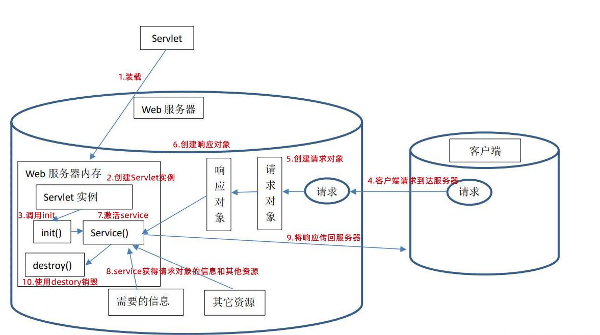
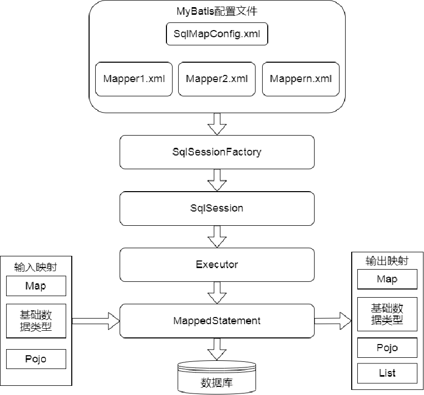

# Web应用开发基础

#### Web应用四层开发模式，如何进行多人协作开发

Q1.四层开发：表现层、服务层、业务层、数据访问层

- 表现层	UI用户界面、UI逻辑
- 服务层	Service对外统一提供接口
- 业务层	业务规则/业务流（Controller）、业务逻辑（Module）
- 数据库访问层	SQL语句

Q2.多人协作开发

- 任务管理	

  将需求转化成清晰有序的开发任务，并对开发任务进行有效的管理。

- 分支管理    

  充分利用分布式版本控制系统（如：Git） ，保证各开发成员在同一个项目代码中有序的进行开发工作。

- 代码规范

  建立统一的代码规范，提高代码的可理解性、可维护性。

- 提交规范

  提供可读性更好的代码提交记录。

- 开发流程规范 

  建立清晰、有序、无阻塞的开发流程。

#### 谈一谈web开发与社会、生活、环境、法律、安全等方面的联系、好处以及解决了什么问题

#### Servlet的生命周期



**Servlet的生命周期包括加载和实例化、初始化、服务和销毁过程。** 

- 实例化：Servlet 容器创建 Servlet 的实例

- 初始化：该容器调用 init() 方法

- 服务：如果请求 Servlet，则容器调用 service() 方法

- 销毁：销毁实例之前调用 destroy() 方法

- 不可用：销毁实例并标记为垃圾收集


（理解）其中，加载和实例化过程只有一次（调用init()方法），这个过程可能是Tomcat容器启动时执行，也可能是第一次访问该Servlet执行，这主要取决于容器的配置文件。服务过程（对每一次请求调用service()方法）是不受限制的，每次服务过程就是一个Servlet线程的运行过程。当Tomcat容器关闭时，执行destroy()方法，销毁Servlet实例。但是，也可能由于Servlet本身的变化而提前执行，不过Servlet的生命周期不长于容器的生命周期。

#### MVC模式意义 （P38看书的具体解释） 你在开发web项目的时候MVC和哪些是关联的

Q1.意义： MVC强制把数据从表示层分离出来

- **多个视图能共享一个模型**
- 同样的构件能被不同界面使用
- 很容易改变应用程序的数据层和业务规则
  因为模型是自包含的并且与控制器和视图相分离
- 控制器使得可以连接不同的的模型和视图
- 有利于软件工程化管理 

Q2.比如说 MVC的M.V.C和我们学过的哪些技术是相关的（书本上的解释）

- M(Model)	DAO层（数据库访问层）、JavaBean、普通Java类、EJB
- V(View)	JSP、HTML、XHTML、XML、CSS
- C(Controller)	Servlet、Spring boot、maven等

#### 内置对象

Q1.JSP中常用到的内置对象，PPT标题有

- request
- response
- session
- application
- page

Q2.session相关

生命周期：在第一个JSP页面或Servlet被装载时由服务器自动创建，并在用户退出应用程序时由服务器销毁

#### P65代码

```java
@WebServlet("/LoginSession")
public void doPost(HttpServletRequest requset,HttpServletResponse response)
		throws ServletException,IOException{
            HttpSession session = request.getSession();		//得到session对象
            String account = request.getParameter("account");
            String secret = request.getParameter("secret");
            RequestDispatcher dispatcher = null;
            if(LoginManagement.login(account, secret)){		//登陆成功
                request.setAttribute("log","ok");
                request.setAttribute("name",account);		//成功，向session对象中写入用户名
                dispatcher = getServletContext().getRequestDispatcher("/bookmain.jsp");
            }
            else{
                request.setAttribute("log","err");
                dispatcher = getServletContext().getRequestDispatcher("/login.jsp");
            }
            dispatcher.forward(request, response);
		}
```

比如考察

`dispatcher.forward(...)`的两个参数
注解`@WebServlet("/LoginSession")
doPost(...)`参数
`request` `response`所属的类

题目分值为挖空个数 

#### JSON

Q1.语法格式 P68

- 数据在键值对中
- 数据由逗号分隔
- 花括号保存对象
- 方括号保存数组

Q2.在Java下通常是如何处理JSON的？P70

1. JSON字符串（浏览器传至服务器）与Java对象的相互转换功能，也就是反序列化
2. Java对象转换成JSON字符串，也就是序列化。发送到前端后，由JavaScript反序列化为JavaScript环境下的JSON对象。
3. Java对象数组（或List）序列化JSON字符串，发送到前端后，由JavaScript反序列化为JavaScript环境下的JSON对象数据。内部结构为List形式的JSON字符串
4. 对树状结构的`JSONNode`的处理 

Q3.在JavaScript中处理JSON

```javascript
//增加、修改操作:
var student={};//一个空对象
student.name=“张三”；结果：{“name”: “张三”};
student[“ID”]=“123456”; 结果：{“name”: “张三”,“ID”:“123456”};

//取值、查询操作：
var name=student.name 或：name= student[“name”];

//遍历操作:
//类似于数组操作，不过，把下标用key替换。如下所示：
for(var value in student)
 		alert(student[value]);//类似于数组下标（键值为下标）	

//删除操作：
//删除JSON对象中的一组key/value对，可用delete(key)方法，如：
delete(student ["name"]);//其结果相当于删除了“name”: “张三”。

```

Q4.JavaScript与JSON关系

- JSON是JavaScript对象
JSON是一种轻量级的数据交换格式，全称——JavaScript对象表示法（JavaScript Object Notation）

- JSON的语法
JavaScript对象字面量表示法语法的一个子集

#### 异步通信 ajax 

Q1.

同步通信：发送方发出数据后，等接收方发回响应，在发下一个数据包的通信方式
异步通信：发送方发出数据后，不等接收方发回响应，接着发送下一个数据包的通信方式

Q2.P76页代码

```java
<!DOCTYPE html>
<html>

<head>
	<title>login.html</title>
	<meta http-equiv="Content-Type" content="text/html; charset=utf-8" />
	<script src="https://unpkg.com/axios/dist/axios.min.js"></script>
	<script src="https://cdn.jsdelivr.net/npm/vue/dist/vue.js"></script>
</head>

<body>
	<div id="app">
		<form @submit.prevent="onSubmit" method="post">
			<P>用户名<input type="text" size="20" v-model="userName"></P>
			<P>密码<input type="password" size="20" v-model="passWord"></P>
			<P><input type="submit" value="提交"> </P>
		</form>
		<span>{{promptMess}}</span>
	</div>
	<script type="text/javascript">
		var vm = new Vue({
			el: '#app',
			data: { promptMess: "", userName: "", passWord: "", },
			methods: {
				onSubmit: function () {
					var self = this;//回调函数中无法获得this.
					axios({
						url: "LogServlet", method: "post",
						data: { name: this.userName, pass: this.passWord }
					})
						.then(function (response) {
							if (response.data == "error")//登录失败，返回空串，
								self.promptMess = "密码或用户名错误";
							else {
								self.promptMess = "登录成功";
								//其它代码；
							}
						}).catch(function (error) { });
				}
			}
		});
	</script>
</body>

</html>
```

例如考察

line23.`onsubmit`后的内容
line25.`url` `method`后的填写 `url`后填写的内容与代码的片段有关
line27.`then`后内容的填写
line29，31.`self` `catch`

P77代码

```java
@WebServlet("/LogServlet")
public class LogServlet extends HttpServlet {
    protected void doGet(HttpServletRequest request, HttpServletResponse response)
            throws ServletException, IOException {
        // TODO Auto-generated method stub
        response.setContentType("text/html;  charset=utf-8");
        BufferedReader rd = request.getReader();
        String strJSON = "", temp;
        while ((temp = rd.readLine()) != null) {
            strJSON = strJSON + temp;
        }
        System.out.println(strJSON);
        JSONObject obj = JSON.parseObject(strJSON);
        System.out.println(obj);
        String name = obj.getString("name");
        String pass = obj.getString("pass");
        System.out.println(name);
        PrintWriter out = response.getWriter();
        //HttpSession session=request.getSession();
        String returnString = "error";
        if (name.equals("123") && pass.equals("123"))
            returnString = "ok";
        out.write(returnString);
    }
}
```

#### Servlet过滤器

是什么：过滤器是小型的Web组件。若服务器（如Tomcat) 中有过滤器部署、则对于从客户端发送过来的请求，服务器首先让过滤器执行，这可能是安全、权限检查，也可能是字符集进行统一过滤处理；然后，或者让客户请求的目的地页面或Servlet处理，或者直接进行页面转发（假如安全检查没有通过）。如果系统中设置了多个过滤器（一般情况下一个过滤器完成一项特定任务），则一组过滤器会形成一个过滤链，客户请求会在过滤链中逐步过滤执行。

作用：

1. 在`HttpServletRequest`到达`Servlet`之前，拦截客户的`HttpServletRequest`
2. 根据需要检查`HttpServletRequest`，也可以修改`HttpServletRequest`头和数据
3. 在`HttpScrvletResponse`到达客户端之前,拦截`HttpServletResponse`
4. 根据需要检查`HttpServletResponse` ，可以修改`HttpServletResponse` 头和数据

#### Spring IOC

Q1.Spring IOC

是什么：Spring两个核心功能之一是依赖注入(Dependency Injection,DI)和控制反转(Inversion Of Control,IOC)。Spring利用以来注入技术实现了控制反转功能。

控制反转：将合作对象的引用或依赖交给第三方管理，从而实现对象之间的解耦。

Q2.POJO

有代码挖空，P112     <font color=red>**（讲课时候没找到）**</font>

```java
@Service("userService")
public class UserService {
    //以下是字段field注入方式
    @Autowired
    private UserDao userDao;
    @Autowired
    private User user;
    /*@Autowired 构造器注入
	public UserService(UserDao userDao,User user) {
	 
		this.userDao=userDao;
		this.user=user;
	}*/

    //@Autowired  set注入
 	/*public void setUserDao(UserDao userDao ){this.userDao=userDao;}
	public void setUser(User user ){this.user=user;}*/

    public void loginUser() {
        userDao.login(user);
    }
    //其它API，略


}
```

代码挖空 比如

注解关键字`@Autowried`
给定一个类，new一个POJO对象 

#### Spring MVC P115	<font color=red>**粗略带过**</font>


Spring MVC是当前最优秀的MVC框架，自从Spring 3版本发布后，支持注解配置.。提供了模型-视图-控制器（MVC）架构和现成组件，可以用来开发灵活和松散耦合的Web应用程序。MVC模式可以分离应用程序的不同方面（输入逻辑、业务逻辑和UI逻辑），同时提供这些元素之间的松散耦合。

- Model	       封装了应用程序的数据，通常由POJO组成。

- View              负责呈现模型数据，并且通常生成客户端浏览器可以解释的HTML输出。

- Controller    负责处理用户请求并构建适当的模型，并将其传递给视图以供呈现。

#### Maven的主要作用 P127	<font color=red>**粗略带过**</font>

Maven就是一个包含了项目对象模型(Project Object Model,POM)的软件项目管理工具，可以通过配置描述信息来管理项目的构建、报告和文档

#### MyBatis	<font color=red>**粗略带过**</font>



是一个基于Java的持久层框架
支持自定义SQL、存储过程以及高级映射，免除了几乎所有的JDBC代码以及设置参数和获取结果集的工作

#### JDBC应用示例

P145代码挖空

```java
import java.sql.*;
public class FirstJDBC {
    public static void main(String arg[]) {
        // 指定连接的数据库URL
        String url = "jdbc:mysql://127.0.0.1:3306/test?useUnicode=true&characterEncoding=utf-8"; // 解决中文字符问题
        // JDBC 5.X的驱动名称
        // JDBC 8.X的驱动名称为 com.mysql.cj.jdbc.Driver
        String driver = "com.mysql.jdbc.Driver";
        String user = "root";
        String pass = "123456";
        Connection con=null;
        Statement stmt = null;
        ResultSet rs = null;
        try {
            // 加载JDBC驱动器
            Class.forName(driver);
            // 通过驱动程序管理器建立与数据库的连接
            con = DriverManager.getConnection(url, user, pass);
            // 创建执行查询的 Statement 对象
            stmt = con.createStatement();
            // SQL语句，用于查询用户表中信息
            String sql = "select * from tb_user";
            // 以上变量定义在 try 块外
            // 执行查询，查询结果放在 ResultSet 对象中
            rs = stmt.executeQuery(sql);
            String name,password,tel;
            // 打印查询结果
            while(rs.next()) {
                // 获得每一行每一列的数据
                name = rs.getString(1);
                password = rs.getString(2);
                tel = rs.getString("tel");
                System.out.println(name + "," + password + "," + tel);
            }
        }
        // 找不到驱动程序，捕捉异常。如发生该错误，请检查JDK版本是否在1.1以上
        catch(ClassNotFoundException e) {
            System.out.println("错误：" + e);
        }
        catch (SQLException e1) {
            System.out.println("错误：" + e1);
        }
        finally {
            try {
                rs.close();
                stmt.close();
                con.close();
            }
            catch(SQLException e) {

            }
        }
    }
}
```

#### 分页技术实现方案	 <font color=red>**粗略带过**</font>

**书本部分：**

1. 第一种方法即传统的分页方法，它是将查询结果缓存在`HttpSession`或有状态的`Javabean` 中，翻页时从缓存中取出一页数据进行显示。这种方法虽然翻页响应快（在内存中读数据），但也存在缺点：首先，用户可能看到的是过期数据（因为数据库是在不断更新中）；其次，如果数据扯非常大时，第一次查询（遍历结果集）会耗费很长时间，并且缓存的数据也会占用大扯内存，因此效率明显下降。这种方法一般适用于数据规模不大而且并发批也不大的项目。
2. 第二种方法是对上述方法的改进。其主要设计思想是：每次翻页都查询一次数据库，从结果集(ResultSet)中只取出一页数据。这种方法不存在占用大批内存的问题，但在某些数据库（如Oracle) 的JDBC 实现中，每次查询几乎也需要遍历所有的记录实验证明，在记录数很大时，这种方法的速度也非常慢。
3. 第三种方法设计思想是：每次翻页的时候，只从数据库里检索出与页面大小一样的数据块。这样做，虽然每次翻页都需要查询数据库，但由于查询出的记录数很少．因此查询速度快。如果使用连接池技术，还可以略过最耗时的建立数据库的连接过程，而在数据库端有各种成熟的优化技术用于提高查询速度。因此，这种方法在上述3种方法中是最优的。

分页显示的核心数据都是即将被显示的页面数（页码）（pagenum) 

**PPT部分：**

- 每次翻页的时候，只从数据库里检索出页面大小的数据块。这样做，虽然每次翻页都需要查询数据库，但由于查询出的记录数很少，因此查询速度快，如果使用连接池技术，更可以略过最耗时的建立数据库连接过程，而在数据库端，有各种成熟的优化技术用于提高查询速度，因此，该种查对较优。本节只介绍这种方法的实现。
- 分页还可以通过数据库的存储技术来实现，该种方法把分页过程的业务逻辑委托给具体数据库中实现，因此，其速度是最快的。但由于该种方法与具体数据库相关，因此移植性差，可重用性也差。